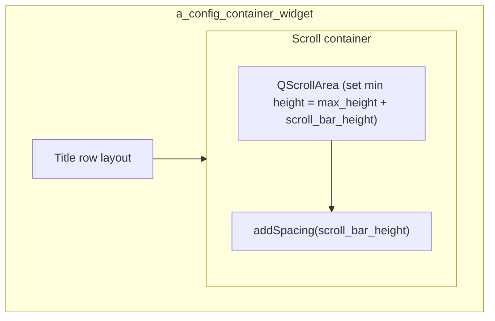

# Epoch render config multi-config scroll bar sizing

## Problem

For multi-config epochs (e.g. "custom_paradigm" with many sub-configs), the section uses a horizontal `QScrollArea`. Two issues cause content or the scroll bar to be cut off:

1. **QScrollArea does not include scroll bar in size hint**
  With `ScrollBarAsNeeded`, Qt's `QScrollArea::sizeHint()` does not reserve space for the horizontal scroll bar ([QTBUG-10265](https://bugreports.qt.io/browse/QTBUG-10265)), so the layout may allocate only the content height and the bar overlaps or is clipped.
2. **Fixed 20px bottom spacing**
  The code uses a hardcoded `margin_pixels = 20` (lines 521–524 in [EpochRenderConfigWidget.py](h:\TEMP\Spike3DEnv_ExploreUpgrade\Spike3DWorkEnv\pyPhoPlaceCellAnalysis\src\pyphoplacecellanalysis\GUI\Qt\Widgets\EpochRenderConfigWidget\EpochRenderConfigWidget.py)) which may not match the actual scroll bar height on all platforms/themes.
3. **Scroll area has no minimum height**
  The scroll area itself never gets an explicit minimum height; only the inner widget container gets `setMinimumSize(total_width, max_height)` (lines 572–575). The scroll area can therefore be laid out at `max_height` only, with no room for the bar.

## Approach

Reserve vertical space for the horizontal scroll bar in two places:

1. **Use platform scroll bar extent** for the reserved height instead of a magic number.
2. **Set the scroll area’s minimum height** to `content_height + scroll_bar_height` so the layout always gives it enough vertical space.
3. **Set the bottom spacing** to the same scroll bar height so the section’s preferred height consistently includes the bar.

## Implementation

**File:** [EpochRenderConfigWidget.py](h:\TEMP\Spike3DEnv_ExploreUpgrade\Spike3DWorkEnv\pyPhoPlaceCellAnalysis\src\pyphoplacecellanalysis\GUI\Qt\Widgets\EpochRenderConfigWidget\EpochRenderConfigWidget.py)

### 1. Compute scroll bar height once per multi-config section

Immediately after creating the scroll area (after line 518, before adding it to the layout):

- Get the horizontal scroll bar height using the style metric so it works before the bar is shown:
  - `scroll_bar_height = a_sub_config_scroll_area.style().pixelMetric(pg.Qt.QtWidgets.QStyle.PixelMetric.PM_ScrollBarExtent)`
- If that returns 0 (e.g. on some styles), fall back to `a_sub_config_scroll_area.horizontalScrollBar().sizeHint().height()` or a small default (e.g. 16).

Use a local variable `scroll_bar_height` in the same `else` block so it is available when sizing the inner container and scroll area later.

### 2. Use dynamic spacing instead of fixed 20

- Replace `margin_pixels = 20` with `margin_pixels = scroll_bar_height` (or keep a minimum, e.g. `max(scroll_bar_height, 4)`, to avoid zero spacing).
- Keep `a_sub_config_scroll_container_layout.addSpacing(margin_pixels)` so the layout still reserves space below the scroll area.

### 3. Set scroll area minimum height

In the existing block that runs when there are sub-widgets (lines 568–582), after setting the inner container’s minimum size and before `updateGeometry()`:

- Set the scroll area’s minimum height so it always includes the bar:
  - `a_sub_config_scroll_area.setMinimumHeight(max_height + scroll_bar_height)`
- This forces the layout to allocate at least `max_height + scroll_bar_height` for the scroll area, preventing the bar from overlapping content or being cut off.

### 4. (Optional) Set container minimum height from content

The multi-config container currently has `setMinimumSize(150, 112)` (line 415). To make the section’s preferred height fully content-driven:

- After computing `max_height` and `scroll_bar_height`, compute a minimum height for the whole section, e.g.:
  - Title row height (e.g. from `a_config_title_button.sizeHint().height()` or the title row layout)
  - Plus scroll content + scroll bar: `max_height + scroll_bar_height`
  - Plus the bottom spacing: `scroll_bar_height`
- Set the container’s minimum height to the maximum of 112 and this value so the section is never shorter than its content plus scroll bar.

## Layout (unchanged structure)

## Summary of code changes

| Location                                              | Change                                                                                                               |
| ----------------------------------------------------- | -------------------------------------------------------------------------------------------------------------------- |
| After creating `a_sub_config_scroll_area` (~line 518) | Compute `scroll_bar_height` via `style().pixelMetric(PM_ScrollBarExtent)` with fallback.                             |
| Lines 520–524                                         | Use `scroll_bar_height` (or `max(scroll_bar_height, 4)`) instead of fixed `20` for `margin_pixels` and `addSpacing`. |
| Lines 571–579 (inside `if len(...) > 0`)              | Call `a_sub_config_scroll_area.setMinimumHeight(max_height + scroll_bar_height)`.                                    |
| Optional (after above)                                | Compute and set `a_config_container_widget.setMinimumHeight(...)` from title height + scroll area height + spacing.  |

No new methods or subclasses are required. The scroll area and container are only created in `_build_children_widgets`; all changes stay in that method.