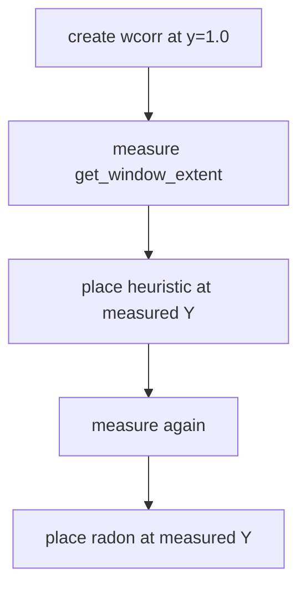

# Fix overlay label equal spacing

## Problem

In the bottom DecodedEpochSlices columns, corner metrics (`wcorr`, `coverage`, `mseq_tcov`, `radon`) drift vertically across epoch rows and have uneven gaps. This is separate from the earlier “missing overlays” work in [`fix_overlay_regression_c8b01c84.plan.md`](h:/TEMP/Spike3DEnv_ExploreUpgrade/Spike3DWorkEnv/Spike3D/.cursor/plans/fix_overlay_regression_c8b01c84.plan.md).

Labels are three stacked artists (blue wcorr, green heuristic, yellow radon) created in [`OverlayLabelsPaginatedPlotDataProvider._callback_update_curr_single_epoch_slice_plot`](h:/TEMP/Spike3DEnv_ExploreUpgrade/Spike3DWorkEnv/pyPhoPlaceCellAnalysis/src/pyphoplacecellanalysis/General/Pipeline/Stages/DisplayFunctions/DecoderPredictionError.py).

## Root cause (locked)



1. Stack Y comes from `_axes_y_below_anchored_artist` measuring display extents mid-page-render — extents are incomplete/stale across axes, so rows get different Y chains (and sometimes fallback `0.78`).
2. Default path uses plain `AnchoredText` with `borderpad=0.5` ([`add_inner_title`](h:/TEMP/Spike3DEnv_ExploreUpgrade/Spike3DWorkEnv/NeuroPy/neuropy/utils/matplotlib_helpers.py)); full-artist measurement includes that pad, so inter-block gaps ≠ intra-block line gaps.
3. Inset kwargs pass both `bbox_transform=ax.transAxes` and `transform=fig.transFigure`, which can contaminate OffsetBox placement across differently located subplot rows.

DecodedEpochSlices defaults `use_AnchoredCustomText=False` in [`stacked_epoch_slices.py`](h:/TEMP/Spike3DEnv_ExploreUpgrade/Spike3DWorkEnv/pyPhoPlaceCellAnalysis/src/pyphoplacecellanalysis/Pho2D/stacked_epoch_slices.py) (~3260), so the tighter TextArea measurement branch never runs.

## Approach (locked)

Keep three colored blocks; stop measuring to stack them. Use **deterministic axes-fraction Y** from line count so every subplot with the same visible lines gets the same geometry.

### 1. Pure axes anchoring for inset mode

In `_helper_build_text_kwargs_adjacent_right_lots_of_text` (and the shared create/update path): drop `transform=a_fig.transFigure`. Keep `loc='upper right'`, `bbox_to_anchor=(1.0, y)`, `bbox_transform=curr_ax.transAxes` only.

### 2. Deterministic stack helper

Replace measurement-based stacking in the callback with something like:

```python
def _overlay_stack_y_below(cls, curr_ax, n_lines_above: int, font_size_pt: float, line_spacing: float = 1.15, gap_lines: float = 0.15) -> float:
    # Convert pt line height -> axes fraction from curr_ax window height; return 1.0 - n_lines_above*line_h_axes - gap
```

Stack rules:
- wcorr: `bbox_to_anchor=(1.0, 1.0)`
- heuristic: Y from `n_lines(wcorr)`
- radon: Y from `n_lines(wcorr) + n_lines(heuristic)`
- Line counts from the actual display strings (`final_text.count('\n') + 1` when non-empty), so missing blocks do not leave empty gaps.

Keep `_axes_y_below_anchored_artist` only as an unused/legacy helper or delete call sites; do not use it for placement.

### 3. Zero borderpad on stacked overlay labels

When creating/updating overlay artists via `add_inner_title`, pass `borderpad=0.` (already accepted via `**kwargs` into `AnchoredText`). That removes pad inflation between blocks so vertical rhythm matches equal line steps.

### 4. Scope

Only change [`DecoderPredictionError.py`](h:/TEMP/Spike3DEnv_ExploreUpgrade/Spike3DWorkEnv/pyPhoPlaceCellAnalysis/src/pyphoplacecellanalysis/General/Pipeline/Stages/DisplayFunctions/DecoderPredictionError.py) OverlayLabels callback/helpers. No notebook edits; no change to the missing-overlays plan unless needed for verification.

## Verification

Re-open the multi-decoder DecodedEpochSlices window and `add_data_overlays(included_columns=['radon','wcorr','coverage','mseq_tcov'])`.

Expect:
- Every epoch row: label block flush to the same top-right corner of its axes
- Equal vertical step between `wcorr` → `coverage`/`mseq_tcov` → `radon`
- No progressive downward drift from epoch[0] to epoch[N]
