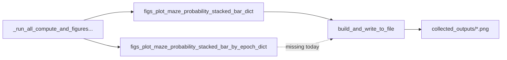

# Export `_by_epoch` maze-context figures

**Goal:** Persist `figs_plot_maze_probability_stacked_bar_by_epoch_dict` PNGs the same way aggregate stacked-bar figures already are.

**Root cause:** Plot helpers only return figures. PNG writing lives solely in [`batch_user_completion_helpers.py`](h:\TEMP\Spike3DEnv_ExploreUpgrade\Spike3DWorkEnv\pyPhoPlaceCellAnalysis\src\pyphoplacecellanalysis\General\Batch\BatchJobCompletion\UserCompletionHelpers\batch_user_completion_helpers.py) inside `compute_and_figures_nwb_wmaze_maze_context_probabilities_completion_function`, which currently only reads `figs_plot_maze_probability_stacked_bar_dict`.

## File to change

[`batch_user_completion_helpers.py`](h:\TEMP\Spike3DEnv_ExploreUpgrade\Spike3DWorkEnv\pyPhoPlaceCellAnalysis\src\pyphoplacecellanalysis\General\Batch\BatchJobCompletion\UserCompletionHelpers\batch_user_completion_helpers.py) (~4213–4229)

No change needed in [`PendingNotebookCode.py`](h:\TEMP\Spike3DEnv_ExploreUpgrade\Spike3DWorkEnv\pyPhoPlaceCellAnalysis\src\pyphoplacecellanalysis\SpecificResults\PendingNotebookCode.py): it already builds and returns both figure dicts.

## Implementation

In the existing `if write_png or write_vector_format:` block, drive exports from both dicts with the same write mechanics (shared `custom_fig_man`, unpack `fig_tuple[0]`, `build_and_write_to_file`, extend `callback_outputs['figure_output_paths']`, print paths).

Replace the single-dict loop with a two-source loop:

- `figs_plot_maze_probability_stacked_bar_dict` → display context `maze_context_decoded_probabilities[{epoch_name}]` (unchanged)
- `figs_plot_maze_probability_stacked_bar_by_epoch_dict` → display context `maze_context_decoded_probabilities_by_epoch[{epoch_name}]` (matches how figures are built in the helper)

Keep the `## END for ...` closing-comment style. Empty/missing by-epoch dicts should no-op safely (`or {}`).

Expected new filenames (same parent as today), e.g.:
`..._maze_context_decoded_probabilities_by_epoch[lap].png` (and `replay` / `pbe`).

## Verification

Re-run the existing completion-function notebook cell (or the batch callback). Confirm logs show `figure_output_paths` for both aggregate and `_by_epoch` keys, and that the new PNGs exist beside the existing ones under `collected_outputs`.