# Export Filename Suffix (Option 2) + Parser Safety

## Problem

Phase-2 track-body runs save the global pickle with `-trackBodyPeakOnly`, but **completion exports** (CSVs/PKLs in `collected_outputs`) still use `build_complete_session_identifier_filename_string()` → `get_custom_pipeline_filenames_from_parameters()`, which only encodes `epochs_source`, `included_qclu_values`, and `minimum_inclusion_fr_Hz`. Same qclu/fr params → **same export filenames** as the base run → overwrite risk.

## Suffix format (parser-critical)

Do **not** append bare `-trackBodyPeakOnly` into the `custom_replay_name` segment. [`ExportValueNameCleaner.parse_comparable_custom_replay_name_to_separate_columns()`](h:/TEMP/Spike3DEnv_ExploreUpgrade/Spike3DWorkEnv/pyPhoPlaceCellAnalysis/src/pyphoplacecellanalysis/SpecificResults/AcrossSessionResults.py) splits each hyphen segment on `_` with `maxsplit=1`; a segment without `_` raises `ValueError`.

**Use:** `-variant_trackBodyPeakOnly` (key=`variant`, value=`trackBodyPeakOnly`)

Example export basename segment:

`withNormalComputedReplays-qclu_[1, 2, 4, 6, 7, 8, 9]-frateThresh_2.0-variant_trackBodyPeakOnly`

This is compatible with:
- [`try_iterative_parse_chain()`](h:/TEMP/Spike3DEnv_ExploreUpgrade/Spike3DWorkEnv/pyPhoCoreHelpers/src/pyphocorehelpers/Filesystem/path_helpers.py) — stores remainder as opaque `custom_replay_name`
- [`reorder_ensuring_qclu_before_frateThresh()`](h:/TEMP/Spike3DEnv_ExploreUpgrade/Spike3DWorkEnv/pyPhoPlaceCellAnalysis/src/pyphoplacecellanalysis/SpecificResults/AcrossSessionResults.py) — trailing suffix captured in group `(.*)$`
- [`get_only_most_recent_session_files()`](h:/TEMP/Spike3DEnv_ExploreUpgrade/Spike3DWorkEnv/pyPhoPlaceCellAnalysis/src/pyphoplacecellanalysis/SpecificResults/AcrossSessionResults.py) — groups by `_comparable_custom_replay_name`, so track-body and base runs stay separate (desired)

```mermaid
flowchart LR
  ipy["ProcessBatchOutputs.ipy Phase 2"]
  handler["BatchSessionCompletionHandler"]
  pipeline["curr_active_pipeline"]
  export["build_complete_session_identifier_filename_string"]
  parse["parse_filename / ExportValueNameCleaner"]

  ipy -->|"export_filename_extra_suffix_parts"| handler
  ipy -->|"override kwargs per completion fn"| handler
  handler -->|"set pipeline attr before completion fns"| pipeline
  pipeline --> export
  export -->|"custom_replay includes variant_*"| parse
```



## Implementation

### 1. Central export suffix plumbing (pipeline)

**File:** [`Computation.py`](h:/TEMP/Spike3DEnv_ExploreUpgrade/Spike3DWorkEnv/pyPhoPlaceCellAnalysis/src/pyphoplacecellanalysis/General/Pipeline/Stages/Computation.py)

In `get_custom_pipeline_filenames_from_parameters()` (after `_get_custom_filenames_from_computation_metadata(...)` returns `custom_suffix`):

- Read optional transient attribute: `getattr(self, '_export_filename_extra_suffix_parts', None) or []`
- If non-empty, append: `custom_suffix = parts_separator.join([custom_suffix, *extra_parts])`

This automatically propagates to `get_complete_session_identifier_string()` and all callers of `build_complete_session_identifier_filename_string()` (including [`context_dependent.py`](h:/TEMP/Spike3DEnv_ExploreUpgrade/Spike3DWorkEnv/pyPhoPlaceCellAnalysis/src/pyphoplacecellanalysis/Analysis/Decoder/context_dependent.py) `default_export_all_CSVs` / `export_pkl`).

Add a small module-level helper (in [`batch_user_completion_helpers.py`](h:/TEMP/Spike3DEnv_ExploreUpgrade/Spike3DWorkEnv/pyPhoPlaceCellAnalysis/src/pyphoplacecellanalysis/General/Batch/BatchJobCompletion/UserCompletionHelpers/batch_user_completion_helpers.py) or `BatchCompletionHandler.py`):

```python
def apply_export_filename_extra_suffix_parts_to_pipeline(curr_active_pipeline, export_filename_extra_suffix_parts=None):
    if export_filename_extra_suffix_parts:
        curr_active_pipeline._export_filename_extra_suffix_parts = list(export_filename_extra_suffix_parts)
```

### 2. Handler field + pre-completion hook

**File:** [`BatchCompletionHandler.py`](h:/TEMP/Spike3DEnv_ExploreUpgrade/Spike3DWorkEnv/pyPhoPlaceCellAnalysis/src/pyphoplacecellanalysis/General/Batch/BatchJobCompletion/BatchCompletionHandler.py)

- Add field: `export_filename_extra_suffix_parts: List[str] = field(default=Factory(list))` (passed via existing `batch_session_completion_handler_kwargs` template wiring)
- In `on_complete_success_execution_session()`, **before** the completion-function loop (~line 918): call helper when `self.export_filename_extra_suffix_parts` is non-empty

### 3. Option 2: per-function override kwargs

**Files:** [`batch_user_completion_helpers.py`](h:/TEMP/Spike3DEnv_ExploreUpgrade/Spike3DWorkEnv/pyPhoPlaceCellAnalysis/src/pyphoplacecellanalysis/General/Batch/BatchJobCompletion/UserCompletionHelpers/batch_user_completion_helpers.py)

Add optional kwarg to active completion functions (at function start, call helper):

| Function | Why |
|---|---|
| `generalized_decode_epochs_dict_and_export_results_completion_function` | CSV + optional PKL exports |
| `save_custom_session_files_completion_function` | session/global pickle + h5 names |
| `figures_plot_generalized_decode_epochs_dict_and_export_results_completion_function` | accept kwarg for API consistency; figures use `FileOutputManager` display-context names (no change unless we later thread suffix into display context — out of scope for CSV collision fix) |

Kwarg name: `export_filename_extra_suffix_parts: Optional[List[str]] = None`

Handler pre-hook covers functions that don't receive the kwarg; explicit kwarg satisfies option 2 and makes overrides visible in generated scripts.

### 4. Wire Phase-2 block in `.ipy`

**File:** [`ProcessBatchOutputs_qclus1246789_Only.ipy`](h:/TEMP/Spike3DEnv_ExploreUpgrade/Spike3DWorkEnv/Spike3D/ProcessBatchOutputs_qclus1246789_Only.ipy)

In the active track-body Phase-2 block (~lines 275–287):

```python
export_filename_extra_suffix_parts = ['variant_trackBodyPeakOnly']
active_phase_dict['batch_session_completion_handler_kwargs'] = {
    **active_phase_dict.get('batch_session_completion_handler_kwargs', {}),
    'apply_track_body_aclu_filter': True,
    ...
    'export_filename_extra_suffix_parts': export_filename_extra_suffix_parts,
}
```

Merge into `custom_user_completion_function_override_kwargs_dict` for the three functions above (define `_export_suffix_kwarg = dict(export_filename_extra_suffix_parts=export_filename_extra_suffix_parts)` once and spread into each active entry).

Keep pickle suffix `-trackBodyPeakOnly` as-is (pickle paths are not parsed by `parse_filename`); export suffix uses the parser-safe `variant_trackBodyPeakOnly` form.

### 5. Harden filename parsing

**File:** [`AcrossSessionResults.py`](h:/TEMP/Spike3DEnv_ExploreUpgrade/Spike3DWorkEnv/pyPhoPlaceCellAnalysis/src/pyphoplacecellanalysis/SpecificResults/AcrossSessionResults.py)

Update `parse_comparable_custom_replay_name_to_separate_columns()`:

- For each hyphen segment after `replayMethod`, if `'_' in a_part`: split `key, value = a_part.split('_', maxsplit=1)` as today
- Else: store whole segment under its own key (fallback) OR skip with a debug-safe default — prefer storing `split_dict[a_part] = ''` only for unknown segments; `variant_trackBodyPeakOnly` uses the normal path

Add a `parse_filename` test fixture (~lines 2281–2294):

- Input: basename with `...-frateThresh_2.0-variant_trackBodyPeakOnly-(ripple_all_scores_merged_df)_tbin-0.075`
- Expected `custom_replay_name`: `withNormalComputedReplays-qclu_[...]-frateThresh_2.0-variant_trackBodyPeakOnly`

Optionally extend docstring example in `parse_comparable_custom_replay_name_to_separate_columns` to show `'variant': 'trackBodyPeakOnly'`.

## Out of scope (note only)

- **Figure PDF/PNG filenames** in `figures_plot_generalized_decode_*` use `IdentifyingContext` via `FileOutputManager`, not `custom_replay_name`. They may still collide between base and track-body runs unless display context is extended separately.
- **Figures batch script** loading base global pickle (known limitation from prior analysis).

## Verification

1. Regenerate batch scripts from `.ipy` and inspect generated Python for `export_filename_extra_suffix_parts` in handler kwargs + completion override dict.
2. After a track-body run, confirm a CSV in `collected_outputs` contains `-variant_trackBodyPeakOnly` in the stem and does not overwrite the base-run CSV for the same session/qclu/fr/tbin.
3. Run the inline `parse_filename` test block (or a quick one-liner) on a track-body export basename and confirm `custom_replay_name` parses correctly.
4. Run `ExportValueNameCleaner.parse_comparable_custom_replay_name_to_separate_columns(...)` on the new `custom_replay_name` and confirm it returns a `variant` column without error.
