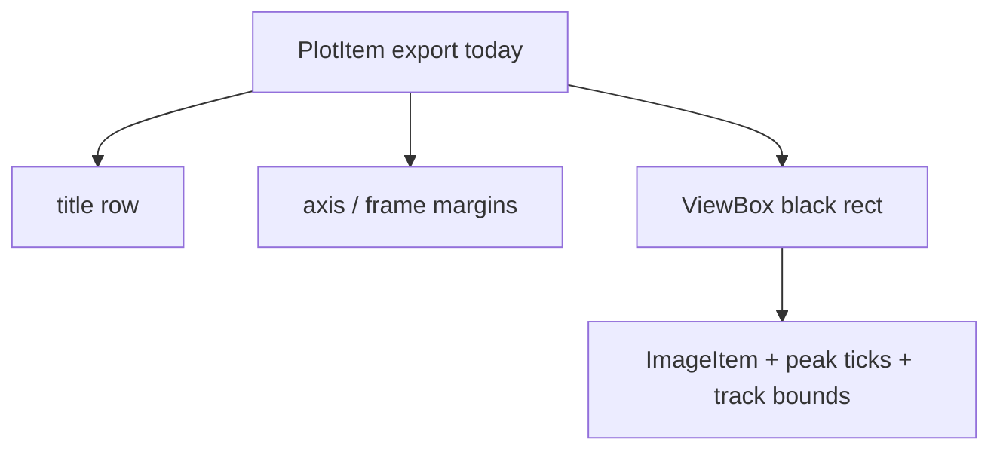

# Export only the black heatmap rect (no titles/frames)

## Why titles/white borders appear

[`save_figure`](h:/TEMP/Spike3DEnv_ExploreUpgrade/Spike3DWorkEnv/pyPhoPlaceCellAnalysis/src/pyphoplacecellanalysis/GUI/PyQtPlot/Widgets/ContainerBased/TemplateDebugger.py) currently exports `a_win.plotItem`:

```python
export_pyqtgraph_plot(a_win.plotItem, savepath=export_file_path, **export_size_kwargs)
```

A `PlotItem` includes layout chrome outside the data ViewBox: title row (`visualize_heatmap_pyqtgraph` always `setTitle(...)`), axis slots, and plot frame. That produces the white top/bottom bars and title text in exports.

Track-bound lines and peak ticks live as children of the **ViewBox**, so exporting the ViewBox keeps them and drops title/frame chrome.

`prepare_for_publication` does **not** solve this — it still leaves titles on the PlotItem and only tweaks ViewBox padding/bg.



## Change

In [`TemplateDebugger.save_figure`](h:/TEMP/Spike3DEnv_ExploreUpgrade/Spike3DWorkEnv/pyPhoPlaceCellAnalysis/src/pyphoplacecellanalysis/GUI/PyQtPlot/Widgets/ContainerBased/TemplateDebugger.py):

1. Add `export_content_only: bool = True`.
2. Choose export target:
   - `True` → `a_win.getViewBox()`
   - `False` → keep `a_win.plotItem`
3. When `export_content_only=True` and `export_dimensions_px=(w, h)` is set, treat `(w, h)` as the **ViewBox content size**, not the full PlotWidget:
   - Measure chrome before resize: `chrome_w = a_win.width() - vb.width()`, `chrome_h = a_win.height() - vb.height()` (from ViewBox `sceneBoundingRect` mapped to widget/device pixels, after `processEvents`).
   - Resize the widget so the ViewBox lands at the requested content size:
     `a_win.setFixedSize(round(w) + chrome_w, round(h) + chrome_h)`
   - Pass `width=w, height=h` to `export_pyqtgraph_plot` (content dims only).
   - Restore prior widget size after export (same as today).
4. When `export_content_only=False`, keep current behavior: `setFixedSize(round(w), round(h))` on the whole PlotWidget and export PlotItem at `(w, h)`.

```python
export_item = a_win.getViewBox() if export_content_only else a_win.plotItem
# ... chrome-aware setFixedSize when export_content_only ...
export_pyqtgraph_plot(export_item, savepath=export_file_path, **export_size_kwargs)
```

Do **not** export bare `ImageItem` — that would drop sibling overlays (peak ticks, track bounds).

Do **not** permanently strip on-screen titles for sizing; inflate the widget by measured chrome so the ViewBox itself becomes `(w, h)` while chrome stays outside the exported rect.

## Usage

```python
template_debugger.save_figure(
    shared_output_file_prefix='output/2026-09-29',
    export_dimensions_px=(114.6818, 156.474),  # ViewBox content size when export_content_only=True
    export_content_only=True,  # default; black rect + lines only
)
```

No change needed in `export_pyqtgraph_plot` — it already accepts any graphics item; exporters use `sceneBoundingRect()`.

## Out of scope

- Changing on-screen dock titles / white dock chrome
- `prepare_for_publication` ViewBox white background
- Display-fn `sess_config` wiring
