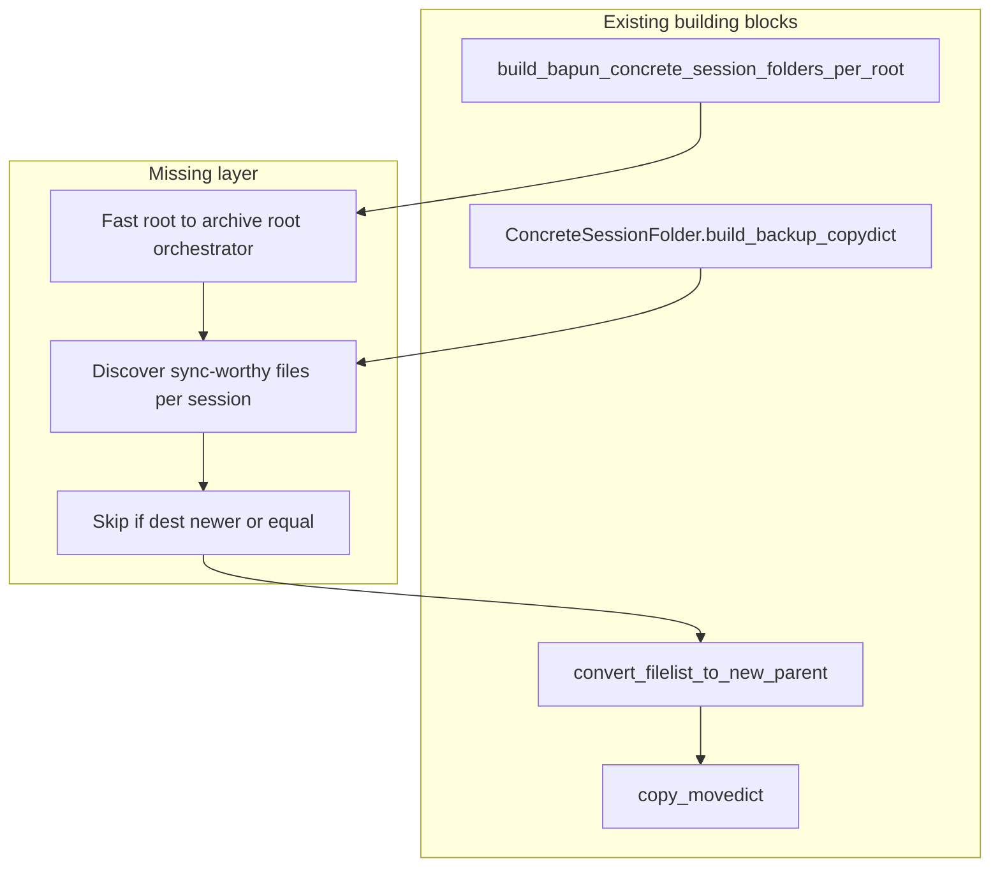

# Fast-to-slow computed-results sync

## What already exists (partial implementations)

Your codebase already has **~80% of the plumbing**, but nothing performs **fast→slow hierarchical sync** end-to-end.

| Location | What it does | Gap vs your goal |
|---|---|---|
| [`path_helpers.py`](h:/TEMP/Spike3DEnv_ExploreUpgrade/Spike3DWorkEnv/pyPhoCoreHelpers/src/pyphocorehelpers/Filesystem/path_helpers.py) | `generate_copydict`, `copy_movedict`, `convert_filelist_to_new_parent`, `discover_data_files` | Docstring example mirrors **slow→fast** (`/media/MAX/Data` → `/home/halechr/FastData`). Filters by absolute cutoff date, not per-file src-vs-dest mtime. |
| [`runBatch.py` → `ConcreteSessionFolder.build_backup_copydict`](h:/TEMP/Spike3DEnv_ExploreUpgrade/Spike3DWorkEnv/pyPhoPlaceCellAnalysis/src/pyphoplacecellanalysis/General/Batch/runBatch.py) | Knows core result files: `loadedSessPickle.pkl`, `output/global_computation_results.pkl`, `output/pipeline_results.h5` | Dest modes are **flat** (`CommonTargetDirectory`) or **rename-in-place** — not cross-root hierarchy preservation. |
| [`AcrossSessionResults.copy_session_folder_files_to_target_dir`](h:/TEMP/Spike3DEnv_ExploreUpgrade/Spike3DWorkEnv/pyPhoPlaceCellAnalysis/src/pyphoplacecellanalysis/SpecificResults/AcrossSessionResults.py) | Copies session outputs into `collected_outputs` with renamed basenames | Flat archive layout, not “corresponding directory”. |
| [`AcrossSessionHelpers._copy_exported_files_from_session_folder_to_collected_outputs`](h:/TEMP/Spike3DEnv_ExploreUpgrade/Spike3DWorkEnv/pyPhoPlaceCellAnalysis/src/pyphoplacecellanalysis/SpecificResults/AcrossSessionResults.py) | Glob-based extraction to `collected_outputs` | Same flat-layout limitation. |
| [`ProcessBatchOutputs_Bapun_Batch.ipy`](h:/TEMP/Spike3DEnv_ExploreUpgrade/Spike3DWorkEnv/Spike3D/ProcessBatchOutputs_Bapun_Batch.ipy) | `resolve_bapun_session_folder_and_root` / `build_bapun_concrete_session_folders_per_root` — per-session **fast-first** root resolution | Resolves where to **read/compute**, not where to **write results back**. Imports `generate_copydict`/`copy_movedict` but does not call them in the main flow. |
| [`symbolic_link_helpers.py`](h:/TEMP/Spike3DEnv_ExploreUpgrade/Spike3DWorkEnv/pyPhoCoreHelpers/src/pyphocorehelpers/Filesystem/symbolic_link_helpers.py) | `make_specific_items_local`, `SymlinkManager` | Alternative strategy (materialize via symlinks); unused in batch pipelines. |
| [`backup_previous_session_files_completion_function`](h:/TEMP/Spike3DEnv_ExploreUpgrade/Spike3DWorkEnv/pyPhoPlaceCellAnalysis/src/pyphoplacecellanalysis/General/Batch/BatchJobCompletion/UserCompletionHelpers/batch_user_completion_helpers.py) | In-place backup with suffix | Same-folder versioning, not cross-disk sync. |

**No `sync_results` / `migrate_results` function exists.** Closest named items are pickle-schema migration (`migrate_session_batch_output`) and path remapping (`BatchRun.change_global_root_path`, in-memory only).



---

## Target behavior (your choices)

- **Layout:** preserve session hierarchy  
  `fast_root/Bapun/RatS/Day4OpenField/...` → `archive_root/Bapun/RatS/Day4OpenField/...`
- **Files (default):**
  1. Core pipeline outputs (existing `ConcreteSessionFolder` keys): `loadedSessPickle.pkl`, `output/global_computation_results.pkl`, `output/pipeline_results.h5`
  2. Session preprocessing / first-build artifacts in the session folder: `{session_stem}*.npy` (covers `.neurons.npy`, `.position.npy`, `.probegroup.npy`, `.paradigm.npy`, and generated files like `.flattened.spikes.npy`, `.maze1.linear.npy`, `.ripple.npy` per [Bapun folder docstring](h:/TEMP/Spike3DEnv_ExploreUpgrade/Spike3DWorkEnv/NeuroPy/neuropy/core/session/Formats/Specific/BapunDataSessionFormat.py))
- **Copy only what's needed:** copy when src exists and (dest missing **or** src mtime > dest mtime); skip otherwise
- **Safety:** require archive session basedir to already exist (canonical slow storage should already hold raw session data + `.xml`); only create missing parent dirs for individual files (`copy_file` already does this)

---

## Proposed API

### 1) Generic helpers in [`path_helpers.py`](h:/TEMP/Spike3DEnv_ExploreUpgrade/Spike3DWorkEnv/pyPhoCoreHelpers/src/pyphocorehelpers/Filesystem/path_helpers.py)

Add two small functions (reuse `FilesystemMetadata.get_last_modified_time` already used by `generate_copydict`):

```python
def filter_copydict_to_outdated_destinations(file_copydict: Dict[Path, Path], skip_if_dest_newer_or_equal: bool = True) -> Dict[Path, Path]:
    """Drop entries where dest exists and is >= src mtime."""

def build_cross_root_copydict(source_files: List[Path], source_data_root: Path, dest_data_root: Path, skip_if_dest_newer_or_equal: bool = True) -> Dict[Path, Path]:
    """Map source_files to dest via convert_filelist_to_new_parent, then filter to outdated/missing dest."""
```

These invert the existing slow→fast docstring pattern without changing `generate_copydict` semantics.

### 2) Session file discovery in [`runBatch.py`](h:/TEMP/Spike3DEnv_ExploreUpgrade/Spike3DWorkEnv/pyPhoPlaceCellAnalysis/src/pyphoplacecellanalysis/General/Batch/runBatch.py)

Extend `ConcreteSessionFolder` with:

```python
def discover_syncable_result_files(self, include_preprocessing_npy: bool = True, extra_globs: Optional[List[str]] = None) -> List[Path]:
    """Return extant paths: core pipeline files + optional {session_stem}*.npy in session root."""

@classmethod
def build_cross_root_results_sync_copydict(cls, fast_session_folders: List[ConcreteSessionFolder], session_fast_roots: Dict[IdentifyingContext, Path], archive_data_root: Path, include_preprocessing_npy: bool = True, skip_if_dest_newer_or_equal: bool = True, ...) -> Dict[Path, Path]:
    """For each session: map fast basedir -> archive basedir, discover files, filter, return copydict."""
```

Implementation notes:
- Derive `session_stem` from existing `.xml` glob in session folder (same logic as Bapun format)
- Reuse the existing `src_files_dict` structure from `build_backup_copydict` for core pipeline files instead of duplicating path properties
- For each session, skip when `session_fast_roots[ctx].resolve() == archive_data_root.resolve()`
- Skip sessions whose archive basedir does not exist (log warning with context + expected archive path)

### 3) High-level orchestrator (same file or thin wrapper module)

```python
def sync_computed_session_results_to_archive_root(fast_session_folders, session_fast_roots, archive_data_root, dry_run: bool = False, print_progress: bool = True, ...) -> Tuple[Dict[Path, Path], Optional[Dict[Path, Path]]]:
    """Build copydict, optionally execute copy_movedict, return (planned_copydict, moved_files_dict_or_None)."""
```

Optional: persist planned copydict via existing `save_copydict_to_text_file` for audit/dry-run review (same pattern as `copy_session_folder_files_to_target_dir`).

---

## Path configuration (reuse, don't duplicate)

Do **not** introduce a new global path registry in this pass. Accept parameters from callers:

- **Fast roots:** `session_global_data_root_parent_paths` from [`build_bapun_concrete_session_folders_per_root`](h:/TEMP/Spike3DEnv_ExploreUpgrade/Spike3DWorkEnv/Spike3D/ProcessBatchOutputs_Bapun_Batch.ipy) (list order = fast → slow)
- **Archive root:** explicit `archive_data_root` argument — typically the **slow/canonical** root (e.g. last extant entry in `known_global_data_root_parent_paths`, or a dedicated `W:/Data` / turbo path depending on machine)

Example caller pattern in Bapun batch notebook (post-compute phase):

```python
archive_data_root = find_first_extant_path([Path(r'/nfs/turbo/umms-kdiba/Data'), Path(r'W:/Data')])
planned, moved = sync_computed_session_results_to_archive_root(good_session_concrete_folders, session_global_data_root_parent_paths, archive_data_root, dry_run=True)
# review planned, then dry_run=False
```

---

## Integration points (optional follow-ups, not required for core function)

1. **Batch completion callback** in [`batch_user_completion_helpers.py`](h:/TEMP/Spike3DEnv_ExploreUpgrade/Spike3DWorkEnv/pyPhoPlaceCellAnalysis/src/pyphoplacecellanalysis/General/Batch/BatchJobCompletion/UserCompletionHelpers/batch_user_completion_helpers.py) — per-session sync after each job (heavier I/O during batch) vs notebook post-batch sync (recommended default)
2. **Jupyter dry-run widget** — wrap with existing [`DryRunExecutionWidget`](h:/TEMP/Spike3DEnv_ExploreUpgrade/Spike3DWorkEnv/pyPhoCoreHelpers/src/pyphocorehelpers/gui/Jupyter/IPythonDryrunExecutionWidget.py) pattern

---

## Verification

1. Pick one Bapun session computed on a fast root with a matching folder on archive root
2. Run with `dry_run=True`; confirm copydict maps e.g.  
   `K:/scratch/.../Bapun/RatS/Day4OpenField/output/global_computation_results.pkl` → `W:/Data/.../Bapun/RatS/Day4OpenField/output/global_computation_results.pkl`
3. Re-run dry_run; confirm **zero** entries when dest is up to date
4. Touch a src file (or recompute one session); confirm only changed files appear
5. Confirm sessions where `fast_root == archive_root` are skipped entirely

---

## Files to change

| File | Change |
|---|---|
| [`pyphocorehelpers/Filesystem/path_helpers.py`](h:/TEMP/Spike3DEnv_ExploreUpgrade/Spike3DWorkEnv/pyPhoCoreHelpers/src/pyphocorehelpers/Filesystem/path_helpers.py) | Add `filter_copydict_to_outdated_destinations`, `build_cross_root_copydict` |
| [`pyphoplacecellanalysis/General/Batch/runBatch.py`](h:/TEMP/Spike3DEnv_ExploreUpgrade/Spike3DWorkEnv/pyPhoPlaceCellAnalysis/src/pyphoplacecellanalysis/General/Batch/runBatch.py) | Add `discover_syncable_result_files`, `build_cross_root_results_sync_copydict`, `sync_computed_session_results_to_archive_root` on/near `ConcreteSessionFolder` |

No NeuroPy changes required for Bapun (session stem + `.npy` globs are sufficient). KDIBA generalization later could pull optional/generated specs from each format's `SessionFolderSpec`.
