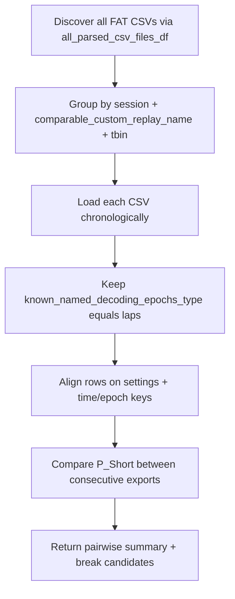

# Historical FAT `P_Short` Drift Comparison

## Goal
Detect when a code change broke exported lap marginals by comparing **`P_Short` only** across historical `*(FAT)*.csv` exports, matching **same settings** to each other, restricted to **`known_named_decoding_epochs_type == 'laps'`** (exclude `pbe` / `global`).

## Placement
Add the function to [`PendingNotebookCode.py`](h:/TEMP/Spike3DEnv_ExploreUpgrade/Spike3DWorkEnv/pyPhoPlaceCellAnalysis/src/pyphoplacecellanalysis/SpecificResults/PendingNotebookCode.py) (notebook overflow / diagnostic), reusing discovery helpers already in [`AcrossSessionResults.py`](h:/TEMP/Spike3DEnv_ExploreUpgrade/Spike3DWorkEnv/pyPhoPlaceCellAnalysis/src/pyphoplacecellanalysis/SpecificResults/AcrossSessionResults.py):
- `find_csv_files` / `find_most_recent_files` → use **`all_parsed_csv_files_df`** (full history), not most-recent-only
- Filter `file_type == 'FAT'`

## Notebook call site (required)
In [`PhoDibaPaper2024_FULL_ARCHIVE_2026-08-31.ipynb`](h:/TEMP/Spike3DEnv_ExploreUpgrade/Spike3DWorkEnv/Spike3D/EXTERNAL/PhoDibaPaper2024Book/PhoDibaPaper2024_FULL_ARCHIVE_2026-08-31.ipynb), add a new code cell **immediately after** the existing FAT setup that builds `most_recent_parsed_FAT_csv_files_df` / initializes `FAT_df` (the “Collecting Final FAT_CSV Results” area ~cells that already have `all_parsed_csv_files_df` and `collected_outputs_directory` in scope).

Call shape:

```python
from pyphoplacecellanalysis.SpecificResults.PendingNotebookCode import compare_historical_FAT_P_Short_across_exports

pairwise_FAT_P_Short_compare_df, FAT_P_Short_break_candidates_df = compare_historical_FAT_P_Short_across_exports(
    collected_outputs_directory=collected_outputs_directory,
    all_parsed_csv_files_df=all_parsed_csv_files_df,
    atol=1e-6,
    debug_print=True,
)
display(FAT_P_Short_break_candidates_df)
display(pairwise_FAT_P_Short_compare_df)
```

## Approach



### 1. Discover and group historical FAT files
- Input: `collected_outputs_directory` (or an existing `all_parsed_csv_files_df`)
- Keep groups with `n_exports >= 2` under keys already used by `get_only_most_recent_session_files`:
  - `session`, `_comparable_custom_replay_name`, `decoding_time_bin_size_str`
- Sort each group by `export_datetime` ascending
- Note: current `K:\scratch\collected_outputs` has only **2** multi-export settings groups (36 FAT files total, all dated 2026-09-01). The function still works; more history will surface automatically if restored.

### 2. Load + filter to laps / `P_Short`
For each CSV:
- `pd.read_csv(..., low_memory=False)`
- Require `P_Short` present; skip/report if missing
- Constrain to:
  - `known_named_decoding_epochs_type == 'laps'`
- Further partition within-file by **content settings** so unlike configs are never compared:
  - `data_grain`, `trained_compute_epochs`, `masked_time_bin_fill_type`, `decoder_identifier`

### 3. Align rows and compare only `P_Short`
For each consecutive export pair `(t_i, t_{i+1})` within a settings group + content partition:
- Inner-merge on stable row keys (use whichever exist):
  - Prefer: `['t_bin_center' or 't', 'epoch_id'/'parent_epoch_id', 'lap_idx'/'epoch_idx']` plus the content-settings columns above
- Compare `P_Short` left vs right:
  - `n_aligned`, `mean_abs_diff`, `max_abs_diff`, `corr`, `frac_changed` (abs diff > `atol`, default `1e-6`)
- Mark pair as **changed** if `max_abs_diff > atol` (or `frac_changed > 0`)

### 4. Breakpoint summary
Return a tidy `pairwise_compare_df` sorted by `export_datetime_b`, plus a compact `break_candidates_df` of first/largest changes per settings group — i.e. the export-time window where `P_Short` first diverges.

Suggested signature (single line preferred):

```python
def compare_historical_FAT_P_Short_across_exports(collected_outputs_directory: Optional[Path] = None, all_parsed_csv_files_df: Optional[pd.DataFrame] = None, atol: float = 1e-6, debug_print: bool = True) -> Tuple[pd.DataFrame, pd.DataFrame]:
```

## Non-goals
- No PBE/global comparisons
- No other numeric columns (`P_Long`, `P_LR`, etc.)
- No rewriting of existing FAT load path in `_new_process_csv_files`
