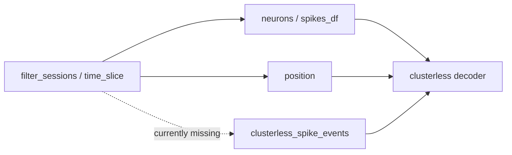

# Filter clusterless_spike_events on session filtering

## Problem

When a session is filtered to an epoch (e.g. `maze1` via the pipeline's `filter_sessions`), spike trains and position are correctly restricted to the epoch, but `clusterless_spike_events` is left untouched or dropped entirely.

This breaks clusterless decoding on filtered sessions: [`DefaultComputationFunctions.py`](file:///home/halechr/repos/pyPhoPlaceCellAnalysis/src/pyphoplacecellanalysis/General/Pipeline/Stages/ComputationFunctions/DefaultComputationFunctions.py) reads `sess.clusterless_spike_events` (lines 101–102) and passes it to `build_multiunits_from_spike_events` while using **filtered** position times for `t_start`/`t_end` (lines 163–169). If events are unfiltered, multiunits include spikes outside the filtered epoch.



## Root cause (two code paths)

### 1. [`DataSession.time_slice()`](file:///home/halechr/repos/NeuroPy/neuropy/core/session/dataSession.py) (lines 156–190)

Slices `neurons`, `position`, `flattened_spiketrains`, `ripple`, `pbe`, `laps`, `replay` — but **not** `clusterless_spike_events`. The attribute is copied via `to_dict()`/`deepcopy` but never sliced.

### 2. [`batch_filter_session()`](file:///home/halechr/repos/NeuroPy/neuropy/core/session/SessionSelectionAndFiltering.py) (lines 119–228)

Used by pipeline epoch filters (`_filter_function_factory` → `build_custom_epochs_filters`). Builds a new `DataSession` with explicit kwargs and **does not pass** `clusterless_spike_events` at all, so filtered sessions lose the attribute even when the source session has it.

## Implementation plan

All changes in **NeuroPy** (minimal, focused diffs).

### A. Add multi-interval slicing to `ClusterlessSpikeEvents` (recommended)

[`ClusterlessSpikeEvents`](file:///home/halechr/repos/NeuroPy/neuropy/core/clusterless_spike_events.py) already has single-interval `time_slice()` (lines 242–245). Add a `time_sliced(t_start, t_stop)` method mirroring [`TimeSlicedMixin.time_sliced`](file:///home/halechr/repos/NeuroPy/neuropy/utils/mixins/time_slicing.py):

- Accept scalar or array `t_start`/`t_stop` (same contract as spikes)
- Build `start_stop_times_arr` and call `determine_event_interval_is_included(self.spike_times_sec, ...)`
- Return `_copy_with_mask(inclusion_mask, t_start=float(np.min(starts)), t_stop=float(np.max(stops)))`

This matches how `batch_filter_session` filters spikes: `filtered_spikes_df.spikes.time_sliced(epochs.starts, epochs.stops)`.

### B. Update `DataSession.time_slice()`

In [`dataSession.py`](file:///home/halechr/repos/NeuroPy/neuropy/core/session/dataSession.py), after the existing replay block (~line 188):

```python
if getattr(copy_sess, 'clusterless_spike_events', None) is not None:
    copy_sess.clusterless_spike_events = copy_sess.clusterless_spike_events.time_slice(active_epoch_times[0], active_epoch_times[1])
```

Same guard pattern as `ripple`/`pbe`/`laps`.

### C. Update `batch_filter_session()`

In [`SessionSelectionAndFiltering.py`](file:///home/halechr/repos/NeuroPy/neuropy/core/session/SessionSelectionAndFiltering.py):

1. Before building `filtered_sess`, if `getattr(sess, 'clusterless_spike_events', None)` is not None:
   - `filtered_clusterless = sess.clusterless_spike_events.time_sliced(epochs.starts, epochs.stops)`
2. Pass to constructor via kwargs:
   - `clusterless_spike_events=filtered_clusterless` (or `None` when absent)

Follow the existing single-line call style per project conventions.

### D. Tests

Extend [`tests/test_clusterless_spike_events.py`](file:///home/halechr/repos/NeuroPy/tests/test_clusterless_spike_events.py):

- `test_time_sliced_supports_multiple_intervals` — verify disjoint epoch intervals exclude gap spikes

Extend [`tests/test_neurons_metadata.py`](file:///home/halechr/repos/NeuroPy/tests/test_neurons_metadata.py) (already has `batch_filter_session` harness):

- Attach a small `ClusterlessSpikeEvents` object to the mock `sess`
- Assert `batch_filter_session` returns a session with sliced events (correct spike count/times and updated `t_start`/`t_stop`)

Optional lightweight test for `DataSession.time_slice()` using a minimal session with `clusterless_spike_events` set via kwargs (can live in `test_clusterless_spike_events.py`).

## Out of scope (not required for this fix)

- **pyPhoPlaceCellAnalysis changes** — fixing NeuroPy session filtering is sufficient; filtered `computation_result.sess` will carry correctly sliced events.
- **Disk fallback in computation** — if `clusterless_spike_events` is None, `_perform_clusterless_position_decoding_computation` still loads the full `.clusterless_spikes.npz` from disk (lines 103–108). That is a separate issue; this plan ensures filtered sessions retain a sliced in-memory copy so the fallback is not needed when the source session had events attached.
- **`get_neuron_type()` / lap splitting** — neuron-type filtering does not apply to clusterless events; lap-specific splitting via `Laps.build_lap_specific_lists` is a separate code path (if needed later).

## Verification

Run NeuroPy tests:

```bash
cd /home/halechr/repos/NeuroPy && uv run pytest tests/test_clusterless_spike_events.py tests/test_neurons_metadata.py -q
```

Manual sanity check (post-implementation): filter a loaded session to `maze1` and confirm `filtered_sess.clusterless_spike_events.n_spikes` is less than the global session and all `spike_times_sec` fall within the epoch bounds.
