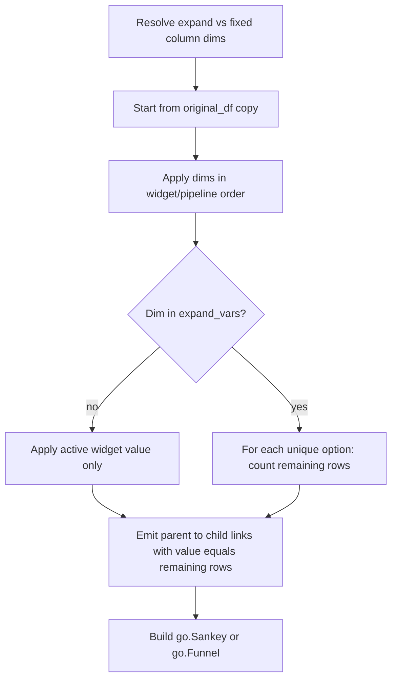

# Filter-impact Sankey / funnel for DataFrameFilter

## Goal
Visualize how filter choices change remaining dataframe row counts: start from unfiltered `n_rows`, then layer filters. Column-valued filters can either **branch** over all options or stay **fixed** at the current widget value. Render with **Plotly Sankey** (branching) or **funnel** (single active path).

## API (chosen)
Add one method on [`DataFrameFilter`](h:\TEMP\Spike3DEnv_ExploreUpgrade\Spike3DWorkEnv\pyPhoPlaceCellAnalysis\src\pyphoplacecellanalysis\SpecificResults\PhoDiba2023Paper.py):

```python
def build_filter_impact_flow_figure(self, df_name: Optional[str] = None,
    expand_vars: Optional[Sequence[str]] = None, fixed_vars: Optional[Sequence[str]] = None,
    chart: Literal['sankey', 'funnel'] = 'sankey', include_boolean_predicates: bool = True) -> go.Figure:
```

**Variable resolution** (column filter dimensions only — keys match `get_df_filter_active_constraint_dict` / widget `df_col_name`, e.g. `trained_compute_epochs`, `time_bin_size`):

- Pass **`expand_vars`**: those dimensions branch over unique DF values; all other column filters are fixed to the active widget value.
- Pass **`fixed_vars`**: those stay fixed; all other column filters expand.
- Pass **neither**: every column filter is fixed → single active path (funnel-friendly).
- Pass **both**: raise `ValueError` (ambiguous).
- Unknown names in either list: raise `ValueError` listing known dimensions.

Default `df_name`: active plot original name (`active_plot_df_name.removeprefix('filtered_')`), sourced from `original_df_dict`.

Boolean predicates (`high_wcorr`, etc.) are **never expanded**; when `include_boolean_predicates=True`, enabled ones appear as single fixed nodes on the path (on/off as currently selected).

## Data pipeline



1. **Discover dimensions** from existing widgets (reuse metadata already used by `get_df_filter_active_constraint_dict` ~3359–3423): `replay_name`/`custom_replay_name`, `time_bin_size`, plus each entry in `custom_dynamic_filter_widgets_list` (`metadata['df_col_name']`, options from widget `options`, active value from `widget.value`).
2. **Resolve** expand/fixed sets as above.
3. **Walk in stable order** matching the live filter pipeline: `custom_replay_name` → `time_bin_size` → custom dropdown/SelectMultiple widgets in `custom_dynamic_filter_widgets_list` order → then enabled boolean predicates from `additional_filter_predicates` (names not backed by a column widget).
4. **Count without mutating** live filter state: work on a boolean mask (or a lightweight column copy), never write `is_filter_included` on `original_df_dict` frames. For each node, remaining count = `mask.sum()` after applying that step’s constraint.
5. **Expanding a dim**: for each option `v` in widget options, child remaining = rows under parent mask that also match `col == v` (or `.isin` for multi-select options treated as single-value branches). Emit one Sankey link parent→`{dim}={v}` with `value=remaining` (**skip zero-remaining** links).
6. **Fixed dim**: one child only, using active widget value; same link emission.
7. **Sankey node labels**: `unfiltered (N)` then `{dim}={value} (n_remaining)` so counts are readable on the chart.
8. **Funnel mode**: only valid when the resolved expand set is empty (active path). Map sequential remaining counts to `go.Funnel` stages. If `chart='funnel'` but expand set non-empty → raise `ValueError` telling the user to use Sankey or clear expand.

## Plot construction
Keep Plotly figure building next to the count walker on `DataFrameFilter` (no new module). Use `plotly.graph_objects` already imported in this file:

- Sankey: `go.Sankey(node=dict(label=...), link=dict(source=..., target=..., value=...))`
- Funnel: `go.Funnel(y=stage_labels, x=remaining_counts)`

Return a plain `go.Figure` (caller can `.show()` or wrap in `FigureWidget`). **Do not** auto-wire into `display()` or filter-change callbacks in this pass.

## Touch points
Single primary file: [`PhoDiba2023Paper.py`](h:\TEMP\Spike3DEnv_ExploreUpgrade\Spike3DWorkEnv\pyPhoPlaceCellAnalysis\src\pyphoplacecellanalysis\SpecificResults\PhoDiba2023Paper.py)

- Small private helpers on `DataFrameFilter`:
  - `_iter_column_filter_dimensions()` → ordered list of `{name, df_col_name, options, active_value, is_multi}`
  - `_resolve_expand_fixed_vars(expand_vars, fixed_vars, all_dim_names)` → `(expand_set, fixed_set)`
  - `_build_filter_impact_flow_graph(...)` → nodes/links or stage list
  - public `build_filter_impact_flow_figure(...)` → `go.Figure`
- Reuse constraint semantics consistent with widget predicates (`astype(str)` compare / `.isin` for multi) and with [`constrain_df_cols`](h:\TEMP\Spike3DEnv_ExploreUpgrade\Spike3DWorkEnv\NeuroPy\neuropy\utils\indexing_helpers.py) (~1726+), but implement mask application locally so alternatives can be evaluated without rebuilding lambdas.

## Out of scope
- Notebook edits
- Auto-refresh on `_on_widget_change`
- Full combinatorial expansion of boolean predicates
- Changing existing DataGrid / `step_by_step_predicate_filtered_row_counts_dict` behavior

## Usage example (after implement)
```python
fig = df_filter.build_filter_impact_flow_figure(
    expand_vars=['trained_compute_epochs', 'known_named_decoding_epochs_type'],
    chart='sankey')
fig.show()

# Equivalent: fix everything except those two
fig = df_filter.build_filter_impact_flow_figure(
    fixed_vars=['custom_replay_name', 'time_bin_size', 'decoder_identifier', 'masked_time_bin_fill_type'],
    chart='sankey')

# Active path only
fig = df_filter.build_filter_impact_flow_figure(chart='funnel')
```
