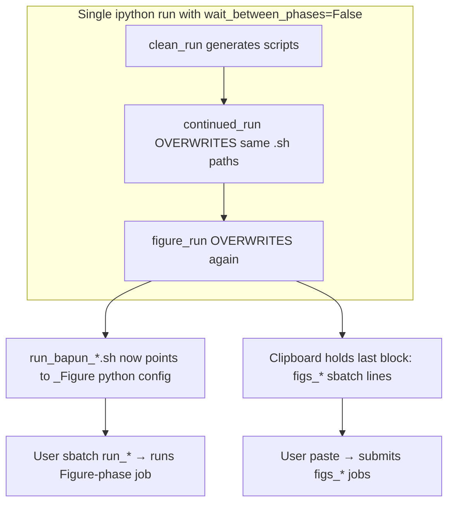
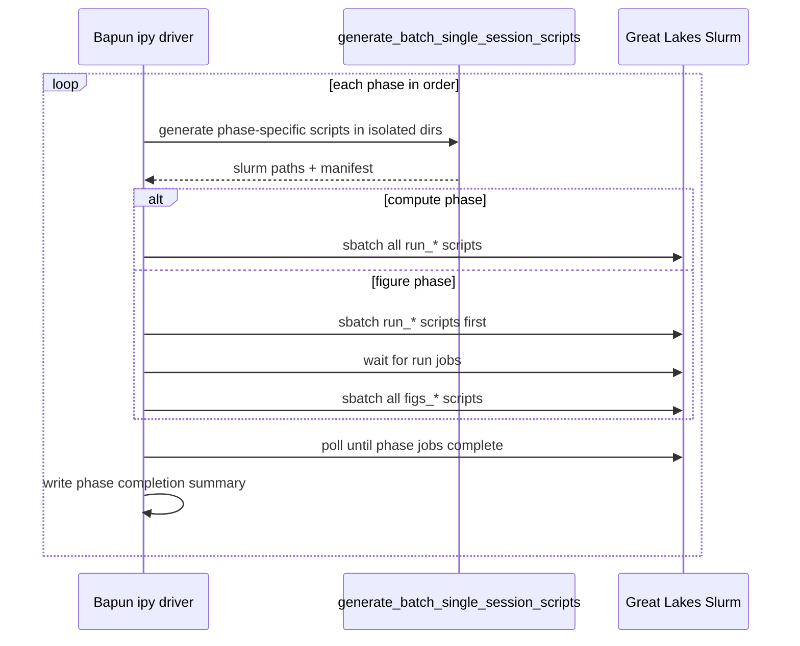

# Fix Bapun Batch Driver for Great Lakes

## Root cause diagnosis

Your terminal output confirms three independent failure modes that combine into "running the wrong thing":



### 1. Phase script collision (primary bug)

[`generate_batch_single_session_scripts`](h:/TEMP/Spike3DEnv_ExploreUpgrade/Spike3DWorkEnv/pyPhoPlaceCellAnalysis/src/pyphoplacecellanalysis/General/Batch/pythonScriptTemplating.py) writes phase-specific **Python** files but phase-agnostic **Slurm/shell** wrappers:

| Artifact | Naming today | Includes phase suffix? |
|---|---|---|
| Run Python | `run_{session}_{job_suffix}.py` | Yes (`_Clean`, `_Continued`, `_Figure`) |
| Run Slurm | `run_{session}.sh` | **No — overwritten each phase** |
| Figures Python | `figures_{session}.py` | **No — overwritten each phase** |
| Figures Slurm | `figs_{session}.sh` | **No — overwritten each phase** |
| Output dir | `run_{session}/` | **No — shared across phases** |

After all 3 phases finish in one invocation, `run_bapun_RatN_Day4OpenField.sh` invokes the **Figure-phase** Python script even though the filename looks generic.

The KDIBA workflow in [`ProcessBatchOutputs.ipy`](h:/TEMP/Spike3DEnv_ExploreUpgrade/Spike3DWorkEnv/Spike3D/ProcessBatchOutputs.ipy) avoids this by setting `active_phase` manually and running **one phase per notebook execution**. The Bapun driver loops all phases with `wait_between_phases=False`, destroying the intended workflow.

### 2. Misleading submission UX

In [`ProcessBatchOutputs_Bapun_Batch.ipy`](h:/TEMP/Spike3DEnv_ExploreUpgrade/Spike3DWorkEnv/Spike3D/ProcessBatchOutputs_Bapun_Batch.ipy):

- `also_show_figure_script_outputs=True` prints `figs_*` sbatch lines during **clean_run** and **continued_run** when those jobs should not run yet.
- `copy_to_clipboard()` is unreliable over SSH and is overwritten each phase; the final clipboard always holds **figure_run figs commands**.
- `enable_auto_code_block_execution=False` so nothing is actually submitted by the driver.
- `execute_code_block()` fires a single multiline shell string and does not capture Slurm job IDs — unsuitable for orchestration.

The garbled paste lines (`utput/gen_scripts/...`) are consistent with corrupted multi-line clipboard paste in bash, not separate Slurm misconfiguration.

### 3. Slurm jobs activate the wrong venv

[`slurm_template.sh.j2`](h:/TEMP/Spike3DEnv_ExploreUpgrade/Spike3DWorkEnv/pyPhoPlaceCellAnalysis/src/pyphoplacecellanalysis/Resources/Templates/slurm_template.sh.j2) hardcodes:

```bash
source '/home/halechr/repos/Spike3D/.venv/bin/activate'
```

You run from `Spike3D_ExploreEnv` (`/gpfs/.../Spike3D_ExploreEnv/Spike3D/.venv`). Submitted jobs may silently use a stale/missing environment.

### 4. Missing computation phase

`phases_to_run` is `[clean_run, continued_run, figure_run]` — **`final_run` is skipped**. Yet `figure_run` carries phase-3 extended computations (wcorr shuffle, extended PF peak info, directional train/test split, etc.) in its generated **run** scripts, while the driver only submits **figs** scripts in that phase. Those computations never run unless they were already satisfied by earlier phases.

### 5. Configuration mismatches

- `included_qclu_values=[1,2,4,6,7,8,9]` but `override_custom_pickle_suffix` hardcodes `qclu_[1, 2]` — pickle reload will not match analysis qclus.
- `minimum_inclusion_fr_Hz=1.0` but pickle suffix references `frateThresh_5.0` pattern from KDIBA templates.
- RatU / RatK session folders reported missing on turbo (`build_session_basedirs_dict: no extant folder`) — jobs will fail at session load unless paths are corrected or sessions excluded.

---

## Target architecture (sequential auto-submit)



Phases: **`clean_run → continued_run → final_run → figure_run`** (restore `final_run` so phase-3 compute runs before figures; keep Bapun-specific completion functions).

---

## Implementation plan

### A. Library fixes — [`pythonScriptTemplating.py`](h:/TEMP/Spike3DEnv_ExploreUpgrade/Spike3DWorkEnv/pyPhoPlaceCellAnalysis/src/pyphoplacecellanalysis/General/Batch/pythonScriptTemplating.py)

1. **Phase-safe naming** (minimal, backward-compatible):
   - Slurm/bash run wrapper: `run_{curr_session_complete_identifier}.sh` (matches Python target)
   - Figures Python: `figures_{curr_session_complete_identifier}.py`
   - Figures Slurm: `figs_{curr_session_complete_identifier}.sh`
   - Keep directory as `run_{session}/` for VSCode workspace compatibility, but filenames inside are unique per phase.

2. **Optional phase subdirectory** (used by Bapun driver):
   - Add kwarg `batch_script_subdirectory: Optional[str] = None` (e.g. `"clean_run"`) appended to `curr_batch_script_rundir` when set.
   - Bapun driver passes `active_phase.name` so phases never overwrite each other even if re-run.

3. **Dynamic venv path for Slurm/bash templates**:
   - Derive `venv_activate_path` from `Path(sys.executable).resolve().parent.parent / 'bin/activate'` at generation time.
   - Pass into `slurm_template.render(...)` and `bash_template.render(...)`.

### B. Template fixes

- [`slurm_template.sh.j2`](h:/TEMP/Spike3DEnv_ExploreUpgrade/Spike3DWorkEnv/pyPhoPlaceCellAnalysis/src/pyphoplacecellanalysis/Resources/Templates/slurm_template.sh.j2): replace hardcoded `source` with `source '{{ venv_activate_path }}'`
- [`bash_template.sh.j2`](h:/TEMP/Spike3DEnv_ExploreUpgrade/Spike3DWorkEnv/pyPhoPlaceCellAnalysis/src/pyphoplacecellanalysis/Resources/Templates/bash_template.sh.j2): same fix (currently uses incorrect `sh '.../activate'`)

### C. Bapun driver restructure — [`ProcessBatchOutputs_Bapun_Batch.ipy`](h:/TEMP/Spike3DEnv_ExploreUpgrade/Spike3DWorkEnv/Spike3D/ProcessBatchOutputs_Bapun_Batch.ipy)

1. **Add Slurm orchestration helpers** (top of file):
   - `submit_slurm_scripts(paths) -> List[int]` — one `sbatch` per script, parse job IDs from stdout
   - `wait_for_slurm_jobs(job_ids, poll_seconds=60)` — poll `squeue -j {ids} -h` until empty; on failure print `sacct` summary
   - `write_phase_manifest(phase, run_paths, figs_paths, job_ids, output_dir)` — write `submit_clean_run.sh` / `submit_figure_run_figs.sh` and a JSON manifest for audit/re-run

2. **Rewrite `process_all_phases` loop**:
   - Default `wait_between_phases=True` only when `enable_auto_code_block_execution=False` (manual fallback)
   - When auto mode enabled:
     - Generate scripts with `batch_script_subdirectory=active_phase.name`
     - **clean_run / continued_run / final_run**: submit `output_slurm_scripts['run']`, wait
     - **figure_run**: submit `run` scripts first (phase-3 compute), wait; then submit `figs`, wait
   - Set `also_show_figure_script_outputs=False` by default; only print figs lines in figure phase
   - Stop using clipboard as primary UX; keep optional `copy_to_clipboard` behind `copy_commands_to_clipboard=False`

3. **Preflight validation block** (before phase loop):
   - Assert each session `basedir` exists and contains the sole `.xml` file
   - Fail fast with actionable paths for RatU/RatK (or exclude with explicit comment)
   - Print resolved `scripts_output_path`, `global_data_root_parent_path`, `sys.executable`

4. **Fix Bapun configuration alignment**:
   - Build `override_custom_pickle_suffix` from actual `included_qclu_values` and `minimum_inclusion_fr_Hz`
   - Restore `final_run` in default `phases_to_run`
   - Set Great Lakes-friendly defaults at bottom:
     ```python
     enable_auto_code_block_execution = True
     wait_between_phases = False  # auto mode handles gating via Slurm wait
     also_show_figure_script_outputs = False
     phases_to_run = [clean_run, continued_run, final_run, figure_run]
     ```

5. **Improve `execute_code_block`** to delegate to `submit_slurm_scripts` + `wait_for_slurm_jobs` rather than one opaque shell string.

### D. Verification on Great Lakes

After implementation, dry-run checklist:

1. Run driver with `included_session_contexts` limited to **RatN + RatS** (known-good paths) and `phases_to_run=[clean_run]` first.
2. Confirm generated paths look like:
   `.../gen_scripts/run_bapun_RatN_Day4OpenField/clean_run/run_bapun_RatN_Day4OpenField__..._Clean.sh`
3. Confirm `squeue` job names include `_Clean` suffix (from `#SBATCH --job-name`) and **not** `figs_*` during clean phase.
4. Inspect one generated `.sh` file: venv `source` points to active `Spike3D_ExploreEnv` venv.
5. After job completes, inspect `slurm_*.out` for successful `BapunBatchHelpers.run_all` preflight and batch completion.
6. Run full 4-phase pipeline once RatU/RatK data paths are confirmed.

---

## Files to change

| File | Change |
|---|---|
| [`pythonScriptTemplating.py`](h:/TEMP/Spike3DEnv_ExploreUpgrade/Spike3DWorkEnv/pyPhoPlaceCellAnalysis/src/pyphoplacecellanalysis/General/Batch/pythonScriptTemplating.py) | Phase-safe slurm/figures naming; optional phase subdir; venv path injection |
| [`slurm_template.sh.j2`](h:/TEMP/Spike3DEnv_ExploreUpgrade/Spike3DWorkEnv/pyPhoPlaceCellAnalysis/src/pyphoplacecellanalysis/Resources/Templates/slm_template.sh.j2) | Parameterized venv activation |
| [`bash_template.sh.j2`](h:/TEMP/Spike3DEnv_ExploreUpgrade/Spike3DWorkEnv/pyPhoPlaceCellAnalysis/src/pyphoplacecellanalysis/Resources/Templates/bash_template.sh.j2) | Parameterized venv activation |
| [`ProcessBatchOutputs_Bapun_Batch.ipy`](h:/TEMP/Spike3DEnv_ExploreUpgrade/Spike3DWorkEnv/Spike3D/ProcessBatchOutputs_Bapun_Batch.ipy) | Sequential auto-submit orchestration, preflight, config fixes, restored final_run |

No changes to Bapun completion helpers unless testing reveals Bapun-specific runtime errors after the pipeline runs correctly.

---

## Out of scope (follow-up if needed)

- Fixing missing RatU/RatK on-disk data layout (data ops, not driver code)
- Adding `sacct` email notifications or Neptune logging
- Parallel session submission within a phase (can add later via `sbatch` array or concurrent submit + shared wait)
