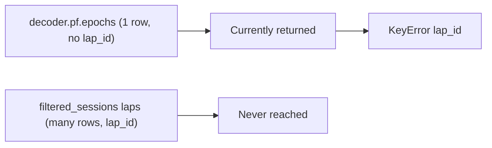

# Fix Bapun `lap_id` KeyError in train/test split

## Problem

Bapun mode fails at `split_into_training_and_test(..., group_column_name='lap_id')` because [`_resolve_bapun_train_test_split_laps_df`](h:/TEMP/Spike3DEnv_ExploreUpgrade/Spike3DWorkEnv/pyPhoPlaceCellAnalysis/src/pyphoplacecellanalysis/SpecificResults/PendingNotebookCode.py) returns `decoder.pf.epochs` whenever it is non-empty. For Bapun 2D, that is typically **one session-level epoch** (e.g. whole `roam` period) with no `lap_id`, so the fallback to `filtered_sessions[maze].laps` never runs.



## Fix (single file, ~40 lines)

**File:** [`PendingNotebookCode.py`](h:/TEMP/Spike3DEnv_ExploreUpgrade/Spike3DWorkEnv/pyPhoPlaceCellAnalysis/src/pyphoplacecellanalysis/SpecificResults/PendingNotebookCode.py)

### 1. Rewrite `_resolve_bapun_train_test_split_laps_df` (~12967)

**New resolution order** (lap-level sources first):

1. **Primary:** time-slice global session laps to the filtered maze window (same pattern as [`build_non_kdiba_directional_decoders`](h:/TEMP/Spike3DEnv_ExploreUpgrade/Spike3DWorkEnv/pyPhoPlaceCellAnalysis/src/pyphoplacecellanalysis/SpecificResults/PendingNotebookCode.py) ~5372):
   ```python
   a_sess = curr_active_pipeline.filtered_sessions[maze_name]
   laps_df = ensure_dataframe(deepcopy(curr_active_pipeline.sess.laps))
   a_prev_computation_epochs_df = laps_df.epochs.time_slice(a_sess.t_start, a_sess.t_stop)
   ```
2. **Fallback:** `ensure_dataframe(filtered_sessions[maze_name].laps)` if global laps unavailable or empty after slice.
3. **Last resort:** `pf_params.computation_epochs` or `decoder.pf.epochs` **only if** `'lap_id' in df.columns` (or `'lap' in df.columns` with rebuild).

**Normalize** before return:

```python
a_prev_computation_epochs_df = a_prev_computation_epochs_df.laps_accessor.get_valid_laps_epochs_df(rebuild_lap_id_columns=True)
```

This uses existing [`LapsAccessor.ensure_valid_laps_epochs_df`](h:/TEMP/Spike3DEnv_ExploreUpgrade/Spike3DWorkEnv/NeuroPy/neuropy/core/laps.py) to assign `lap_id` from index when missing.

Update docstring to reflect lap-first resolution (not pf-epochs-first).

### 2. Add small helper `_bapun_train_test_split_group_params(laps_df)` (~12977)

Returns `(group_column_name, identity_cols)` for the Bapun branch:

- `group_column_name`: `'lap_id'` if present, else `'lap'` if present, else raise `ValueError` with column list.
- `identity_cols`: `['label', group_column_name]` plus `'lap_dir'` only if column exists (same KDiba-safe pattern from original plan).

### 3. Update Bapun loop in `compute_train_test_split_epochs_decoders` (~13098)

Replace hard-coded:

```python
identity_cols = ['label', 'lap_id']
...
group_column_name='lap_id'
```

with:

```python
group_column_name, identity_cols = _bapun_train_test_split_group_params(a_prev_computation_epochs_df)
...
group_column_name=group_column_name
```

Keep KDiba branch unchanged (always has `lap_id`).

### 4. Optional docstring note

Add one line under Bapun usage: laps are resolved from `filtered_sessions` / time-sliced session laps, not session-level `pf.epochs`.

## Out of scope

- No notebook edits
- No changes to NeuroPy `epoch.py` or KDiba paths

## Verification

Re-run the failing notebook cell:

```python
train_test_result = compute_train_test_split_epochs_decoders(
    curr_active_pipeline=curr_active_pipeline,
    training_data_portion=5.0/6.0,
    debug_print=True,
)
```

Expect:

- `debug_print` shows `n_laps` >> 1 (e.g. ~100+ for OpenField), not 1
- `identity_cols` includes `'lap_id'`
- No `KeyError`
- `train_epochs_dict` keys match maze names (`roam`, `sprinkle`, etc.)
