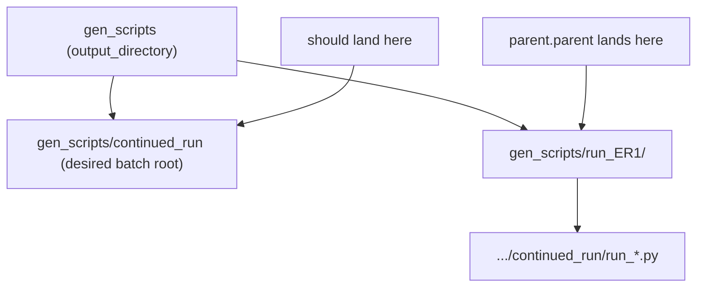

# Fix batch workspace/PowerShell output paths

## Root cause

Both [`build_vscode_workspace`](h:/TEMP/Spike3DEnv_ExploreUpgrade/Spike3DWorkEnv/pyPhoPlaceCellAnalysis/src/pyphoplacecellanalysis/General/Batch/pythonScriptTemplating.py) and [`build_windows_powershell_run_script`](h:/TEMP/Spike3DEnv_ExploreUpgrade/Spike3DWorkEnv/pyPhoPlaceCellAnalysis/src/pyphoplacecellanalysis/General/Batch/pythonScriptTemplating.py) infer the output folder via:

```python
top_level_script_folders_path = Path(script_paths[0]).resolve().parent.parent
```

With phased batch generation (`batch_script_subdirectory=active_phase.name`), per-session scripts live at:

```
gen_scripts/run_<session>/continued_run/run_<session>_<suffix>.py
```

So `parent.parent` resolves to **`gen_scripts/run_<first_session>/`** (wrong), not the intended batch root.



The VSCode workspace template also expects a `gen_scripts`-level cwd (`"powershell.cwd": "gen_scripts"`), reinforcing that the batch root must not be a single session folder.

## Target behavior (per your choice)

For phased runs with `batch_script_subdirectory='continued_run'`:

| Artifact | Current (wrong) | Correct |
|---|---|---|
| VSCode workspace | `gen_scripts/run_ER1/run_workspace.code-workspace` | `gen_scripts/continued_run/run_workspace.code-workspace` |
| PowerShell runner | `gen_scripts/run_ER1/run_scripts_continued_run.ps1` | `gen_scripts/continued_run/run_scripts_continued_run.ps1` |

For non-phased runs (`batch_script_subdirectory=None`), keep existing behavior: **`output_directory`** (`gen_scripts`).

## Implementation (minimal, in library)

All changes in [`pythonScriptTemplating.py`](h:/TEMP/Spike3DEnv_ExploreUpgrade/Spike3DWorkEnv/pyPhoPlaceCellAnalysis/src/pyphoplacecellanalysis/General/Batch/pythonScriptTemplating.py):

### 1. Add a small helper to compute batch root

```python
def resolve_batch_scripts_root_directory(output_directory: Path, batch_script_subdirectory: Optional[str] = None) -> Path:
    root = Path(output_directory).resolve()
    if batch_script_subdirectory:
        root = root.joinpath(batch_script_subdirectory)
    return root
```

Create the directory with `mkdir(parents=True, exist_ok=True)` before writing workspace/ps files.

### 2. Extend `BatchScriptsCollection`

Add field:

```python
batch_scripts_root_directory: Path = field(default=None)
```

Populate in `generate_batch_single_session_scripts` from `output_directory` + `batch_script_subdirectory`.

### 3. Update `build_vscode_workspace`

- Add optional kwarg `batch_scripts_root_directory: Optional[Path] = None`
- Replace `parent.parent` logic with resolved root
- Keep workspace folder list as: `[batch_root] + [each script parent dir]` (unchanged structure, corrected root entry)

Call site inside `generate_batch_single_session_scripts`:

```python
batch_root = resolve_batch_scripts_root_directory(output_directory, batch_script_subdirectory)
vscode_workspace_path = build_vscode_workspace(..., batch_scripts_root_directory=batch_root)
```

### 4. Update `build_windows_powershell_run_script`

- Add same optional `batch_scripts_root_directory` kwarg
- Write `{script_name}.ps1` under that root
- Fallback when kwarg is omitted: use `os.path.commonpath` across all script paths (fixes multi-session phased batches even for legacy notebook callers), with single-script fallback to `parent.parent` for backward compatibility

### 5. Update phased batch notebooks (2 call sites)

In [`ProcessBatchOutputs_NWB_WMaze_Batch.ipy`](h:/TEMP/Spike3DEnv_ExploreUpgrade/Spike3DWorkEnv/Spike3D/ProcessBatchOutputs_NWB_WMaze_Batch.ipy) and [`ProcessBatchOutputs_Bapun_Batch.ipy`](h:/TEMP/Spike3DEnv_ExploreUpgrade/Spike3DWorkEnv/Spike3D/ProcessBatchOutputs_Bapun_Batch.ipy), pass the root from the collection:

```python
batch_root = batch_scripts_collection.batch_scripts_root_directory
powershell_script_path = build_windows_powershell_run_script(
    script_paths, max_concurrent_jobs=max_parallel_executions,
    script_name=f'run_scripts_{active_phase.name}',
    batch_scripts_root_directory=batch_root,
)
```

Same for figure-script PowerShell calls.

No changes needed to per-session script generation paths (`run_<session>/<phase>/`).

## Verification

After re-running phase generation for one batch:

1. Confirm `W:/Data/Output/gen_scripts/continued_run/run_workspace.code-workspace` exists
2. Confirm `W:/Data/Output/gen_scripts/continued_run/run_scripts_continued_run.ps1` exists
3. Confirm nothing new is written under `gen_scripts/run_dandi_nwb_ER1_000978_SingleDay/`
4. Open workspace — root folder should be `continued_run`, with per-session script folders listed as children
5. Smoke-check non-phased notebook ([`ProcessBatchOutputs.ipy`](h:/TEMP/Spike3DEnv_ExploreUpgrade/Spike3DWorkEnv/Spike3D/ProcessBatchOutputs.ipy)) still writes to `gen_scripts/` when `batch_script_subdirectory` is unset
