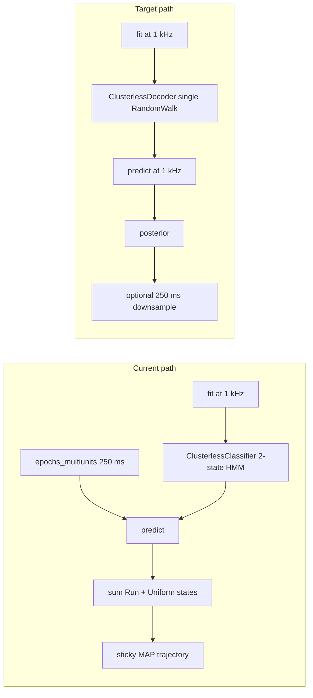

# Diagnose and fix sticky 2D clusterless lap decoding

## What you are seeing

Decoded position stays pinned for many 250 ms bins, then jumps — while measured position moves continuously. Your current setup is **119 bins over a ~30 s lap** (~0.25 s/bin), so this is not a 1 ms-resolution artifact.

The multiunits **shape/format is largely correct** for RTC: `(n_time, n_marks, n_electrodes)` with `NaN` = no spike and finite values = PC marks. That matches [RTC notebook 03](https://replay-trajectory-classification.readthedocs.io/en/latest/_copied_over/notebooks/03-Decoding_with_Clusterless_Spikes.html).

The problems are in **how the RTC model is configured and how lap epochs are re-binned before `predict()`**.

---

## Root causes (ranked)

### 1. Wrong RTC class for continuous running decode (highest impact)

[`ClusterlessRTCPositionDecoder._ensure_fitted_classifier`](h:\TEMP\Spike3DEnv_ExploreUpgrade\Spike3DWorkEnv\pyPhoPlaceCellAnalysis\src\pyphoplacecellanalysis\Analysis\Decoder\rtc_clusterless_decoder.py) builds a **`ClusterlessClassifier`**, not a **`ClusterlessDecoder`**:

```358:358:h:\TEMP\Spike3DEnv_ExploreUpgrade\Spike3DWorkEnv\pyPhoPlaceCellAnalysis\src\pyphoplacecellanalysis\Analysis\Decoder\rtc_clusterless_decoder.py
self.classifier = ClusterlessClassifier(environments=[environment], clusterless_algorithm="multiunit_likelihood", ...)
```

`ClusterlessClassifier` defaults to a **2-state HMM**:

| State | Continuous transition | Effect on position |
|-------|------------------------|-------------------|
| 0 | `RandomWalk(movement_var=6.0)` | can move |
| 1 | `Uniform()` | **frozen** (identity transition) |

With `state_index_for_posterior=None` (default in [`ClusterlessDecodingParameters`](h:\TEMP\Spike3DEnv_ExploreUpgrade\Spike3DWorkEnv\pyPhoPlaceCellAnalysis\src\pyphoplacecellanalysis\Analysis\Decoder\rtc_clusterless_adapters.py)), posteriors **sum both states**. The stationary `Uniform` state produces exactly the sticky-then-jump behavior you describe.

RTC docs for continuous position tracking use **`ClusterlessDecoder`** (single movement model). The commented-out correct setup in [`DefaultComputationFunctions.py`](h:\TEMP\Spike3DEnv_ExploreUpgrade\Spike3DWorkEnv\pyPhoPlaceCellAnalysis\src\pyphoplacecellanalysis\General\Pipeline\Stages\ComputationFunctions\DefaultComputationFunctions.py) (~lines 156–172) shows `estimate_movement_var` + `RandomWalk` — but it was never wired in.



---

### 2. Train at 1 kHz, decode at 250 ms (your confirmed setup)

**Training/fitting** uses dense 1 ms multiunits from [`build_multiunits_from_spike_events`](h:\TEMP\Spike3DEnv_ExploreUpgrade\Spike3DWorkEnv\pyPhoPlaceCellAnalysis\src\pyphoplacecellanalysis\Analysis\Decoder\rtc_clusterless_adapters.py) at `clusterless_sampling_frequency_hz=1000`.

**Lap decoding** re-aggregates via [`epochs_multiunits`](h:\TEMP\Spike3DEnv_ExploreUpgrade\Spike3DWorkEnv\pyPhoPlaceCellAnalysis\src\pyphoplacecellanalysis\Analysis\Decoder\rtc_clusterless_adapters.py) + [`_aggregate_multiunits_last_spike_in_windows`](h:\TEMP\Spike3DEnv_ExploreUpgrade\Spike3DWorkEnv\pyPhoPlaceCellAnalysis\src\pyphoplacecellanalysis\Analysis\Decoder\rtc_clusterless_adapters.py) to 250 ms rows, then calls `classifier.predict()` on those rows.

RTC's `multiunit_likelihood` assumes **each row is one model time step** (background rate scaled by `time_bin_size=1`). The encoding model's `mean_rates` are estimated from 1 ms rows. Feeding 250 ms rows without changing the temporal model breaks the Poisson background calibration.

Additionally, aggregation keeps **only the last spike per electrode per window**, discarding other spikes in the same 250 ms bin.

**Expected symptom:** long stretches where coarse rows are all-`NaN` (no observation → transition-only updates), then jumps when a window finally contains marks.

---

### 3. Movement variance never estimated at decoder clock

`movement_var` estimation is commented out in both:

- [`DefaultComputationFunctions._perform_clusterless_position_decoding_computation`](h:\TEMP\Spike3DEnv_ExploreUpgrade\Spike3DWorkEnv\pyPhoPlaceCellAnalysis\src\pyphoplacecellanalysis\General\Pipeline\Stages\ComputationFunctions\DefaultComputationFunctions.py)
- [`build_clusterless_training_data_from_pfnd`](h:\TEMP\Spike3DEnv_ExploreUpgrade\Spike3DWorkEnv\pyPhoPlaceCellAnalysis\src\pyphoplacecellanalysis\Analysis\Decoder\rtc_clusterless_adapters.py)

The classifier therefore keeps the RTC default `RandomWalk(movement_var=6.0)` per **1 ms step**, instead of data-driven variance from `estimate_movement_var(position, sampling_frequency=1000)`.

---

### 4. 2D flat-index bug when extracting most-likely (x, y)

RTC posteriors are flattened with **`order='F'`** throughout adapters/decoder. But [`perform_compute_most_likely_positions`](h:\TEMP\Spike3DEnv_ExploreUpgrade\Spike3DWorkEnv\pyPhoPlaceCellAnalysis\src\pyphoplacecellanalysis\Analysis\Decoder\reconstruction.py) uses default **`np.unravel_index` (C order)**:

```3099:3102:h:\TEMP\Spike3DEnv_ExploreUpgrade\Spike3DWorkEnv\pyPhoPlaceCellAnalysis\src\pyphoplacecellanalysis\Analysis\Decoder\reconstruction.py
most_likely_position_flat_indicies = np.argmax(flat_p_x_given_n, axis=0)
most_likely_position_indicies = np.array(np.unravel_index(most_likely_position_flat_indicies, original_position_data_shape))
```

PfND 2D occupancy uses `histogram2d` layout; RTC uses Fortran order. For a **41×63** grid this scrambles `(x_idx, y_idx)` when converting flat argmax → `xbin_centers`/`ybin_centers`. This corrupts plotted trajectories even when the posterior itself is reasonable.

(Your transition-matrix helpers already use PfND-consistent indexing: `flat = ix * n_y + iy`.)

---

### 5. Secondary issues (less likely alone, but worth checking)

- **Fit warnings** (`divide by zero in log` in `multiunit_likelihood`) seen in your developer notes → sparse/zero-occupancy bins weaken encoding.
- **`is_training` mask** excludes non-speed-filtered times during fit, but decode uses all lap times.
- **Silent length truncation** in `build_clusterless_training_data_from_pfnd` if resampled position and `rtc_time` lengths differ.
- **Visualization time mismatch** in RatN notebook: lap decode centers are lap-local (~33–63 s) while `TimeSynchronizedPositionDecoderPlotter` is fed full-session `curr_position_df` (~9000 s) — makes overlays look wrong even after decode is fixed.

---

## Quick diagnostics to run before changing code

Run on one lap (e.g. `lap_idx=10`) after reloading a fresh decoder:

1. **Coarse-bin spike coverage**
   - After `epochs_multiunits`, compute per-bin fraction of finite marks: `np.any(np.isfinite(coarse_mu), axis=(1,2)).mean()`
   - If many consecutive bins are all-`NaN`, stickiness is expected.

2. **Native 1 kHz decode on same lap**
   - Slice `decoder.multiunits` / `decoder.rtc_time` to lap bounds.
   - Call `decoder.decode(..., time_bin_size=0.001, rtc_time=lap_rtc_time)` **without** `epochs_multiunits`.
   - If 1 kHz decode tracks position but 250 ms decode does not → temporal aggregation mismatch confirmed.

3. **Posterior state inspection**
   - Inspect `decoder.rtc_results.acausal_posterior` per discrete `state` before summing.
   - If state 1 dominates → Classifier/HMM is the culprit.

4. **Flat-index sanity**
   - Compare `most_likely_positions` against manual F-order unravel of `argmax(flat_p_x_given_n)`.

---

## Recommended fixes (implementation order)

### A. Switch to `ClusterlessDecoder` for position decoding

In [`rtc_clusterless_decoder.py`](h:\TEMP\Spike3DEnv_ExploreUpgrade\Spike3DWorkEnv\pyPhoPlaceCellAnalysis\src\pyphoplacecellanalysis\Analysis\Decoder\rtc_clusterless_decoder.py):

- Import `ClusterlessDecoder`, `RandomWalk`, `estimate_movement_var`.
- Replace `ClusterlessClassifier` with `ClusterlessDecoder(environment=..., transition_type=RandomWalk(movement_var=mv), ...)`.
- Compute `mv = estimate_movement_var(resampled_position, sampling_frequency_hz)` in [`build_clusterless_training_data_from_pfnd`](h:\TEMP\Spike3DEnv_ExploreUpgrade\Spike3DWorkEnv\pyPhoPlaceCellAnalysis\src\pyphoplacecellanalysis\Analysis\Decoder\rtc_clusterless_adapters.py) and pass through `ClusterlessDecodingParameters`.
- Set `place_bin_size ≈ sqrt(mv)` per RTC docs (or keep `PfNDSyncedEnvironment` override).

### B. Decode at native 1 kHz; downsample posterior for laps

In [`decode_specific_epochs`](h:\TEMP\Spike3DEnv_ExploreUpgrade\Spike3DWorkEnv\pyPhoPlaceCellAnalysis\src\pyphoplacecellanalysis\Analysis\Decoder\rtc_clusterless_decoder.py):

- **Preferred:** slice fine `multiunits`/`rtc_time` to each lap epoch and call `predict` at 1 ms; then average/max-pool `p_x_given_n` to 250 ms bins for reporting.
- **Avoid:** passing 250 ms aggregated multiunits into a model trained on 1 ms rows.

Keep `decoding_time_bin_size=0.250` as a **reporting bin size**, not an RTC input bin size.

### C. Fix 2D most-likely index extraction

In `perform_compute_most_likely_positions` (or clusterless override), use PfND-consistent F-order unravel:

```python
np.unravel_index(flat_idx, shape, order='F')
```

Add a roundtrip test on a 41×63 grid (like your lap posterior).

### D. Tighten training/decode alignment

- Remove silent truncation in `build_clusterless_training_data_from_pfnd` (raise if lengths differ).
- Log `is_training.sum() / len(rtc_time)` and electrode keep-mask size at fit time.
- Optionally expose `state_index_for_posterior=0` as interim workaround if Classifier must stay temporarily.

---

## What is NOT the main problem

- **Tensor shape** `(n_time, 4, n_electrodes)` — correct RTC format.
- **`spikes_df=None` in lap decode** — correct for clusterless.
- **Phy PC mark extraction** in [`ClusterlessSpikeEvents`](h:\TEMP\Spike3DEnv_ExploreUpgrade\Spike3DWorkEnv\NeuroPy\neuropy\core\clusterless_spike_events.py) — structurally sound.

---

## Success criteria

After fixes A–C on the same RatN `roam` lap:

- `most_likely_positions` should move continuously with measured `(x, y)` at ~250 ms reporting resolution.
- 1 kHz and 250 ms-downsampled trajectories should agree qualitatively.
- Posterior heatmap peak should sweep across bins over the lap, not remain in one bin for multi-second blocks.
