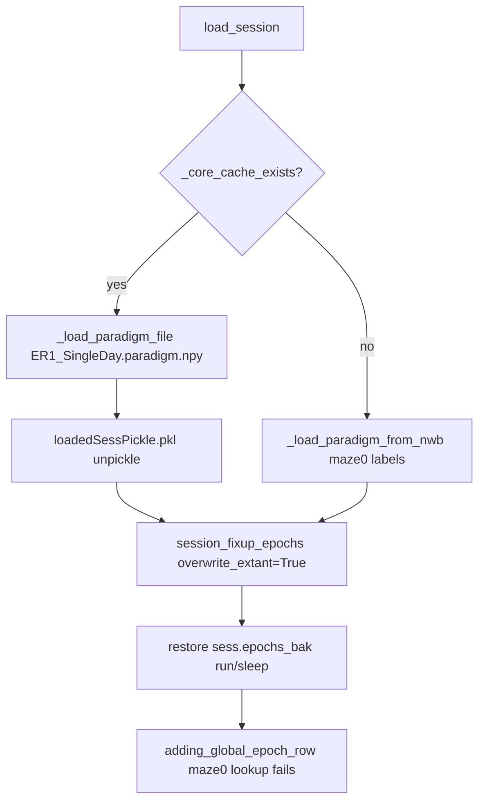

# Fix DANDI NWB stale epoch labels end-to-end

## Root cause (why updating `_load_paradigm_from_nwb` did nothing)

Your updated loader in [`NWBDataSessionFormat.py`](h:/TEMP/Spike3DEnv_ExploreUpgrade/Spike3DWorkEnv/NeuroPy/neuropy/core/session/Formats/Specific/NWBDataSessionFormat.py) only runs when the NWB cache is **missing**. In practice, epochs come from one of three stale sources:



| Source | Path / mechanism | Labels you likely have |
|--------|------------------|------------------------|
| **Paradigm cache** | `H:/Data/DANDI/SingleDayWTrackLearning/export/ER1/ER1_SingleDay.paradigm.npy` | `run`, `sleep` (written before your code change) |
| **Pipeline pickle** | `.../sub-JDS-SingleDay-ER1/loadedSessPickle.pkl` | Same + possibly `sess.epochs_bak` |
| **session_fixup restore** | `NWBDataSessionFormat.session_fixup_epochs(..., override_extant=True)` | Restores first snapshot into `epochs_bak` |

The notebook relabel cells (around the `epochs_df['label'] = ... maze0 ...` block) are a **fourth** path, but the save cell (`curr_active_pipeline.sess.epochs.save()`) may not run before `## NEW BATCH COMPUTE ALL`, and even if it does, `overwrite_extant=True` can undo it via `epochs_bak`.

Evidence: the warning `Could not compute NWB linear position for epoch 'run'` confirms cached labels are still `run`/`sleep`. [`_compute_linear_position_if_possible`](h:/TEMP/Spike3DEnv_ExploreUpgrade/Spike3DWorkEnv/NeuroPy/neuropy/core/session/Formats/Specific/NWBDataSessionFormat.py) only looks for `"run"`.

---

## Fix strategy

Centralize epoch labeling in one function, call it on **every** load path, auto-migrate stale files, and stop restoring incompatible `epochs_bak`.

### 1. Add canonical label standardization in NWB format

In [`NWBDataSessionFormat.py`](h:/TEMP/Spike3DEnv_ExploreUpgrade/Spike3DWorkEnv/NeuroPy/neuropy/core/session/Formats/Specific/NWBDataSessionFormat.py):

- Add `_standardize_alternating_run_sleep_epoch_labels(epochs_df) -> pd.DataFrame` — extract the logic already duplicated in:
  - `_load_paradigm_from_nwb` (lines ~302–304)
  - DANDI notebook manual relabel cell
- Add `_paradigm_labels_are_legacy(paradigm) -> bool` — true when labels are `run`/`sleep` (or missing expected `maze0`).
- Add `_ensure_standard_paradigm_epoch_labels(session, save_if_changed=True) -> session`:
  - If legacy labels detected: relabel, assign to `session.paradigm`, save to `ER1_SingleDay.paradigm.npy` if `save_if_changed`.
  - Clear `sess.epochs_bak` if present (backup is invalid after relabel).
  - Print a one-line migration notice.

Call sites (all paths covered):

```python
# After _load_paradigm_from_nwb
# After _load_paradigm_file (cache load)
# At start of session_fixup_epochs (before adding maze_GLOBAL)
```

Refactor `_load_paradigm_from_nwb` to use `_standardize_alternating_run_sleep_epoch_labels` instead of inline labeling.

### 2. Fix `session_fixup_epochs` restore logic

In [`NWBDataSessionFormat.session_fixup_epochs`](h:/TEMP/Spike3DEnv_ExploreUpgrade/Spike3DWorkEnv/NeuroPy/neuropy/core/session/Formats/Specific/NWBDataSessionFormat.py):

- **Always** run `_ensure_standard_paradigm_epoch_labels` first (handles cache + backup issues).
- Change `epochs_bak` behavior:
  - On first fixup: backup **after** standardization (not before).
  - On `overwrite_extant=True`: restore `epochs_bak` only if backup labels are compatible with `hardcoded_params.non_global_activity_session_names`; otherwise discard backup and re-standardize from current paradigm.
- Before `adding_global_epoch_row`: validate `maze0` and `maze8` exist; if not, raise a clear error listing actual labels (or auto-derive first/last maze from labels matching `maze\d+`).

### 3. Remove remaining `run`-label assumptions

In the same NWB format file:

- **`_compute_linear_position_if_possible`**: iterate maze epoch labels (`maze0`, `maze1`, … or any label starting with `maze`) instead of hard-coded `"run"`.
- **`build_filters_run_epochs` / `build_default_filter_functions`**: filter maze epochs (reuse hardcoded params or `label.str.startswith('maze')`) instead of `elem == "run"`.

### 4. Defensive improvement in epoch helper

In [`epoch.py` `adding_global_epoch_row`](h:/TEMP/Spike3DEnv_ExploreUpgrade/Spike3DWorkEnv/NeuroPy/neuropy/core/epoch.py) (~1824):

- Before `.tolist()[0]`, check match count; if zero, raise `ValueError` with `first_included_epoch_name`, `last_included_epoch_name`, and `list(self.get_unique_labels())`.

This prevents silent `IndexError` and makes future mismatches obvious.

### 5. Pickle migration on load

In [`NeuropyPipeline.try_init_from_saved_pickle_or_reload_if_needed`](h:/TEMP/Spike3DEnv_ExploreUpgrade/Spike3DWorkEnv/pyPhoPlaceCellAnalysis/src/pyphoplacecellanalysis/General/Pipeline/NeuropyPipeline.py) `_ensure_unpickled_pipeline_up_to_date`:

- For `format_name == 'dandi_nwb'`: call `NWBDataSessionFormatRegisteredClass._ensure_standard_paradigm_epoch_labels(curr_active_pipeline.sess, save_if_changed=True)`.
- If migration occurred: set `did_add_property = True` so pickle is re-saved with corrected epochs and without stale `epochs_bak`.

This auto-overwrites `loadedSessPickle.pkl` on next load when labels were wrong (per your preference).

### 6. Notebook cleanup (minimal)

In [`InteractivePipelineLoadFromPickle_DANDI_SingleDayWTrackLearning_sub-JDS-SingleDay-ER1.ipynb`](h:/TEMP/Spike3DEnv_ExploreUpgrade/Spike3DWorkEnv/Spike3D/InteractivePipelineLoadFromPickle_DANDI_SingleDayWTrackLearning_sub-JDS-SingleDay-ER1.ipynb):

- Mark the manual relabel + save cells as **deprecated** (comment: now handled by NWB format auto-migration), or remove them to avoid confusion.
- Add a small diagnostic cell before `## NEW BATCH COMPUTE ALL`:
  ```python
  print(curr_active_pipeline.sess.epochs.to_dataframe()['label'].tolist())
  ```
- Confirm `## NEW BATCH COMPUTE ALL` uses `active_data_mode_name=active_data_mode_name` (already fixed).

No need to manually run relabel cells after code changes.

### 7. One-time verification steps (after code deploy)

Run in notebook (no manual file deletion required if auto-migrate works):

1. Load with `force_reload=True` once (or load pickle — migration should trigger).
2. Confirm labels: `['maze0','sleep0',...,'maze8']` plus later `maze_GLOBAL`.
3. Run `final_process_bapun_all_comps` cell under `## NEW BATCH COMPUTE ALL`.

Optional sanity check on disk: open `ER1_SingleDay.paradigm.npy` labels after load — should show `maze0` not `run`.

---

## Files to change

| File | Changes |
|------|---------|
| [`NWBDataSessionFormat.py`](h:/TEMP/Spike3DEnv_ExploreUpgrade/Spike3DWorkEnv/NeuroPy/neuropy/core/session/Formats/Specific/NWBDataSessionFormat.py) | Standardize helper, cache migration, fixup logic, maze filters, linearization |
| [`epoch.py`](h:/TEMP/Spike3DEnv_ExploreUpgrade/Spike3DWorkEnv/NeuroPy/neuropy/core/epoch.py) | Clear error in `adding_global_epoch_row` |
| [`NeuropyPipeline.py`](h:/TEMP/Spike3DEnv_ExploreUpgrade/Spike3DWorkEnv/pyPhoPlaceCellAnalysis/src/pyphoplacecellanalysis/General/Pipeline/NeuropyPipeline.py) | Unpickle migration hook for `dandi_nwb` |
| [`InteractivePipelineLoadFromPickle_DANDI_...ER1.ipynb`](h:/TEMP/Spike3DEnv_ExploreUpgrade/Spike3DWorkEnv/Spike3D/InteractivePipelineLoadFromPickle_DANDI_SingleDayWTrackLearning_sub-JDS-SingleDay-ER1.ipynb) | Deprecate manual relabel cells, add diagnostic |

No changes needed to [`PendingNotebookCode.py`](h:/TEMP/Spike3DEnv_ExploreUpgrade/Spike3DWorkEnv/pyPhoPlaceCellAnalysis/src/pyphoplacecellanalysis/SpecificResults/PendingNotebookCode.py) beyond what is already in place (delegates to NWB `session_fixup_epochs`).

---

## Expected outcome

After implementation, any load path (NWB fresh, `.paradigm.npy` cache, or pickle) will produce consistent `maze0`–`maze8` labels, auto-overwrite stale cache/pickle files, and `final_process_bapun_all_comps` will successfully add `maze_GLOBAL` without `IndexError`.
