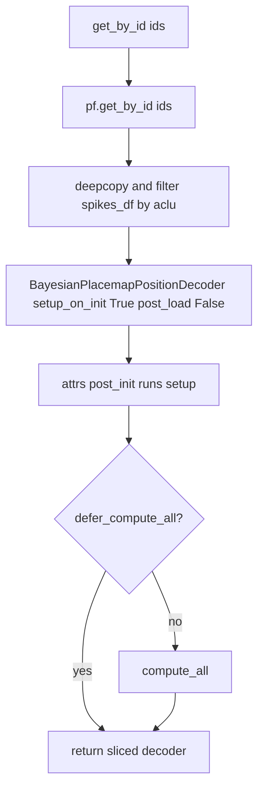

# Fix BayesianPlacemapPositionDecoder.get_by_id

**Goal:** Make `get_by_id` return a correctly neuron-sliced `BayesianPlacemapPositionDecoder` with rebuilt placefield/decoder state, without recursion or post-load crashes.

**Architecture:** Slice via `PfND.get_by_id`, construct a fresh decoder with forced safe init flags, optionally recompute with `compute_all()` unless deferred. Do not round-trip through `to_dict()`.

**Tech Stack:** Python, attrs-based decoder classes in pyPhoPlaceCellAnalysis / NeuroPy

---

## Problem

Current implementation in [`reconstruction.py`](pyPhoPlaceCellAnalysis/src/pyphoplacecellanalysis/Analysis/Decoder/reconstruction.py) (lines 3645–3660) is close, but still unsafe in two ways:

1. Copies `post_load_on_init=self.post_load_on_init`. If that is `True`, `__attrs_post_init__` calls `post_load()`, which expects a serialized `flat_p_x_given_n` and will fail on a fresh slice.
2. Copies `setup_on_init=self.setup_on_init`. If that is `False`, the slice never builds `F` / `P_x` / `neuron_IDs`, so later decoding is broken even when `defer_compute_all=True`.

`get_by_id` must always produce a freshly set-up sliced decoder; it is not a deserialize path.

## Chosen implementation

Replace the body of `BayesianPlacemapPositionDecoder.get_by_id` with:

```python
def get_by_id(self, ids, defer_compute_all: bool = False):
    """Return a copy restricted to neuron_ids equal to ids.

    Always runs setup on the sliced decoder (builds F, P_x, neuron_IDs).
    Does not run post_load (no serialized posterior to restore).
    If defer_compute_all is False, also runs compute_all() for full-session decode caches.
    """
    neuron_sliced_pf: PfND = self.pf.get_by_id(ids)
    spikes_df = deepcopy(self.spikes_df)
    if (spikes_df is not None) and ('aclu' in spikes_df.columns):
        spikes_df = spikes_df[np.isin(spikes_df['aclu'].to_numpy(), ids)].copy()

    neuron_sliced_decoder = BayesianPlacemapPositionDecoder(time_bin_size=self.time_bin_size, pf=neuron_sliced_pf, spikes_df=spikes_df, setup_on_init=True, post_load_on_init=False, debug_print=self.debug_print)

    if not defer_compute_all:
        neuron_sliced_decoder.compute_all()

    return neuron_sliced_decoder
```

Key decisions locked in:

- Force `setup_on_init=True` and `post_load_on_init=False` on the slice.
- Filter `spikes_df` by `aclu ∈ ids` after deepcopy, matching `PfND.get_by_id` behavior and reducing leave-one-out memory cost.
- Keep `defer_compute_all` semantics used by leave-one-out in [`decoder_result.py`](pyPhoPlaceCellAnalysis/src/pyphoplacecellanalysis/Analysis/Decoder/decoder_result.py).
- Keep constructor call on one line per project style.



## Files to change

- Modify: [`pyPhoPlaceCellAnalysis/src/pyphoplacecellanalysis/Analysis/Decoder/reconstruction.py`](pyPhoPlaceCellAnalysis/src/pyphoplacecellanalysis/Analysis/Decoder/reconstruction.py) — `BayesianPlacemapPositionDecoder.get_by_id` only
- Optionally strengthen assertions in [`pyPhoPlaceCellAnalysis/tests/test_decoders.py`](pyPhoPlaceCellAnalysis/tests/test_decoders.py) `test_subset_decoder_by_neuron_id` for `neuron_IDs`, `F` neuron axis, and `defer_compute_all=True` setup-without-full-decode

## Verification

- Run `test_subset_decoder_by_neuron_id` (or the decoder test module) with `uv run`.
- Mentally confirm no recursion: `get_by_id` → `PfND.get_by_id` / constructor / `setup` / optional `compute_all`; none call back into decoder `get_by_id`.
- Confirm leave-one-out path still works with `defer_compute_all=True` (setup present, no forced `compute_all`).
