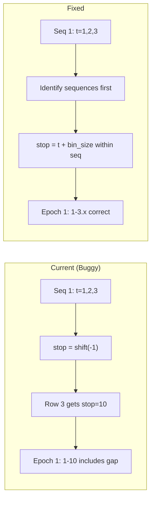

# Fix Sequential Position Epochs Computation

## Problem

The functions `_custom_merge_sequential_t_bins_to_epochs` and `_custom_build_sequential_position_epochs` in [`PredictiveDecodingComputations.py`](pyPhoPlaceCellAnalysis/src/pyphoplacecellanalysis/General/Pipeline/Stages/ComputationFunctions/MultiContextComputationFunctions/PredictiveDecodingComputations.py) have a bug where the `stop` column is computed via `shift(-1)`, causing the last row in each sequence to incorrectly have its `stop` set to the next sequence's `start` time (spanning the gap).



## Solution

Rewrite to compute `sequence_id` FIRST (based on gaps in `t`), then compute `stop` values within each sequence:

1. Identify consecutive sequences using `(t.diff() > dt_max).cumsum()`
2. For each sequence, compute proper start/stop:

   - `start` = first `t` in sequence
   - `stop` = last `t` in sequence + `bin_size`

3. Use vectorized pandas operations for efficiency

## Implementation

Replace both functions with a single, cleaner implementation:

```python
@classmethod
def _custom_build_sequential_position_epochs(cls, matching_past_positions_df: pd.DataFrame, col_name: str = 'past_future_matching_pos_epoch_id', EPSILON_GAP_SIZE_SEC: float = 1e-9) -> Tuple[pd.DataFrame, Dict]:
    if len(matching_past_positions_df) < 1:
        print(f'warn: empty df!')
        return pd.DataFrame({}), {}

    df = matching_past_positions_df.copy()
    assert 't' in df

    # Compute bin size from minimum consecutive gap
    t_sorted = np.sort(df['t'].values)
    pos_t_bin_sample_size_sec = np.nanmin(np.abs(np.diff(t_sorted)))
    dt_max = pos_t_bin_sample_size_sec * 2.5

    # Identify sequences FIRST by detecting gaps > dt_max
    df = df.sort_values('t').reset_index(drop=True)
    df['sequence_id'] = (df['t'].diff() > dt_max).cumsum()

    # Build epochs by aggregating each sequence
    epochs_df = df.groupby('sequence_id').agg(
        start=('t', 'first'),
        stop=('t', 'last'),
        t_count=('t', 'count'),
        start_pos_idx=('t', 'idxmin'),
        stop_pos_idx=('t', 'idxmax')
    ).reset_index()
    
    # Extend stop by bin_size (last t is start of last bin, not end)
    epochs_df['stop'] = epochs_df['stop'] + pos_t_bin_sample_size_sec - EPSILON_GAP_SIZE_SEC
    epochs_df['duration'] = epochs_df['stop'] - epochs_df['start']
    epochs_df['label'] = epochs_df['sequence_id'].astype(int)
    
    # ... rest of function unchanged
```

The key fix: **compute `sequence_id` before computing `stop`**, and set `stop = last_t + bin_size` instead of using `shift(-1)`.