# Fix epoch widget regressions

## Diagnosis (matches your screenshots)

```mermaid
flowchart TD
    subgraph popups [Popup windows + 10s delay]
        Show["EpochRenderConfigWidget.__init__ calls self.show()"]
        LapsN["Laps good-path creates ~361 widgets"]
        Show --> LapsN
        LapsN --> Popups["Each widget becomes a top-level window briefly"]
    end
    subgraph lapsDup [Laps duplicates]
        Assert["good-path: len unique labels == len df"]
        LapLabels["Laps df label = str lap_id 1..361"]
        Assert --> LapLabels
        LapLabels --> OnePerLap["361 sidebar widgets named 1,2,3..."]
    end
    subgraph paradigm [custom_paradigm render/toggle]
        ListApply["config_dicts_from_states always returns List dict"]
        Positional["_update_df_visualization_columns assigns lists by row index"]
        ListApply --> Positional
        Positional --> Misalign["Visibility/colors can misalign vs label order"]
    end
```



| Symptom | Root cause | Why PBEs is fine |
|---------|------------|------------------|
| 20+ empty popup windows | [`EpochRenderConfigWidget.py:76`](h:/TEMP/Spike3DEnv_ExploreUpgrade/Spike3DWorkEnv/pyPhoPlaceCellAnalysis/src/pyphoplacecellanalysis/GUI/Qt/Widgets/EpochRenderConfigWidget/EpochRenderConfigWidget.py) `self.show()` in every child `__init__`, before parent layout | PBEs fallback → 1 widget → 1 popup |
| Laps shows 1..N widgets | [`init_configs_list_from_interval_datasource_df`](h:/TEMP/Spike3DEnv_ExploreUpgrade/Spike3DWorkEnv/pyPhoPlaceCellAnalysis/src/pyphoplacecellanalysis/PhoPositionalData/plotting/mixins/epochs_plotting_mixins.py) good-path treats any df with unique `label` values as multi-epoch UI; Laps uses `label = str(lap_id)` ([`neuropy/core/laps.py:546-547`](h:/TEMP/Spike3DEnv_ExploreUpgrade/Spike3DWorkEnv/NeuroPy/neuropy/core/laps.py)) | PBEs all share label `"PBEs"` → assertion fails → fallback → 1 widget |
| custom_paradigm names OK but render/toggle wrong | List-based apply in [`Specific2DRenderTimeEpochs._update_df_visualization_columns`](h:/TEMP/Spike3DEnv_ExploreUpgrade/Spike3DWorkEnv/pyPhoPlaceCellAnalysis/src/pyphoplacecellanalysis/GUI/PyQtPlot/Widgets/Mixins/RenderTimeEpochs/Specific2DRenderTimeEpochs.py) writes columns by **position**, not by matching `config.name` ↔ `df.label`; combined with always-list widget output, toggling one epoch can corrupt `is_visible` for other rows | N/A |

`maze_GLOBAL` stays excluded (per your choice); 5 sidebar widgets for `custom_paradigm` is correct.

---

## Fix 1 — Stop popup windows and speed up sidebar build

**File:** [`EpochRenderConfigWidget.py`](h:/TEMP/Spike3DEnv_ExploreUpgrade/Spike3DWorkEnv/pyPhoPlaceCellAnalysis/src/pyphoplacecellanalysis/GUI/Qt/Widgets/EpochRenderConfigWidget/EpochRenderConfigWidget.py)

- Remove `self.show()` from `EpochRenderConfigWidget.__init__` (line 76). Child widgets must never self-show; only the container (`EpochRenderConfigsListWidget`) is shown by the parent plot.
- Pass `parent=a_sub_config_widget_container` from `_build_children_widgets` via `build_single_epoch_display_config_widget(..., parent=...)` so widgets are created as children immediately.
- Wrap `_build_children_widgets` in `self._is_programmatic_update = True` (same pattern as `update_from_configs`) to suppress any incidental `sigAnyConfigChanged` during mass widget creation.

---

## Fix 2 — Restore single-widget behavior for Laps/PBEs/Ripples

**File:** [`epochs_plotting_mixins.py`](h:/TEMP/Spike3DEnv_ExploreUpgrade/Spike3DWorkEnv/pyPhoPlaceCellAnalysis/src/pyphoplacecellanalysis/PhoPositionalData/plotting/mixins/epochs_plotting_mixins.py) — `init_configs_list_from_interval_datasource_df`

Replace the naive assertion `len(unique_label_names) == len(df)` with a **viz-compression heuristic** (reuses existing `get_serialized_data(drop_duplicates=True)`):

1. If compressed viz df has **1 row** → return **one** `EpochDisplayConfig` named after the series (`name` arg, e.g. `"Laps"`), reading `is_visible` as `all(df.is_visible)` when column exists.
2. Else if compressed row count **equals** full df row count **and** row count is small (e.g. `<= 20`) → **paradigm multi-epoch path**: one config per row, keyed by `df.label`, with per-row `is_visible`.
3. Else → existing fallback (single config from compressed df).

This keeps:
- **Laps** (361 rows, 1 unique viz) → 1 widget
- **PBEs** (531 rows, 1 unique viz) → 1 widget
- **custom_paradigm** (5 rows, 5 distinct colors) → 5 widgets (`pre`, `maze1`, `post1`, `maze2`, `post2`)

Keep QPen/QBrush tuple serialization in the good path unchanged.

---

## Fix 3 — Label-keyed apply for multi-epoch series (custom_paradigm rendering + toggles)

**File:** [`Specific2DRenderTimeEpochs.py`](h:/TEMP/Spike3DEnv_ExploreUpgrade/Spike3DWorkEnv/pyPhoPlaceCellAnalysis/src/pyphoplacecellanalysis/GUI/PyQtPlot/Widgets/Mixins/RenderTimeEpochs/Specific2DRenderTimeEpochs.py)

Add a helper (e.g. `_apply_config_lists_to_df_by_label`) used from `_update_df_visualization_columns` when kwargs contain **list-valued** fields and `name`/`label` keys align with `active_df['label']`:

- Build `label → config index` from the parallel `name` list (from `split_list_of_dicts`).
- For each df row, apply `is_visible`, `pen_color`, `brush_color`, `y_location`, `height` from the matching config — not from positional index.
- Preserve existing **singleton broadcast** (`len(list)==1` → all rows) for Laps/PBEs after Fix 2.

**File:** [`EpochRenderingMixin.py`](h:/TEMP/Spike3DEnv_ExploreUpgrade/Spike3DWorkEnv/pyPhoPlaceCellAnalysis/src/pyphoplacecellanalysis/GUI/PyQtPlot/Widgets/Mixins/RenderTimeEpochs/EpochRenderingMixin.py)

- In `update_rendered_intervals_visualization_properties`, when `interval_update_kwargs` is a list: if `len(list) == 1`, pass through for broadcast; if `len(list) == len(df)` and labels match, use label-keyed path; otherwise log a warning and avoid silent positional clobbering.

No change to series-level `setVisible(any row visible)` logic — that part is correct once per-row `is_visible` is written correctly.

---

## Fix 4 — Live validation (your run)

After fixes, on RatK D3 TwoNovel:

1. **No popup windows** during sidebar build; sidebar should appear in one pass (no 10s blank + 7s delay).
2. **Laps**: exactly **one** red widget under the Laps header; series eye toggles all laps.
3. **custom_paradigm**: 5 widgets; each rectangle matches paradigm `start`/`stop` durations; toggling `maze2` off hides only that interval; other four remain.
4. **PBEs / SessionEpochs**: still single-widget series; no regression.

Quick sanity check in notebook after `build_bapun_proper_epoch_intervals`:

```python
ds = active_2d_plot.interval_datasources['custom_paradigm'].df
assert list(ds.label) == ['pre','maze1','post1','maze2','post2']
assert 'is_visible' in ds.columns
```

Toggle `maze2` in sidebar, re-read `ds.is_visible` — only the `maze2` row should be `False`.
