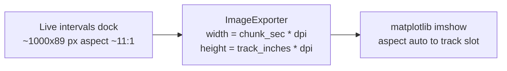

# Fix Stretched Interval Labels in PDF Export

## Root Cause

Interval labels use `CustomRectBoundedTextItem` (a pyqtgraph `TextItem`), which **counters the ViewBox scale** so text stays pixel-sized on screen. That works in the live UI.

During PDF export, two steps distort text:



1. [`export_as_img_arr`](h:/TEMP/Spike3DEnv_ExploreUpgrade/Spike3DWorkEnv/pyPhoPlaceCellAnalysis/src/pyphoplacecellanalysis/Pho2D/PyQtPlots/TimeSynchronizedPlotters/PyqtgraphTimeSynchronizedWidget.py) sets exporter size from time chunk and figure track height:

```626:634:h:/TEMP/Spike3DEnv_ExploreUpgrade/Spike3DWorkEnv/pyPhoPlaceCellAnalysis/src/pyphoplacecellanalysis/Pho2D/PyQtPlots/TimeSynchronizedPlotters/PyqtgraphTimeSynchronizedWidget.py
exporter = ImageExporter(pi)
if (start is not None) and (end is not None):
    exporter.parameters()['width'] = max(1, int((end - start) * dpi))
if (info is not None):
    exporter.parameters()['height'] = max(1, int((info['extent'][3] - info['extent'][2]) * dpi))
_refresh_interval_rect_labels_for_plot_item(canvas_width_px=..., canvas_height_px=...)
```

2. The on-screen intervals dock is capped to ~89 px tall ([`interval_dock_max_height=89`](h:/TEMP/Spike3DEnv_ExploreUpgrade/Spike3DWorkEnv/pyPhoPlaceCellAnalysis/src/pyphoplacecellanalysis/GUI/PyQtPlot/DockingWidgets/SpecificDockWidgetManipulatingMixin.py)) while export height can be `0.05 in * 600 dpi = 30 px` and export width can be `60 s * 600 dpi = 36000 px`.

3. `ImageExporter` renders `sourceRect → targetRect` via `scene.render(...)`. When **target aspect ratio differs from the ViewBox widget aspect**, the scene is non-uniformly stretched. `TextItem` compensates for the widget transform but **not** for this extra export stretch → labels become wide, flat smears (matches your screenshot).

The recent smart-label work correctly decides *which* labels fit using export dimensions, but cannot fix *how* `TextItem` is rasterized under mismatched aspect.

## Fix (user-selected): Resize view before capture

In [`PyqtgraphTimeSynchronizedWidget.export_as_img_arr`](h:/TEMP/Spike3DEnv_ExploreUpgrade/Spike3DWorkEnv/pyPhoPlaceCellAnalysis/src/pyphoplacecellanalysis/Pho2D/PyQtPlots/TimeSynchronizedPlotters/PyqtgraphTimeSynchronizedWidget.py), temporarily resize the plot view so **ViewBox pixel geometry matches export target** before `ImageExporter.export()`.

### Implementation sketch

Add a small helper (inside `export_as_img_arr` or as a private method):

```python
def _with_export_view_geometry(self, export_w, export_h, fn):
    layout = self.getRootGraphicsLayoutWidget()
    orig_min, orig_max, orig_size = layout.minimumSize(), layout.maximumSize(), layout.size()
    try:
        layout.setMinimumSize(export_w, export_h)
        layout.setMaximumSize(export_w, export_h)
        layout.resize(export_w, export_h)
        QApplication.processEvents()
        return fn()
    finally:
        layout.setMinimumSize(orig_min)
        layout.setMaximumSize(orig_max)
        layout.resize(orig_size)
        QApplication.processEvents()
```

Then wrap the existing export block:

1. Compute `export_w`, `export_h` (same formulas as today).
2. Inside `_with_export_view_geometry(export_w, export_h, ...)`:
   - Apply X/Y range changes (existing code)
   - Read **post-resize** `vb.width()` / `vb.height()` (should equal export dims)
   - Call `_refresh_interval_rect_labels_for_plot_item(export_w, export_h)` using those dims
   - Run `ImageExporter` with matching width/height
3. In `finally`, restore live ranges/links **and** refresh labels back to live ViewBox size (existing restore path).

Also restore any dock `maximumHeight` constraints if they prevent resize — temporarily clear `setMaximumHeight` on the parent dock widget when present, then restore.

### Why this works

- ViewBox `sceneTransform` is rebuilt for export pixel grid.
- `TextItem.updateTransform()` inverts the correct parent transform.
- `IntervalRectsItem.refresh_visible_labels()` fit checks use the same canvas size as the rasterized image.
- `imshow(..., aspect='auto')` in [`ExportHelpers.export_wrapped_tracks_to_paged_df`](h:/TEMP/Spike3DEnv_ExploreUpgrade/Spike3DWorkEnv/pyPhoPlaceCellAnalysis/src/pyphoplacecellanalysis/General/Mixins/ExportHelpers.py) still maps `export_w x export_h` uniformly into the track slot because both axes scale by `1/dpi`.

## Files to change

| File | Change |
|------|--------|
| [`PyqtgraphTimeSynchronizedWidget.py`](h:/TEMP/Spike3DEnv_ExploreUpgrade/Spike3DWorkEnv/pyPhoPlaceCellAnalysis/src/pyphoplacecellanalysis/Pho2D/PyQtPlots/TimeSynchronizedPlotters/PyqtgraphTimeSynchronizedWidget.py) | Add temporary view resize around export; refresh labels after resize |
| (optional) [`ExportHelpers.py`](h:/TEMP/Spike3DEnv_ExploreUpgrade/Spike3DWorkEnv/pyPhoPlaceCellAnalysis/src/pyphoplacecellanalysis/General/Mixins/ExportHelpers.py) | No logic change expected; re-run export script to validate |

No changes needed in [`IntervalRectsItem.py`](h:/TEMP/Spike3DEnv_ExploreUpgrade/Spike3DWorkEnv/pyPhoPlaceCellAnalysis/src/pyphoplacecellanalysis/GUI/PyQtPlot/Widgets/GraphicsObjects/IntervalRectsItem.py) or [`AlignableTextItem.py`](h:/TEMP/Spike3DEnv_ExploreUpgrade/Spike3DWorkEnv/pyPhoPlaceCellAnalysis/src/pyphoplacecellanalysis/External/pyqtgraph_extensions/graphicsItems/TextItem/AlignableTextItem.py) for this approach.

## Validation

1. Re-run your existing export snippet with `'intervals'` included and `dpi=600`.
2. Confirm interval labels are legible (not horizontally smeared) in the PDF.
3. Confirm live UI labels unchanged after export completes (pan/zoom on intervals track).
4. Spot-check other pyqtgraph tracks in the same export (`rasters[raster_window]`, etc.) for regressions.

## Temporary workaround (until fix is applied)

Increasing the intervals dock height before export reduces (but does not eliminate) distortion because it brings widget aspect closer to export aspect. This is not a reliable substitute for the code fix.
