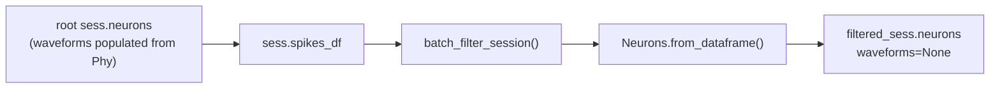

# Fix waveforms lost after session filtering

## Root cause



[`batch_filter_session`](h:\TEMP\Spike3DEnv_ExploreUpgrade\Spike3DWorkEnv\NeuroPy\neuropy\core\session\SessionSelectionAndFiltering.py) (lines 198–202) builds filtered neurons with:

```python
neurons_obj = Neurons.from_dataframe(filtered_spikes_df, ...)
```

[`Neurons.from_dataframe`](h:\TEMP\Spike3DEnv_ExploreUpgrade\Spike3DWorkEnv\NeuroPy\neuropy\core\neurons.py) (lines 390–427) only passes `spiketrains`, `neuron_ids`, `neuron_type`, and `shank_ids` — **not** `waveforms`, `peak_channels`, or `extended_neuron_properties_df`.

By contrast, native subsetting paths (`time_slice`, `get_by_id`, `get_neuron_type`) already preserve `waveforms` via `__getitem__` (lines 143–167). The dataframe rebuild path is the gap.

This breaks downstream clusterless decoding in [`rtc_clusterless_adapters.py`](h:\TEMP\Spike3DEnv_ExploreUpgrade\Spike3DWorkEnv\pyPhoPlaceCellAnalysis\src\pyphoplacecellanalysis\Analysis\Decoder\rtc_clusterless_adapters.py) (line 104), which requires `sess.neurons.waveforms`.

## Fix strategy (comprehensive)

### 1. Add a shared metadata-copy helper on `Neurons`

In [`neurons.py`](h:\TEMP\Spike3DEnv_ExploreUpgrade\Spike3DWorkEnv\NeuroPy\neuropy\core\neurons.py), add a small static/class method, e.g. `_subset_per_neuron_metadata_from_source(source_neurons, target_neuron_ids) -> dict`, that:

- Maps `target_neuron_ids` → source linear indices via `source_neurons.reverse_cellID_index_map`
- Returns subset arrays for:
  - `waveforms` (if not None)
  - `peak_channels` (if not None)
  - `_extended_neuron_properties_df` (if not None): filter rows where `aclu` (or `si_unit_id` fallback) is in `target_neuron_ids`, preserving row order aligned with `target_neuron_ids`
- Raises or warns if a target id is missing from source (should not happen in normal filtering)

### 2. Extend `Neurons.from_dataframe` with optional `source_neurons`

Update signature:

```python
def from_dataframe(cls, spikes_df, dat_sampling_rate, time_variable_name='t_rel_seconds', source_neurons=None):
```

After building the base `Neurons` object from grouped spikes, if `source_neurons is not None`:

- Call the helper above with `out_neurons.neuron_ids`
- Pass returned `waveforms`, `peak_channels`, `extended_neuron_properties_df` into a final `Neurons(...)` (or assign on the instance)

Keep existing behavior when `source_neurons=None`.

### 3. Wire `batch_filter_session` to pass source neurons

In [`SessionSelectionAndFiltering.py`](h:\TEMP\Spike3DEnv_ExploreUpgrade\Spike3DWorkEnv\NeuroPy\neuropy\core\session\SessionSelectionAndFiltering.py) line 198:

```python
neurons_obj = Neurons.from_dataframe(
    filtered_spikes_df,
    sess.recinfo.dat_sampling_rate,
    time_variable_name=spk_df.spikes.time_variable_name,
    source_neurons=sess.neurons,
)
```

This is the single call site for `Neurons.from_dataframe` in the filtering pipeline.

### 4. Fix `Neurons.__getitem__` to preserve `extended_neuron_properties_df`

Currently `__getitem__` (lines 134–168) copies `waveforms`/`peak_channels`/`shank_ids` but omits `extended_neuron_properties_df`. Extend it to:

- When `self._extended_neuron_properties_df is not None` and boolean/integer index `i` is applied, subset the properties dataframe to match the selected `neuron_ids[i]`
- Pass `extended_neuron_properties_df=...` into the returned `Neurons(...)`

This makes `get_by_id`, `get_neuron_type`, and `get_above_firing_rate` consistent for extended properties too.

### 5. Add unit tests

Add tests under NeuroPy (new file e.g. `tests/test_neurons_from_dataframe.py` or extend an existing test module if present):

| Test | Assert |
|------|--------|
| `from_dataframe` + `source_neurons` | filtered neuron count matches; `waveforms.shape[0] == n_neurons`; `peak_channels` aligned |
| `from_dataframe` without source | unchanged behavior (`waveforms is None`) |
| `Neurons.__getitem__` with extended df | subset preserves `_extended_neuron_properties_df` row count |
| `batch_filter_session` integration (lightweight mock session) | filtered session neurons have non-None waveforms when root has them |

Use synthetic `Neurons` with small object-dtype waveform arrays and a minimal `spikes_df` — no Phy files needed.

## Files to change

| File | Change |
|------|--------|
| [`neuropy/core/neurons.py`](h:\TEMP\Spike3DEnv_ExploreUpgrade\Spike3DWorkEnv\NeuroPy\neuropy\core\neurons.py) | helper, `from_dataframe`, `__getitem__` |
| [`neuropy/core/session/SessionSelectionAndFiltering.py`](h:\TEMP\Spike3DEnv_ExploreUpgrade\Spike3DWorkEnv\NeuroPy\neuropy\core\session\SessionSelectionAndFiltering.py) | pass `source_neurons=sess.neurons` |
| New test file in NeuroPy | regression tests |

## Verification after implementation

In the notebook, after rebuilding root neurons and re-filtering:

```python
for a_name, fs_sess in curr_active_pipeline.filtered_sessions.items():
    assert fs_sess.neurons.waveforms is not None
    assert fs_sess.neurons.waveforms.shape[0] == fs_sess.neurons.n_neurons
```

Clusterless decoding via `build_multiunits_from_session(filtered_sess, ...)` should no longer raise the waveforms `ValueError`.

## Out of scope

- HDF serialization of waveforms (already explicitly unsupported; line 515 assertion remains)
- Recomputing waveforms from Phy templates inside `from_dataframe` when source lacks them (would require Phy folder access at filter time)
