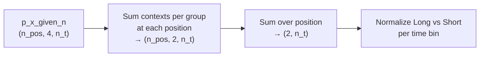
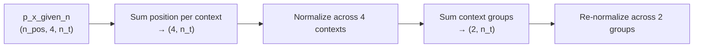

# Fix KDiba Long/Short and LR/RL Marginal Computation

## Root cause

`determine_long_short_likelihoods` (lines 3600–3608) is **not** the bug — its epoch-level aggregation is unchanged from the old branch:

```python
track_identity_all_epoch_bins_marginal = np.stack([
    np.sum(v.p_x_given_n, axis=-1) / np.sum(v.p_x_given_n, axis=(-2, -1))
    for v in track_identity_marginals
], axis=0)
```

The regression is in **`build_custom_marginal_over_long_short`** (and the parallel **`build_custom_marginal_over_direction`**), introduced when marginalization was generalized via `_marginalize_p_x_given_n_to_context_probs` + `_group_context_marginal`. There is already a TODO at line 3577 noting the mismatch.

### Old KDiba order (correct for this dataset)

From [`_OLD_kdiba2025branch_DirectionalPlacefieldGlobalComputationFunctions.py`](h:\TEMP\Spike3DEnv_ExploreUpgrade\Spike3DWorkEnv\pyPhoPlaceCellAnalysis\src\pyphoplacecellanalysis\General\Pipeline\Stages\ComputationFunctions\MultiContextComputationFunctions\_OLD_kdiba2025branch_DirectionalPlacefieldGlobalComputationFunctions.py) (~2424–2454):



- **Long/Short**: `long_LR + long_RL` and `short_LR + short_RL` **per position bin**, then sum position, then normalize.
- **LR/RL**: `long_LR + short_LR` and `long_RL + short_RL` **per position bin**, then sum position, then normalize.

### New (broken) order

From [`DirectionalPlacefieldGlobalComputationFunctions.py`](h:\TEMP\Spike3DEnv_ExploreUpgrade\Spike3DWorkEnv\pyPhoPlaceCellAnalysis\src\pyphoplacecellanalysis\General\Pipeline\Stages\ComputationFunctions\MultiContextComputationFunctions\DirectionalPlacefieldGlobalComputationFunctions.py) (~3576–3577):



The extra **4-way normalization before grouping** collapses epoch-specific signal when spatial peaks differ across contexts — producing near-constant `P_Long` / `P_Short` (and similarly flat `P_LR` / `P_RL`) even when raw `p_x_given_n_list` has structure.

`build_non_marginalized_raw_posteriors` is already equivalent to the old path (spatial sum then per-time-bin normalize) and does **not** need changes.

---

## Implementation plan

### 1. Add a shared helper for correct group marginalization

In [`DirectionalPlacefieldGlobalComputationFunctions.py`](h:\TEMP\Spike3DEnv_ExploreUpgrade\Spike3DWorkEnv\pyPhoPlaceCellAnalysis\src\pyphoplacecellanalysis\General\Pipeline\Stages\ComputationFunctions\MultiContextComputationFunctions\DirectionalPlacefieldGlobalComputationFunctions.py), add a classmethod near `_group_context_marginal` (~3136):

```python
@classmethod
def _marginalize_p_x_given_n_over_context_groups_in_position_space(
    cls, a_p_x_given_n, context_dim_idx, spatial_sum_axes, group_indices_list
) -> NDArray:
```

Logic (generalizes old 3D KDiba code to 3D and 4D layouts):
1. For each group in `group_indices_list`, **sum the selected context slices along `context_dim_idx`** (keeping full spatial dimensions).
2. **Sum over `spatial_sum_axes`** to get `(n_groups, n_time_bins)`.
3. Call existing `_normalize_per_timebin_context_marginal` once (normalize across groups only).

This replaces the two-step `_marginalize_p_x_given_n_to_context_probs` + `_group_context_marginal` pipeline for grouped marginals.

### 2. Update `build_custom_marginal_over_long_short`

Replace lines ~3576–3577:

```python
context_marginal_p_x_given_n = cls._marginalize_p_x_given_n_to_context_probs(...)
track_identity_marginal_p_x_given_n = cls._group_context_marginal(context_marginal_p_x_given_n, ...)
```

with a single call to the new helper using `[long_context_indices, short_context_indices]`.

Remove the TODO comment once fixed.

### 3. Update `build_custom_marginal_over_direction`

Same change at lines ~3547–3548, using `[lr_context_indices, rl_context_indices]`.

### 4. Leave `determine_long_short_likelihoods` / `determine_directional_likelihoods` unchanged

These higher-level functions are already correct; they will automatically pick up fixed per-epoch marginals from step 2–3.

Downstream callers (`perform_compute_marginals` in [`reconstruction.py`](h:\TEMP\Spike3DEnv_ExploreUpgrade\Spike3DWorkEnv\pyPhoPlaceCellAnalysis\src\pyphoplacecellanalysis\Analysis\Decoder\reconstruction.py), plotting via `active_marginal_fn`, `compute_marginals_df`) require no API changes.

### 5. Add a focused unit test

Add `tests/test_pseudo2d_context_marginals.py` (or similar) with a **synthetic posterior** where contexts have different spatial peaks:

- Build `p` with shape `(n_pos=10, 4, n_t=5)`, non-uniform, normalized per `(context, time)` over position.
- Assert new helper output matches a literal port of the old loop for Long/Short and LR/RL.
- Assert new output **differs** from the current broken `_marginalize` + `_group_context_marginal` path on the same synthetic data (proves the fix is non-trivial).

No session pickle required for CI.

---

## Verification (notebook / session)

After re-running marginals on a KDiba session:

```python
directional_merged_decoders_result.perform_compute_marginals()
laps = directional_merged_decoders_result.all_directional_laps_filter_epochs_decoder_result

# Per-time-bin variance should increase vs broken path
px = laps.track_identity_marginals[0].p_x_given_n  # (2, n_t)
print(px[0].std(), px[1].std())

# Epoch-level P_Long should vary across laps
print(laps.epochs_marginals_df['P_Long'].describe())
```

Compare against archived results from `_OLD_kdiba2025branch` on the same `p_x_given_n_list` if available.

---

## Files to change

| File | Change |
|------|--------|
| [`DirectionalPlacefieldGlobalComputationFunctions.py`](h:\TEMP\Spike3DEnv_ExploreUpgrade\Spike3DWorkEnv\pyPhoPlaceCellAnalysis\src\pyphoplacecellanalysis\General\Pipeline\Stages\ComputationFunctions\MultiContextComputationFunctions\DirectionalPlacefieldGlobalComputationFunctions.py) | New helper; fix `build_custom_marginal_over_long_short` and `build_custom_marginal_over_direction` |
| `tests/test_pseudo2d_context_marginals.py` (new) | Synthetic regression test |

No changes to [`reconstruction.py`](h:\TEMP\Spike3DEnv_ExploreUpgrade\Spike3DWorkEnv\pyPhoPlaceCellAnalysis\src\pyphoplacecellanalysis\Analysis\Decoder\reconstruction.py) unless test imports require it.
