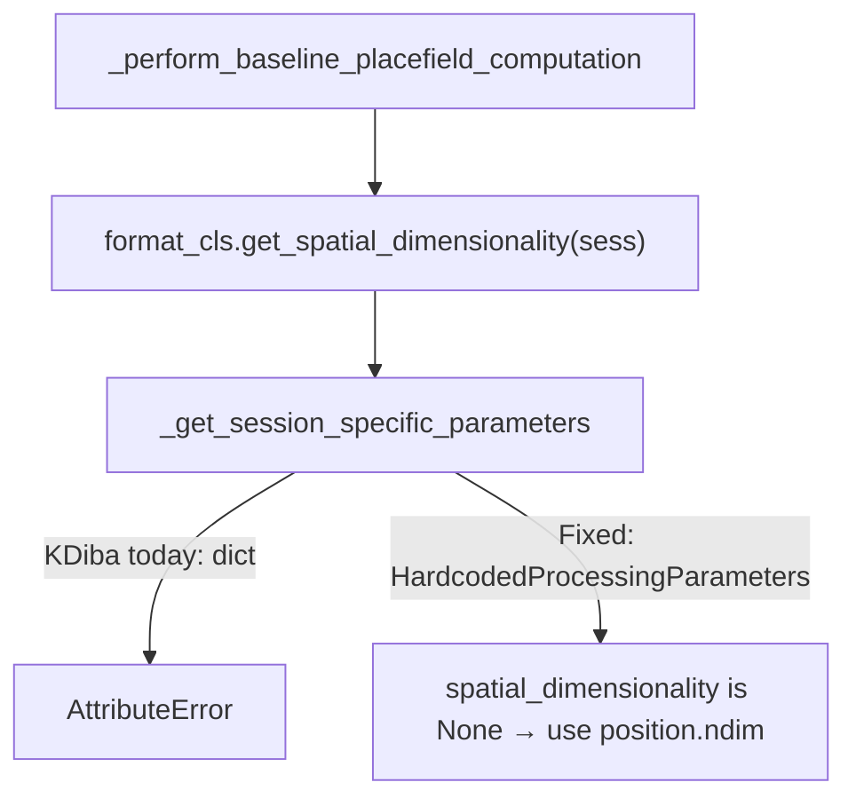

# Fix KDiba AttributeError in post-fixup recompute

## Root cause

Recent 3D placefield support added [`get_spatial_dimensionality`](file:///home/halechr/repos/NeuroPy/neuropy/core/session/Formats/BaseDataSessionFormats.py) (commit `b8c20911`), which does:

```python
hardcoded_params = cls._get_session_specific_parameters(...)
if hardcoded_params.spatial_dimensionality is not None:
    ...
```

[`KDibaOldDataSessionFormatRegisteredClass._get_session_specific_parameters`](file:///home/halechr/repos/NeuroPy/neuropy/core/session/Formats/Specific/KDibaOldDataSessionFormat.py) incorrectly returns the whole `IdentifyingContext.matching(...)` **dict**:

```134:144:/home/halechr/repos/NeuroPy/neuropy/core/session/Formats/Specific/KDibaOldDataSessionFormat.py
def _get_session_specific_parameters(cls, session_context: IdentifyingContext) -> HardcodedProcessingParameters:
    ...
    return IdentifyingContext.matching({ ... }, criteria=...)
```

Every other format (Bapun, Rachel, NWB, DANDI) correctly does:

```python
best_match = IdentifyingContext.matching(the_dict, criteria=...)
return list(best_match.values())[0]
```

KDiba never set `spatial_dimensionality` (stays `None` → fall back to `sess.position.ndim`), so this latent wrong return type only blew up once `get_spatial_dimensionality` started attribute-accessing the result.



## Secondary bug (same recompute path)

In [`PostHocPipelineFixup._perform_required_recompute_on_change`](file:///home/halechr/repos/pyPhoPlaceCellAnalysis/src/pyphoplacecellanalysis/General/Batch/BatchJobCompletion/UserCompletionHelpers/batch_user_completion_helpers.py), a missing comma concatenates two strings:

```python
'_perform_time_dependent_pf_sequential_surprise_computation'
'_perform_two_step_position_decoding_computation',
```

→ becomes one invalid name (matches the notebook warning: found 5/7, skips both). Add the missing comma.

## Changes

1. **[`KDibaOldDataSessionFormat.py`](file:///home/halechr/repos/NeuroPy/neuropy/core/session/Formats/Specific/KDibaOldDataSessionFormat.py)** — align with other formats:
   - Build `the_dict`, call `IdentifyingContext.matching(...)`, return `list(best_match.values())[0]`
   - Use `cls._session_basepath_to_context_parsing_keys` for the criteria subset (same as Bapun/Rachel/NWB)

2. **[`BaseDataSessionFormats.py`](file:///home/halechr/repos/NeuroPy/neuropy/core/session/Formats/BaseDataSessionFormats.py)** — harden `get_spatial_dimensionality` so a bad params return falls back to `sess.position.ndim` instead of crashing (catch `AttributeError` / `TypeError` in addition to `NotImplementedError`). Fix the outdated comment example that shows returning the matching dict.

3. **[`batch_user_completion_helpers.py`](file:///home/halechr/repos/pyPhoPlaceCellAnalysis/src/pyphoplacecellanalysis/General/Batch/BatchJobCompletion/UserCompletionHelpers/batch_user_completion_helpers.py)** — add the missing comma between the two computation function names.

No notebook edits.

## Verification

After the change, re-run the notebook cell that calls `kdiba_session_post_fixup_completion_function(...)`. Expect:
- No `AttributeError` on `spatial_dimensionality`
- Warning no longer lists the concatenated surprise/two-step name as missing (both should resolve if registered)
- Placefield recompute proceeds with 2D path for kdiba (`uses_3d_only == False`)
