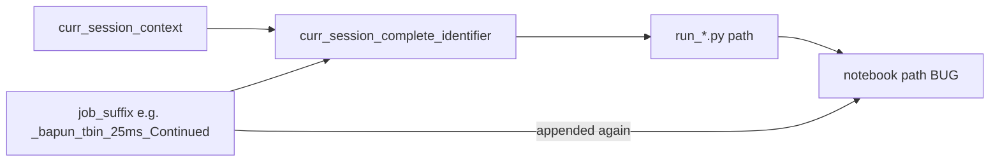

# Fix duplicated suffix in generated notebook names

## Root cause

In [`pythonScriptTemplating.py`](h:\TEMP\Spike3DEnv_ExploreUpgrade\Spike3DWorkEnv\pyPhoPlaceCellAnalysis\src\pyphoplacecellanalysis\General\Batch\pythonScriptTemplating.py), `job_suffix` is applied **twice** when generating notebooks:

1. **First application (correct):** when building the run script path via `curr_session_complete_identifier`:

```448:472:h:\TEMP\Spike3DEnv_ExploreUpgrade\Spike3DWorkEnv\pyPhoPlaceCellAnalysis\src\pyphoplacecellanalysis\General\Batch\pythonScriptTemplating.py
        if (job_suffix is not None) and (len(job_suffix) > 0):
            curr_session_complete_identifier: str = f"{curr_session_context}_{job_suffix}"
        else:
            curr_session_complete_identifier: str = f"{curr_session_context}"
        ...
        python_script_path = os.path.join(curr_batch_script_rundir, f'run_{curr_session_complete_identifier}.py')
```

For your Bapun run this produces stems like:
`run_bapun_RatK_Day4Openfield__bapun_tbin_25ms_Continued`

2. **Second application (bug):** notebook naming appends `job_suffix` again to that stem:

```553:557:h:\TEMP\Spike3DEnv_ExploreUpgrade\Spike3DWorkEnv\pyPhoPlaceCellAnalysis\src\pyphoplacecellanalysis\General\Batch\pythonScriptTemplating.py
            if (job_suffix is not None) and (len(job_suffix) > 0):
                notebook_path = script_path.with_stem(f'{script_path.stem}_{job_suffix}').with_suffix(f'.ipynb')
            else:
                notebook_path = script_path.with_suffix('.ipynb')
```

Resulting notebook name (broken):
`run_bapun_RatK_Day4Openfield__bapun_tbin_25ms_Continued__bapun_tbin_25ms_Continued.ipynb`



The inline comment on line 472 already documents that `.py` filenames include the suffix; the notebook block is stale logic from when script names may not have included it.

## Fix (single-file, minimal)

Edit [`pythonScriptTemplating.py`](h:\TEMP\Spike3DEnv_ExploreUpgrade\Spike3DWorkEnv\pyPhoPlaceCellAnalysis\src\pyphoplacecellanalysis\General\Batch\pythonScriptTemplating.py) lines 551–557:

- Replace the `if job_suffix` branch with a single line:
  - `notebook_path = script_path.with_suffix('.ipynb')`
- Remove the redundant debug `print(F'job_suffix: ...')` immediately above it (line 551), since `curr_item_name` is already printed earlier.

**Expected notebook name after fix:**
`run_bapun_RatK_Day4Openfield__bapun_tbin_25ms_Continued.ipynb` (matches sibling `.py` script)

No changes needed in [`ProcessBatchOutputs_Bapun_Batch.ipy`](h:\TEMP\Spike3DEnv_ExploreUpgrade\Spike3DWorkEnv\Spike3D\ProcessBatchOutputs_Bapun_Batch.ipy) — it passes `current_job_suffix` correctly.

## Verification

After the change, re-run the batch driver (or call `generate_batch_single_session_scripts` for one session with `should_generate_run_notebooks=True`) and confirm:

- Generated `.ipynb` stem equals the corresponding `run_*.py` stem (only extension differs)
- No second copy of `_bapun_tbin_25ms_Continued` (or whatever phase suffix) appears in the filename

## Out of scope (unless you want it)

The double underscore in identifiers (`Day4Openfield__bapun...`) comes from `job_suffix` starting with `_` while the join also inserts `_`. That affects `.py`, slurm, and notebook names consistently today; fixing it would rename existing artifacts and is separate from the duplicated-suffix bug.
