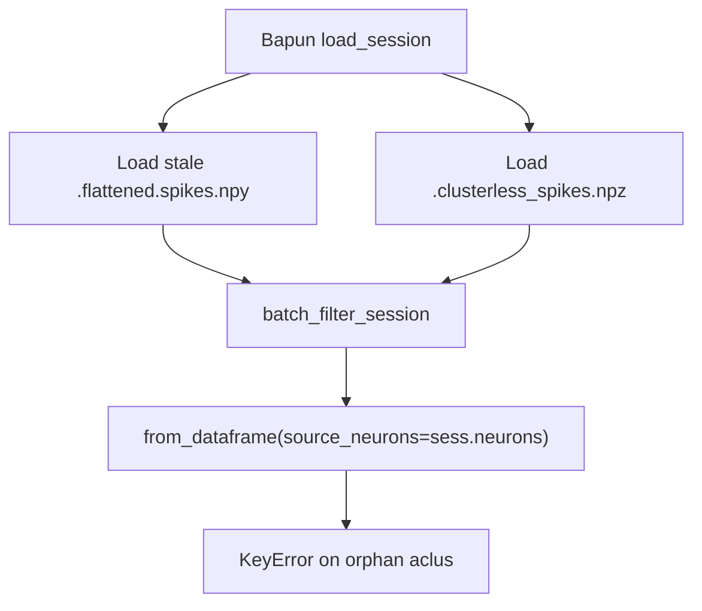

# Fix orphan spike KeyError (clusterless-aware)

## Root cause

Regression from NeuroPy commit `ce0ecce2` ("bump for Clusterless"): [`batch_filter_session`](h:\TEMP\Spike3DEnv_ExploreUpgrade\Spike3DWorkEnv\NeuroPy\neuropy\core\session\SessionSelectionAndFiltering.py) now passes `source_neurons=sess.neurons` into `Neurons.from_dataframe`, which raises if `spikes_df` contains `aclu` values absent from `sess.neurons` (your case: `[47, 66, 78]`).

This happens when a **stale** [`.flattened.spikes.npy`](h:\TEMP\Spike3DEnv_ExploreUpgrade\Spike3DWorkEnv\NeuroPy\neuropy\core\session\Formats\Specific\BapunDataSessionFormat.py) is loaded from disk (line ~1126) while `.neurons.npy` / `sess.neurons` is the canonical sorted-unit list — especially when you have since moved to **clusterless** spike events (`.clusterless_spikes.npz`) and no longer want the old flattened spike cache to govern filtering.

## Fix approach (revised)

Two coordinated changes in NeuroPy only. **No pytest changes.**

### 1. Clusterless-aware filtering in `batch_filter_session`

**File:** [`NeuroPy/neuropy/core/session/SessionSelectionAndFiltering.py`](h:\TEMP\Spike3DEnv_ExploreUpgrade\Spike3DWorkEnv\NeuroPy\neuropy\core\session\SessionSelectionAndFiltering.py)

After epoch/time/neuron-type filtering (~line 155), before `Neurons.from_dataframe`:

**A. Orphan spike drop (when `sess.neurons` exists)**

- `source_neuron_ids = set(int(x) for x in sess.neurons.neuron_ids)`
- `orphan_neuron_ids = sorted(set(filtered_spikes_df['aclu'].unique()) - source_neuron_ids)`
- If non-empty: `warnings.warn(...)` listing dropped IDs + spike count; filter `filtered_spikes_df` to `source_neuron_ids`

This restores pre-regression behavior and keeps waveform metadata copy working for valid units.

**B. Clusterless-only path (when `sess.neurons` is None but `sess.clusterless_spike_events` exists)**

- Skip `Neurons.from_dataframe` entirely (`neurons_obj = None`)
- Build a minimal empty `FlattenedSpiketrains` (or pass through empty spikes_df) so `DataSession` construction does not require sorted-unit spikes
- Still pass through `filtered_clusterless_spike_events` (already time-sliced at line 159)
- Matches existing Bapun intent at lines 1133–1137: clusterless sessions do not need flattened spiketrains for decoding

**C. `source_neurons` argument**

- Keep `source_neurons=sess.neurons` when neurons exist and orphans have been dropped
- Use `source_neurons=None` only when `sess.neurons is None`

### 2. Skip stale flattened spike cache when clusterless is available

**File:** [`NeuroPy/neuropy/core/session/Formats/Specific/BapunDataSessionFormat.py`](h:\TEMP\Spike3DEnv_ExploreUpgrade\Spike3DWorkEnv\NeuroPy\neuropy\core\session\Formats\Specific\BapunDataSessionFormat.py)

Refactor `_perform_spike_comps` (~lines 1121–1150):

1. **Load clusterless first** via `_try_load_clusterless_spike_events_file(session)` (move before flattened load)
2. **If `session.clusterless_spike_events` is not None:**
   - Print info: ignoring cached `.flattened.spikes.npy` because clusterless events are available
   - **Do not** load `FlattenedSpiketrains.from_file(...flattened.spikes.npy)`
   - If `session.neurons` exists: recompute flattened spiketrains fresh from neurons via `_default_compute_flattened_spikes` (consistent with current neurons, not stale cache)
   - If `session.neurons` is None: skip flattened entirely (existing clusterless-only branch)
3. **Else** (no clusterless): keep existing load-or-recompute flattened path unchanged

This implements "ignore previously computed spikes" at load time when clusterless is the intended spike source.

### 3. Verify (manual, no pytest)

- Re-run notebook cell 8: `final_process_bapun_all_comps(curr_active_pipeline, ...)`
- Expect: warning about dropped orphan aclus `[47, 66, 78]` if stale spikes still in memory from pickle; on fresh `load_session`, expect no stale cache load when `.clusterless_spikes.npz` exists
- If pipeline was loaded from pickle with stale `flattened_spiketrains`, reload session (`force_reload=True`) once to pick up the new load behavior

## Files changed

| File | Change |
|------|--------|
| [`SessionSelectionAndFiltering.py`](h:\TEMP\Spike3DEnv_ExploreUpgrade\Spike3DWorkEnv\NeuroPy\neuropy\core\session\SessionSelectionAndFiltering.py) | Orphan aclu drop + clusterless-only filter path |
| [`BapunDataSessionFormat.py`](h:\TEMP\Spike3DEnv_ExploreUpgrade\Spike3DWorkEnv\NeuroPy\neuropy\core\session\Formats\Specific\BapunDataSessionFormat.py) | Prefer clusterless; skip stale flattened cache |

No changes to [`PendingNotebookCode.py`](h:\TEMP\Spike3DEnv_ExploreUpgrade\Spike3DWorkEnv\pyPhoPlaceCellAnalysis\src\pyphoplacecellanalysis\SpecificResults\PendingNotebookCode.py) or any test files.

## Note on pickled pipelines

A pickle loaded **before** this fix may still carry stale `flattened_spiketrains` in memory. The `batch_filter_session` orphan drop (step 1A) unblocks that case immediately; a session reload picks up step 2 for on-disk consistency.
