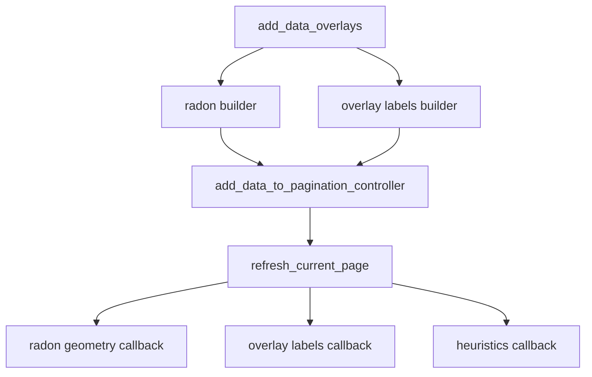

# Fix missing overlays after OverlayLabels rename

## What’s broken

Your notebook path (`plot_full` → later `add_data_overlays(included_columns=['radon','wcorr','coverage','mseq_tcov'])`) draws heatmaps but no corner labels, radon line/band, or green heuristic sequences. The printed `decoder_track_length is None so skipping heuristics plotting` is consistent with heuristic geometry never registering; labels/radon failing is a separate post-rename regression.



## Root causes to fix (locked)

### 1. Falsy `or` drops real data in registration

In [`PaginationMixins.py`](h:/TEMP/Spike3DEnv_ExploreUpgrade/Spike3DWorkEnv/pyPhoPlaceCellAnalysis/src/pyphoplacecellanalysis/GUI/Qt/Mixins/PaginationMixins.py) ~187:

```python
active_plots_data = {k:(deepcopy(provided_data[i]) or default_class_value) for ...}
```

Empty `{}` is falsy → stored as `None`. The radon-only path intentionally passes `{}` today, so `plots_data.overlay_labels_data` becomes `None`. Change to identity-preserving assignment:

```python
v = deepcopy(provided_data[i])
active_plots_data[k] = default_class_value if (v is None) else v
```

### 2. Soft-deps silently skip all corner labels

In [`DecoderPredictionError.py`](h:/TEMP/Spike3DEnv_ExploreUpgrade/Spike3DWorkEnv/pyPhoPlaceCellAnalysis/src/pyphoplacecellanalysis/General/Pipeline/Stages/DisplayFunctions/DecoderPredictionError.py) OverlayLabels callback, the hard assert was replaced with soft `.get` + skip. That hides missing/None data and float-key misses.

Fix:
- Read with `getattr(plots_data, 'overlay_labels_data', None)` / `getattr(..., 'radon_transform_data', None)` (same style as the rest of this file).
- If `enable_overlay_labels_info` and `overlay_labels_data` is a non-empty dict but `epoch_start_t` is missing → print a clear warning (include sample keys), do not pretend success.
- Keep true soft-skip only when `overlay_labels_data` is `None`/empty (radon-only registration).

### 3. Radon geometry callback hard-indexes and can abort the page

With `should_suppress_callback_exceptions=False`, any exception in the first callback re-raises and aborts the axis loop (`stacked_epoch_slices.py` ~1503–1531). The simplified radon callback still does `plots_data.radon_transform_data[data_idx]` with no guard.

Fix: if `radon_transform_data` is missing or `data_idx` not in it, skip drawing line/band (debug print) and return cleanly so later callbacks (labels/heuristics) still run.

### 4. `track_length_cm` not available → heuristics skipped

Confirmed print path in single-controller `add_data_overlays` (~1837–1847). Init sets per-decoder `track_length_cm` in [`_subfn_prepare_plot_multi_decoders_stacked_epoch_slices`](h:/TEMP/Spike3DEnv_ExploreUpgrade/Spike3DWorkEnv/pyPhoPlaceCellAnalysis/src/pyphoplacecellanalysis/Pho2D/stacked_epoch_slices.py) ~2416–2436, but `track_length_cm_dict` is popped and **not** stored on params (line 2419 commented out). Multi-window `add_data_overlays` only reassigns from `track_length_cm_dict` if present.

Fix:
- Persist `params_kwargs['track_length_cm_dict'] = track_length_cm_dict` at prepare time.
- In single-controller `add_data_overlays`, resolve track length as: existing `params.track_length_cm`, else `params.track_length_cm_dict` value for this controller’s decoder name (from `params.name` / known decoder keys), else None.
- YellowBlue’s `add_data_overlays(..., included_columns=[])` can keep skipping heuristics when length is unset; that path is not the main 4-decoder view.

### 5. Explicit `included_columns` must force-enable gated params (from [Find overlay regression cause](c10cc62f-35b7-4e4a-84c8-47aa20035285))

`add_data_to_pagination_controller` only writes provider defaults when `not params.has_attr(a_key)` — so an init-time `enable_radon_transform_info=False` / `enable_overlay_labels_info=False` stays False even after `add_data_overlays(included_columns=['radon','wcorr',...])`. Drawing is gated on those flags, so data can register while artists stay hidden / radon text stays off.

Fix in multi + single `add_data_overlays` before building/registering:
- If load columns intersect radon display keys (`radon` / `speed` / `intercept`) → set `enable_radon_transform_info=True`, and extend load columns with structural `velocity`/`intercept`/`speed` when any radon key is requested.
- If load columns intersect OverlayLabels DF keys (`wcorr`, `coverage`, `mseq_*`, …) → set `enable_overlay_labels_info=True`.

## Files

- [`PaginationMixins.py`](h:/TEMP/Spike3DEnv_ExploreUpgrade/Spike3DWorkEnv/pyPhoPlaceCellAnalysis/src/pyphoplacecellanalysis/GUI/Qt/Mixins/PaginationMixins.py) — fix `is None` registration.
- [`DecoderPredictionError.py`](h:/TEMP/Spike3DEnv_ExploreUpgrade/Spike3DWorkEnv/pyPhoPlaceCellAnalysis/src/pyphoplacecellanalysis/General/Pipeline/Stages/DisplayFunctions/DecoderPredictionError.py) — OverlayLabels soft-deps tightening; radon geometry soft-guard.
- [`stacked_epoch_slices.py`](h:/TEMP/Spike3DEnv_ExploreUpgrade/Spike3DWorkEnv/pyPhoPlaceCellAnalysis/src/pyphoplacecellanalysis/Pho2D/stacked_epoch_slices.py) — persist `track_length_cm_dict`; robust `track_length_cm` resolution; force-enable flags from `included_columns`; when a builder returns `None`, print which provider skipped and why (one line).

## Verification

Re-run the notebook cell that creates the window and calls:

```python
paginated_multi_decoder_decoded_epochs_window.add_data_overlays(
    included_columns=['radon', 'wcorr', 'coverage', 'mseq_tcov'])
```

Expect: blue `wcorr`, green `coverage`/`mseq_tcov`, yellow `radon` labels; yellow radon line; green heuristic triangles when `enable_decoded_sequence_and_heuristics_curve=True`. No page-abort from a single missing overlay dataset.
