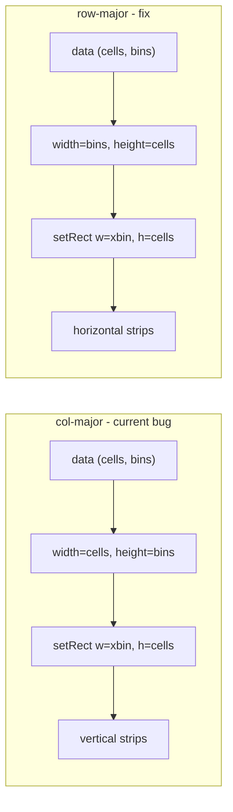

# Fix 1D pf heatmap strip orientation

## Root cause

The window title **"Pho Directional Template Debugger: directional_laps_overview_figure"** is built by [`TemplateDebugger`](h:/TEMP/Spike3DEnv_ExploreUpgrade/Spike3DWorkEnv/pyPhoPlaceCellAnalysis/src/pyphoplacecellanalysis/GUI/PyQtPlot/Widgets/ContainerBased/TemplateDebugger.py) via [`_display_directional_template_debugger`](h:/TEMP/Spike3DEnv_ExploreUpgrade/Spike3DWorkEnv/pyPhoPlaceCellAnalysis/src/pyphoplacecellanalysis/General/Pipeline/Stages/ComputationFunctions/MultiContextComputationFunctions/DirectionalPlacefieldGlobalComputationFunctions.py).

Each panel renders tuning curves as `(n_cells, n_bins)` RGBA via [`visualize_heatmap_pyqtgraph`](h:/TEMP/Spike3DEnv_ExploreUpgrade/Spike3DWorkEnv/pyPhoPlaceCellAnalysis/src/pyphoplacecellanalysis/Pho2D/matplotlib/visualize_heatmap.py), then maps them with:

```python
curr_img.setRect([xbin[0], 0, xbin_width, n_cells])  # (x, y, w, h)
```

**pyqtgraph `ImageItem` defaults to `col-major`**, where:
- `width()` = `shape[0]` (cells)
- `height()` = `shape[1]` (bins)

So `setRect` maps **cells → x-axis** and **bins → y-axis**, producing the vertical strip artifact in your screenshot.

With **`row-major`** (standard `(row, col)` layout):
- `width()` = `shape[1]` = n_bins → x-axis (spatial track)
- `height()` = `shape[0]` = n_cells → y-axis (cell rows)

This matches how other pf-strip code already works around the issue — e.g. [`decoder_result.py`](h:/TEMP/Spike3DEnv_ExploreUpgrade/Spike3DWorkEnv/pyPhoPlaceCellAnalysis/src/pyphoplacecellanalysis/Analysis/Decoder/decoder_result.py) passes `_temp_active_pfs.T` to compensate for `col-major`.



Peak indicator lines and cell labels are already drawn in the correct coordinate frame (x = bin position, y = cell index); only the `ImageItem` axis interpretation is wrong.

## Fix strategy

Use **per-`ImageItem` `axisOrder='row-major'`** rather than changing the global `pg.setConfigOptions(imageAxisOrder=...)` default. This avoids breaking other views that rely on `col-major` (e.g. [`TrialByTrialActivityWindow`](h:/TEMP/Spike3DEnv_ExploreUpgrade/Spike3DWorkEnv/pyPhoPlaceCellAnalysis/src/pyphoplacecellanalysis/GUI/PyQtPlot/Widgets/ContainerBased/TrialByTrialActivityWindow.py) line 152, [`plot_placefields.py`](h:/TEMP/Spike3DEnv_ExploreUpgrade/Spike3DWorkEnv/pyPhoPlaceCellAnalysis/src/pyphoplacecellanalysis/Pho2D/PyQtPlots/plot_placefields.py) line 59).

## Files to change

### 1. [`visualize_heatmap.py`](h:/TEMP/Spike3DEnv_ExploreUpgrade/Spike3DWorkEnv/pyPhoPlaceCellAnalysis/src/pyphoplacecellanalysis/Pho2D/matplotlib/visualize_heatmap.py)

Add optional parameter `axisOrder: Optional[str] = None` to `visualize_heatmap_pyqtgraph`. When provided, pass it to `pg.ImageItem(data, axisOrder=axisOrder)`. Default `None` preserves existing behavior for unrelated callers.

### 2. [`TemplateDebugger.py`](h:/TEMP/Spike3DEnv_ExploreUpgrade/Spike3DWorkEnv/pyPhoPlaceCellAnalysis/src/pyphoplacecellanalysis/GUI/PyQtPlot/Widgets/ContainerBased/TemplateDebugger.py)

- Define a module-level constant, e.g. `PF1D_HEATMAP_AXIS_ORDER = 'row-major'`, for clarity.
- Pass `axisOrder=PF1D_HEATMAP_AXIS_ORDER` to every `visualize_heatmap_pyqtgraph(...)` call (~lines 268, 951).
- In `build_pf1D_heatmap_with_labels_and_peaks`, create `pg.ImageItem(axisOrder=PF1D_HEATMAP_AXIS_ORDER)` instead of bare `pg.ImageItem()`.
- No data transpose or `setRect` changes needed — existing `(n_cells, n_bins, 4)` color matrix and extents are correct once axis order is fixed.

Affected methods:
- `build_pf1D_heatmap_with_labels_and_peaks`
- `BaseTemplateDebuggingMixin._subfn_buildUI_base_decoder_debugger_data` (+ update path)
- `TemplateDebugger._subfn_buildUI_directional_template_debugger_data`
- `TemplateDebugger._subfn_update_directional_template_debugger_data`

### 3. [`DirectionalPlacefieldGlobalComputationFunctions.py`](h:/TEMP/Spike3DEnv_ExploreUpgrade/Spike3DWorkEnv/pyPhoPlaceCellAnalysis/src/pyphoplacecellanalysis/General/Pipeline/Stages/ComputationFunctions/MultiContextComputationFunctions/DirectionalPlacefieldGlobalComputationFunctions.py)

In `_display_directional_laps_overview` (~line 9485), pass the same `axisOrder='row-major'` when creating the four pf1D heatmaps. This fixes the sibling laps-overview display that shares the same rendering pattern.

## Verification

After the fix, re-open **Directional Template Debugger** and confirm in all four panels (`long_LR`, `long_RL`, `short_LR`, `short_RL`):
- Each cell row is a **horizontal** colored strip along the track x-axis
- White peak marker lines remain vertically oriented at the correct bin x-position
- Cell ID labels on the left still align with their rows
- Selecting/highlighting cell 13 (as in your screenshot) still maps to the correct row

No changes to tuning-curve data, sorting, or `setRect` math are expected.
