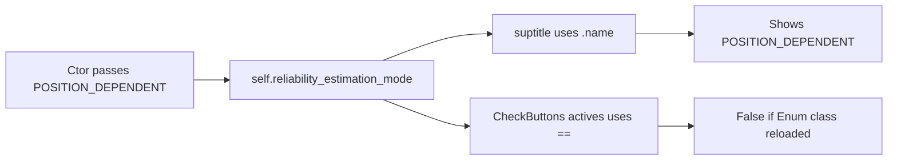

# Fix `pos-dep R` checkbox init in equation debugger

## Root cause

In [`PendingNotebookCode.py`](h:/TEMP/Spike3DEnv_ExploreUpgrade/Spike3DWorkEnv/pyPhoPlaceCellAnalysis/src/pyphoplacecellanalysis/SpecificResults/PendingNotebookCode.py), the title correctly reflects the ctor arg via `.name`:

```2340:2340:h:/TEMP/Spike3DEnv_ExploreUpgrade/Spike3DWorkEnv/pyPhoPlaceCellAnalysis/src/pyphoplacecellanalysis/SpecificResults/PendingNotebookCode.py
... est={self.reliability_estimation_mode.name}'
```

But the checkbox uses Enum identity/`==`:

```2128:2128:h:/TEMP/Spike3DEnv_ExploreUpgrade/Spike3DWorkEnv/pyPhoPlaceCellAnalysis/src/pyphoplacecellanalysis/SpecificResults/PendingNotebookCode.py
estimation_mode_check = CheckButtons(..., [bool(self.reliability_estimation_mode == ReliabilityEstimationMode.POSITION_DEPENDENT)])
```

That matches the project rule ([compare-enum-values-by-value.mdc](h:/TEMP/Spike3DEnv_ExploreUpgrade/Spike3DWorkEnv/Spike3D/.cursor/rules/imported/cursorrules/rules/compare-enum-values-by-value.mdc)): after notebook autoreload, the ctor may pass an older `ReliabilityEstimationMode` type while the debugger module compares against a newly loaded class — `.name` still works (radio uses `.name` and shows TEMPERING correctly), but `==` is False so `pos-dep R` stays unchecked.

`drop n=0` is a plain `bool`, so it initializes correctly.



## Fix

In `InteractiveBayesian2DEquationDebugger` only (same file, ~1531–2569):

1. **Checkbox init** — set actives from `.value`:
   ```python
   want_pos_dep = (self.reliability_estimation_mode.value == ReliabilityEstimationMode.POSITION_DEPENDENT.value)
   estimation_mode_check = CheckButtons(ax_check_est, ['pos-dep R'], [bool(want_pos_dep)])
   ```

2. **Same-class enum compares** in this debugger — switch remaining `==` on these enums to `.value` so setup / redraw / callbacks stay consistent under autoreload:
   - `setup`: tempering gate + POSITION_DEPENDENT ensure-metrics
   - `_poisson_factor_maps`: `use_tempering`
   - `redraw`: POSITION_DEPENDENT R-map branch
   - `on_reliability_mode` / `on_estimation_mode` early-outs
   - `_ensure_sliced_reliability_metrics`: POSITION_DEPENDENT + confusion gate

No widget rebuild or matplotlib `set_active` workarounds needed; RadioButtons already indexes by `.name` and is fine.
