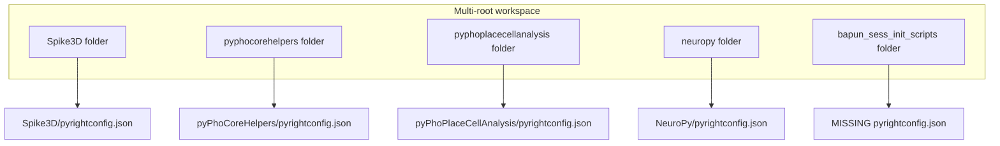

# Fix basedpyright enumeration slowness

## Where `pyrightconfig.json` must live (for Cursor to use it)

BasedPyright discovers config by walking **upward from each multi-root workspace folder** until it finds `pyrightconfig.json` (or `[tool.basedpyright]` / `[tool.pyright]` in `pyproject.toml`). Paths inside the config are **relative to the config file’s directory**, not the `.code-workspace` file.

For your [Spike3D_PhoLibs_workspace_CURSOR_PURPLE.code-workspace](h:/TEMP/Spike3DEnv_ExploreUpgrade/Spike3DWorkEnv/Spike3D/EXTERNAL/VSCode_Workspaces/Spike3D_PhoLibs_workspace_CURSOR_PURPLE.code-workspace), that means:

| Workspace folder in `.code-workspace` | Config found at | Status |
|---|---|---|
| `Spike3D` (`../..` → repo root) | [Spike3D/pyrightconfig.json](h:/TEMP/Spike3DEnv_ExploreUpgrade/Spike3DWorkEnv/Spike3D/pyrightconfig.json) | Present |
| `pyPhoCoreHelpers/src/pyphocorehelpers` | [pyPhoCoreHelpers/pyrightconfig.json](h:/TEMP/Spike3DEnv_ExploreUpgrade/Spike3DWorkEnv/pyPhoCoreHelpers/pyrightconfig.json) (parent walk) | Present |
| `pyPhoPlaceCellAnalysis/src/pyphoplacecellanalysis` | [pyPhoPlaceCellAnalysis/pyrightconfig.json](h:/TEMP/Spike3DEnv_ExploreUpgrade/Spike3DWorkEnv/pyPhoPlaceCellAnalysis/pyrightconfig.json) | Present |
| `NeuroPy/neuropy` | [NeuroPy/pyrightconfig.json](h:/TEMP/Spike3DEnv_ExploreUpgrade/Spike3DWorkEnv/NeuroPy/pyrightconfig.json) | Present |
| `W:/Data/Bapun/RatS/bapun_sess_init_scripts` | **none** | **Missing** |

**Important:** The config does **not** go next to the `.code-workspace` file under `EXTERNAL/VSCode_Workspaces/`. It goes at each **workspace folder root** (or a parent directory above it).



## Why you still see the 10s warning (despite having configs)

Measured file counts under your current workspace roots:

- **Spike3D**: ~302,000 files — almost all in `.venv` (~135K) and `.venv_BAK` (~164K)
- **bapun_sess_init_scripts**: ~132,000 files — `.venv`, `.venv_BAD`, `.venv_WSL`, `EXTERNAL`, etc.
- Lib roots: 250–2,670 files each (fine)

So the warning is real: basedpyright is trying to enumerate hundreds of thousands of files across roots.

Your existing [Spike3D/pyrightconfig.json](h:/TEMP/Spike3DEnv_ExploreUpgrade/Spike3DWorkEnv/Spike3D/pyrightconfig.json) has many `exclude` entries, but:

1. **No `include` on Spike3D** — unlike the lib repos (`"include": ["src"]` / `"neuropy"`), Spike3D defaults to “the whole repo root is the project,” so enumeration starts from the top and must apply excludes to everything underneath.
2. **Fifth workspace root has no config** — `bapun_sess_init_scripts` has no `pyrightconfig.json` and no pyright section in its `pyproject.toml`, so basedpyright scans the entire tree (~132K files).
3. **Workspace settings only exclude two paths** — your `.code-workspace` has `cursorpyright.analysis.exclude` for only `**/EXTERNAL` and `**/LibrariesExamples`, which does not cover venvs:

```283:286:h:/TEMP/Spike3DEnv_ExploreUpgrade/Spike3DWorkEnv/Spike3D/EXTERNAL/VSCode_Workspaces/Spike3D_PhoLibs_workspace_CURSOR_PURPLE.code-workspace
        "cursorpyright.analysis.exclude": [
            "**/EXTERNAL",
            "**/LibrariesExamples"
        ],
```

4. **`python.analysis.exclude` has the same narrow list** — Pylance is disabled (`"python.languageServer": "None"`), but this shows the exclusion intent was never extended to venvs.

`.cursorignore` in Spike3D only ignores SpecStory backups — it does **not** affect basedpyright enumeration (that’s a separate Cursor indexer setting).

## Recommended fixes (in priority order)

### 1. Add `pyrightconfig.json` to the missing workspace root

Create [W:/Data/Bapun/RatS/bapun_sess_init_scripts/pyrightconfig.json](W:/Data/Bapun/RatS/bapun_sess_init_scripts/pyrightconfig.json) modeled on your other repos:

- `"include": ["scripts", "notebooks", "spikeinterface_pipeline", "tests"]` (adjust to dirs you actually edit)
- `"exclude"`: `**/.venv*`, `**/EXTERNAL`, `**/__pycache__`, `**/node_modules`, `**/.git`, etc.

This alone should drop ~130K files from enumeration for that root.

### 2. Narrow Spike3D’s `pyrightconfig.json` with `include`

Add an `include` list to [Spike3D/pyrightconfig.json](h:/TEMP/Spike3DEnv_ExploreUpgrade/Spike3DWorkEnv/Spike3D/pyrightconfig.json) so basedpyright only treats real source areas as the project (e.g. `OpenField`, `pho`, `scripts`, `templating`, etc.) instead of the entire repo root.

This is the strongest fix for the ~300K-file Spike3D root because it prevents enumeration from starting in `.venv` / `.venv_BAK` at all.

Also add explicit excludes as belt-and-suspenders:

- `**/.venv*`
- `.venv_BAK` (your backup venv; 164K files)

### 3. Align `cursorpyright.analysis.exclude` in the `.code-workspace`

Update [Spike3D_PhoLibs_workspace_CURSOR_PURPLE.code-workspace](h:/TEMP/Spike3DEnv_ExploreUpgrade/Spike3DWorkEnv/Spike3D/EXTERNAL/VSCode_Workspaces/Spike3D_PhoLibs_workspace_CURSOR_PURPLE.code-workspace) so `cursorpyright.analysis.exclude` mirrors the important `pyrightconfig.json` excludes (at minimum all `.venv*` patterns, `EXTERNAL`, `data`, `SCRATCH`, `LibrariesExamples`).

Since you open via this file, this ensures Cursor’s pyright extension and the JSON config agree.

### 4. Optional hygiene (biggest disk win)

- **`.venv_BAK`** in Spike3D is 164K files and looks like a stale backup. If you don’t need it locally, deleting or moving it outside the workspace eliminates the largest single directory.
- If `bapun_sess_init_scripts` is not needed daily, removing it from the workspace folders list is the fastest workaround.

### 5. Reload after changes

After editing configs: **Command Palette → “Developer: Reload Window”** (or restart Cursor). basedpyright only re-enumerates on reload.

## How to verify it worked

1. Reload window.
2. Open **Output** panel → select **basedpyright** / **Cursor Pyright** channel.
3. Confirm the “Enumeration … longer than 10 seconds” warning stops.
4. Optionally set `"verboseOutput": true` temporarily in one `pyrightconfig.json` to see which roots/paths are being scanned.

## What you do NOT need to do

- Put `pyrightconfig.json` in `.cursor/`, `.vscode/`, or next to the `.code-workspace` file — those locations are ignored.
- Duplicate configs inside `src/pyphocorehelpers` etc. unless you want belt-and-suspenders; parent-repo configs are already found via upward search.
