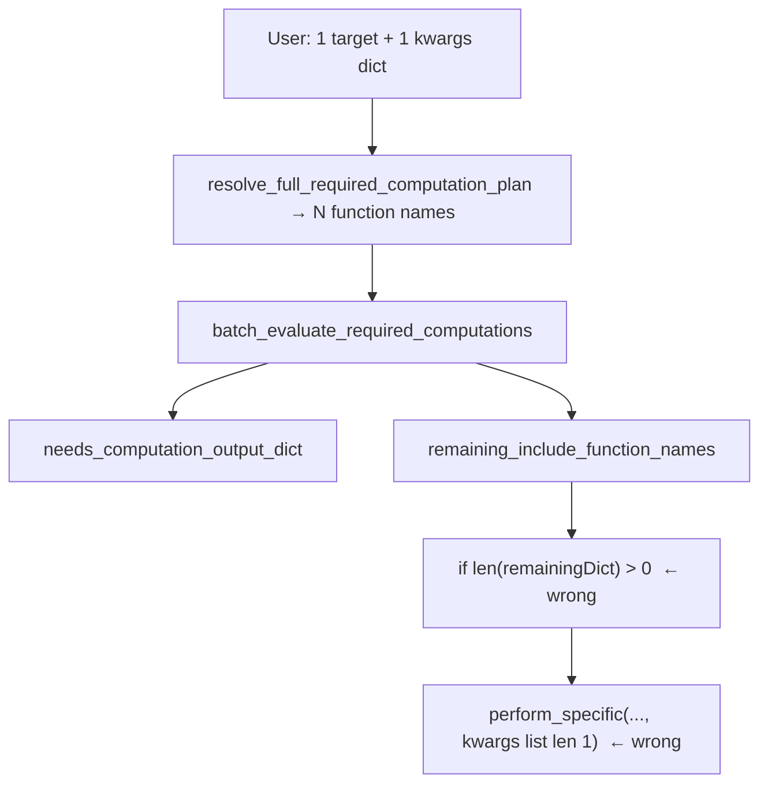

# Fix computation_kwargs_list in resolve_and_execute

**Goal:** Calling `resolve_and_execute_full_required_computation_plan(..., computation_functions_name_includelist=['directional_decoders_decode_continuous'], computation_kwargs_list=[{...}])` from [`EpochComputationFunctions.py`](h:\TEMP\Spike3DEnv_ExploreUpgrade\Spike3DWorkEnv\pyPhoPlaceCellAnalysis\src\pyphoplacecellanalysis\General\Pipeline\Stages\ComputationFunctions\EpochComputationFunctions.py) (~2824) must (1) run missing dependency computations in order, (2) pass `{}` to prereqs and the user kwargs only to matching targets, (3) not assert on kwargs list length.

**Root cause (two bugs in one method):**



- **`remaining_include_function_names`** tracks names in `include_includelist` that never matched a validator (usually empty when the plan is valid). It is **not** “functions that still need compute.”
- When deps need work, `needs_computation_output_dict` is non-empty but `remaining` is often `{}`, so the method hits the “no computations required” branch and never calls `perform_specific_computation`.
- When the wrong branch does run, it passes the **original** 1-element `computation_kwargs_list` to a **longer** `computation_functions_name_includelist` → assertion in `perform_specific_computation`.

## Implementation ([`Computation.py`](h:\TEMP\Spike3DEnv_ExploreUpgrade\Spike3DWorkEnv\pyPhoPlaceCellAnalysis\src\pyphoplacecellanalysis\General\Pipeline\Stages\ComputationFunctions\Computation.py))

### 1. Add helper on `ComputedPipelineStage` (near `run_specific_computations_single_context`, ~522)

`build_computation_kwargs_list_for_function_names(computation_functions_name_includelist, requested_computation_functions_name_includelist, requested_computation_kwargs_list, optional_computation_kwargs_dict=None) -> List[dict]`

- Build lookup from the **user’s** `(requested names, requested kwargs)` zip (preserve current contract: `len(kwargs) == len(requested names)`).
- Merge optional `computation_kwargs_dict` (same pattern as [`batch_extended_computations`](h:\TEMP\Spike3DEnv_ExploreUpgrade\Spike3DWorkEnv\pyPhoPlaceCellAnalysis\src\pyphoplacecellanalysis\General\Batch\NonInteractiveProcessing.py) `computation_kwargs_dict`) for callers that prefer a dict.
- For each name in `computation_functions_name_includelist` (the list about to run), resolve kwargs via `SpecificComputationValidator.does_name_match` against lookup keys (`short_name` / `computation_fn_name`); default `{}`.

Reuse the same short_name fallback idea already in `run_specific_computations_single_context` (lines 527–530).

### 2. Fix `resolve_and_execute_full_required_computation_plan` (~1079–1130)

After `batch_evaluate_required_computations`:

- Compute **functions to run** (dependency order preserved):

```python
functions_to_run = [fn for fn in ordered_required_dependent_computation_fn_names if fn in needs_computation_output_dict]
```

- If `functions_to_run` is non-empty:
  - `aligned_kwargs_list = self.build_computation_kwargs_list_for_function_names(functions_to_run, computation_functions_name_includelist, computation_kwargs_list)`
  - `perform_specific_computation(computation_functions_name_includelist=functions_to_run, computation_kwargs_list=aligned_kwargs_list, enabled_filter_names=enabled_filter_names, fail_on_exception=fail_on_exception, debug_print=debug_print)`
- Else: log that validators passed (unchanged intent).

Optional: add optional parameter `computation_kwargs_dict: Optional[Dict[str, dict]] = None` to `resolve_and_execute_full_required_computation_plan` and pass through to the helper (backward compatible).

Update docstring: kwargs apply to **named targets** in `computation_functions_name_includelist`; resolved dependencies get `{}` unless also present in the lookup/dict.

### 3. Call site ([`EpochComputationFunctions.py`](h:\TEMP\Spike3DEnv_ExploreUpgrade\Spike3DWorkEnv\pyPhoPlaceCellAnalysis\src\pyphoplacecellanalysis\General\Pipeline\Stages\ComputationFunctions\EpochComputationFunctions.py) ~2823)

No logic change required once core is fixed; existing call with one target + `{'time_bin_size', 'should_disable_cache'}` is the intended usage.

**Note (out of scope for this fix):** This call still only runs `directional_decoders_decode_continuous`; `trackID_weighted_position_posterior` export uses `generalized_specific_epochs_decoding` / `DirectionalMergedDecoders` for `psuedo2D_*`. Fixing kwargs does not change that data path.

## Verification

- Dry-run mentally / in notebook: with stale/missing `DirectionalMergedDecoders`, `resolve_and_execute...(['directional_decoders_decode_continuous'], [{time_bin_size, should_disable_cache}])` should run the full ordered chain without AssertionError and pass kwargs only to `directional_decoders_decode_continuous`.
- When all validators pass, should print “no computations required” and not call `perform_specific_computation`.
- Existing multi-target calls with `len(kwargs) == len(includelist)` unchanged.
