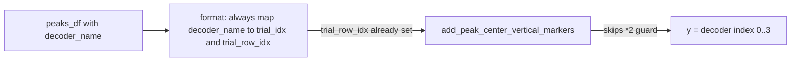

# Fix static decoder PF peak markers

## Problem

In [`PendingNotebookCode.py`](h:\TEMP\Spike3DEnv_ExploreUpgrade\Spike3DWorkEnv\pyPhoPlaceCellAnalysis\src\pyphoplacecellanalysis\SpecificResults\PendingNotebookCode.py) (`plot_static_decoder_placefields_in_trial_by_trial_activity_window`):

1. `_subfn_format_static_decoder_peaks_df_for_tbyt_window` only fills `trial_idx` / `trial_row_idx` when missing, so stale values from prior calls or remapped `rel_trial_idx` persist.
2. It then passes `trial_row_idx` into `TrialByTrialActivityWindow` methods that skip their transform when that column exists — correct for avoiding double-apply, but only if `trial_row_idx` is the right **display** y for this layout.
3. This static hack uses one image row per decoder (`y = 0..n_decoders-1`). The window’s default `(trial_idx-1)*2` is for real lap TbyT spacing and must **not** run here. So we must always set `trial_row_idx = decoder_index` and pass it so the window skips `*2`.
4. Building on all `any_decoder_neuron_IDs` then calling `sliced_by_neuron_id(override_...)` mis-indexes the matrix when override is a subset (bug in `TrialByTrialActivity.sliced_by_neuron_id`), so heatmaps and peak lines disagree under the same aclu title.

## Changes (only inside this function)

### A. Fix `_subfn_format_static_decoder_peaks_df_for_tbyt_window`

- Require `decoder_name` (assert if missing). Do not invent it from `rel_trial_idx` (that column is `{0,1}` per long/short pair after `compute_peak_matched_long_short_pf_remapping`).
- **Always** overwrite (never `if not in columns`):
  - `trial_idx = decoder_to_trial_idx[decoder_name]` (1-based)
  - `trial_row_idx = decoder_to_trial_row_idx[decoder_name]` (0-based decoder index, **no `*2`**)
- Keep the existing column alias / filter / dtype cleanup as-is.

### B. Build heatmaps on `override_active_neuron_IDs`

After ratemap filtering of `override_active_neuron_IDs`, use that array as the matrix neuron axis:

- `n_aclus = len(override_active_neuron_IDs)`
- `aclu_to_matrix_IDX_map` / fill loops over `override_active_neuron_IDs` (not `any_decoder_neuron_IDs`)
- Drop the post-build `sliced_by_neuron_id(...)` call (identity / no longer needed)

This keeps marker aclus and heatmap rows aligned without touching [`reliability.py`](h:\TEMP\Spike3DEnv_ExploreUpgrade\Spike3DWorkEnv\pyPhoPlaceCellAnalysis\src\pyphoplacecellanalysis\Analysis\reliability.py).

### C. Call site

Leave marker/label columns including `trial_row_idx` so the window’s `if 'trial_row_idx' not in peaks_df` guard skips `*2`. No change needed there beyond whatever column names the formatter still provides.

## Out of scope

- No changes to `TrialByTrialActivityWindow` or `sliced_by_neuron_id` itself.
- No notebook edits.