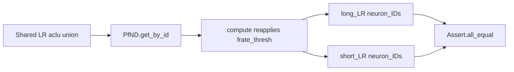

# Keep shared template neuron IDs aligned

## What fails

Double-clicking the directional track remapping display calls `DirectionalLapsResult.get_templates` → `TrackTemplates.filtered_by_frate_and_qclu`. Unfiltered long/short LR `neuron_IDs` already match (`init_from_paired_decoders` at line 2013 succeeds). The assertion fires only after filtering:

```700:700:h:\TEMP\Spike3DEnv_ExploreUpgrade\Spike3DWorkEnv\pyPhoPlaceCellAnalysis\src\pyphoplacecellanalysis\General\Pipeline\Stages\ComputationFunctions\MultiContextComputationFunctions\DirectionalPlacefieldGlobalComputationFunctions.py
        Assert.all_equal(*LR_decoders_dict_neuron_IDs)
```

The two arrays in the traceback are different sets (long-only: 9, 18, 26, 27, 59, 63, 77, 89; short-only: 8, 58, 68, 102), so this is not an ordering mismatch.

## Why the sets diverge

[`TrackTemplates.determine_decoder_aclus_filtered_by_frate_and_qclu`](h:\TEMP\Spike3DEnv_ExploreUpgrade\Spike3DWorkEnv\pyPhoPlaceCellAnalysis\src\pyphoplacecellanalysis\General\Pipeline\Stages\ComputationFunctions\MultiContextComputationFunctions\DirectionalPlacefieldGlobalComputationFunctions.py) builds one shared LR list (union of cells that pass the display firing-rate and qclu criteria on either long or short) and then calls `get_by_id` on both decoders with that same list.

[`PfND.get_by_id`](h:\TEMP\Spike3DEnv_ExploreUpgrade\Spike3DWorkEnv\NeuroPy\neuropy\analyses\placefields.py) does not keep those IDs. It filters spikes and calls `compute()`, which drops any cell whose smoothed peak is not strictly above `config.frate_thresh`. Long and short tracks have different curves, so each decoder keeps a different subset. `init_from_paired_decoders_dicts` then requires the results to be identical.

The filter comment says inclusion is OR across long vs short, and the remapping diagram needs the same cells on both tracks. Slicing the existing ratemaps (no second firing-rate pass) preserves that.



## Change

Add `recompute: bool = True` to `PfND.get_by_id` and thread it through [`BasePositionDecoder.get_by_id`](h:\TEMP\Spike3DEnv_ExploreUpgrade\Spike3DWorkEnv\pyPhoPlaceCellAnalysis\src\pyphoplacecellanalysis\Analysis\Decoder\reconstruction.py). Default stays `True`, so existing callers (including shared-aclu decoder construction) keep current behavior.

When `recompute=False`:

- Still restrict `_filtered_spikes_df` to the requested ids.
- Slice the existing ratemap with `Ratemap.get_by_id` (already requires every requested id to be present) and slice `_ratemap_spiketrains` / `_ratemap_spiketrains_pos` with the same mask.
- Do not call `compute()`.

Pass `recompute=False` from both copies of `determine_decoder_aclus_filtered_by_frate_and_qclu` in [`DirectionalPlacefieldGlobalComputationFunctions.py`](h:\TEMP\Spike3DEnv_ExploreUpgrade\Spike3DWorkEnv\pyPhoPlaceCellAnalysis\src\pyphoplacecellanalysis\General\Pipeline\Stages\ComputationFunctions\MultiContextComputationFunctions\DirectionalPlacefieldGlobalComputationFunctions.py) (`BaseTrackTemplates` around line 780 and `TrackTemplates` around line 1431). The crash path is the `TrackTemplates` override. The base copy has the same `get_by_id` call.

Because the unfiltered neuron ID arrays already compare equal, `np.isin` keeps the same relative order on both decoders, so `Assert.all_equal` holds after the slice.

Leave [`PfND.determine_pf_aclus_filtered_by_frate_and_qclu`](h:\TEMP\Spike3DEnv_ExploreUpgrade\Spike3DWorkEnv\NeuroPy\neuropy\analyses\placefields.py) on the recomputing path; it is not on this stack.
