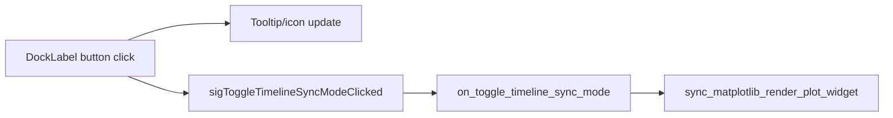

# Fix TO_GLOBAL_DATA track sync toggle

## Root cause

The sync-mode button in [`Dock.py`](h:\TEMP\Spike3DEnv_ExploreUpgrade\Spike3DWorkEnv\pyPhoPlaceCellAnalysis\src\pyphoplacecellanalysis\External\pyqtgraph\dockarea\Dock.py) correctly cycles UI state in `DockLabel.on_sync_mode_btn_clicked` and emits `sigToggleTimelineSyncModeClicked`. The actual sync logic lives in [`SpecificDockWidgetManipulatingMixin.on_toggle_timeline_sync_mode`](h:\TEMP\Spike3DEnv_ExploreUpgrade\Spike3DWorkEnv\pyPhoPlaceCellAnalysis\src\pyphoplacecellanalysis\GUI\PyQtPlot\DockingWidgets\SpecificDockWidgetManipulatingMixin.py), which calls [`Spike2DRaster.sync_matplotlib_render_plot_widget`](h:\TEMP\Spike3DEnv_ExploreUpgrade\Spike3DWorkEnv\pyPhoPlaceCellAnalysis\src\pyphoplacecellanalysis\GUI\PyQtPlot\Widgets\SpikeRasterWidgets\Spike2DRaster.py) (TO_GLOBAL_DATA branch sets x-range to `total_df_start_end_times` and disconnects window scrolling).



**The break:** signal → handler connection is only made in higher-level helpers (`add_docked_marginal_track`, `add_docked_decoded_posterior_track`, etc.). Tracks created directly through `add_new_matplotlib_render_plot_widget` never get connected.

Your screenshot track name (`marginal_over_track_ID_ContinuousDecode - t_bin_size: (0.25, 0.25)`) is created by [`_perform_add_new_decoded_posterior_marginal_row`](h:\TEMP\Spike3DEnv_ExploreUpgrade\Spike3DWorkEnv\pyPhoPlaceCellAnalysis\src\pyphoplacecellanalysis\General\Pipeline\Stages\ComputationFunctions\MultiContextComputationFunctions\DirectionalPlacefieldGlobalComputationFunctions.py) (~L10863), which:

1. Calls `add_new_matplotlib_render_plot_widget(...)` (dock returned as `dock_crap`, then discarded)
2. Calls `sync_matplotlib_render_plot_widget(identifier_name)` once at creation (TO_WINDOW default)
3. **Never connects** `dock_item.sigToggleTimelineSyncModeClicked`

So clicking the button updates the tooltip to `TO_GLOBAL_DATA` but no handler runs — exactly the reported behavior.

## Minimal fix

Wire the sync button at the common dock-creation entry point so all matplotlib/pyqtgraph tracks get the handler automatically.

### 1. Add a small helper on `SpecificDockWidgetManipulatingMixin`

Extract the repeated 8-line connection block (already duplicated ~6 times in the same file) into one method:

```python
def _connect_dock_timeline_sync_mode_button(self, dock_item, identifier_name):
    if 'button_action_callbacks' not in dock_item.connections:
        dock_item.connections['button_action_callbacks'] = {}
    _out_connections = dock_item.connections['button_action_callbacks']
    _prev_conn = _out_connections.pop(identifier_name, None)
    if _prev_conn is not None:
        dock_item.sigToggleTimelineSyncModeClicked.disconnect(_prev_conn)
    assert identifier_name == dock_item._name
    _out_connections[identifier_name] = dock_item.sigToggleTimelineSyncModeClicked.connect(self.on_toggle_timeline_sync_mode)
    dock_item.connections['button_action_callbacks'] = _out_connections
```

Place it immediately after `on_toggle_timeline_sync_mode` (~L135).

### 2. Call the helper from dock creation methods in `Spike2DRaster.py`

In [`add_new_matplotlib_render_plot_widget`](h:\TEMP\Spike3DEnv_ExploreUpgrade\Spike3DWorkEnv\pyPhoPlaceCellAnalysis\src\pyphoplacecellanalysis\GUI\PyQtPlot\Widgets\SpikeRasterWidgets\Spike2DRaster.py) (~L1617), after optional `sync_mode` setup and before return:

```python
if dDisplayItem is not None and getattr(dDisplayItem.config, 'showTimelineSyncModeButton', True):
    self._connect_dock_timeline_sync_mode_button(dDisplayItem, name)
```

Same call at end of [`add_new_embedded_pyqtgraph_render_plot_widget`](h:\TEMP\Spike3DEnv_ExploreUpgrade\Spike3DWorkEnv\pyPhoPlaceCellAnalysis\src\pyphoplacecellanalysis\GUI\PyQtPlot\Widgets\SpikeRasterWidgets\Spike2DRaster.py) (~L1678) for pyqtgraph tracks (e.g. position curves).

**Why here and not in `_perform_add_new_decoded_posterior_marginal_row`:** fixes all direct `add_new_matplotlib_render_plot_widget` callers (PendingNotebookCode, DecoderPredictionError, etc.) with one change; existing `add_docked_*` paths already disconnect/reconnect safely.

No changes needed to `sync_matplotlib_render_plot_widget` — the TO_GLOBAL_DATA logic is already correct once the handler is invoked.

## Verification

1. Open a Spike2DRaster window with a `marginal_over_track_ID_ContinuousDecode` track (or any matplotlib dock track).
2. Scroll to a narrow active window (TO_WINDOW view).
3. Click the timeline sync button once → tooltip shows `TO_GLOBAL_DATA`.
4. Confirm the track x-axis expands to the full session range (`total_data_start_time` … `total_data_end_time`) and no longer follows playback scrolling.
5. Click again → `NO_SYNC` (range frozen); click again → `TO_WINDOW` (re-links to active window).

Optional: watch console for `on_toggle_timeline_sync_mode(...)` print — should appear after fix when toggling.

## Scope / non-goals

- Do not refactor all existing duplicate connection blocks in `SpecificDockWidgetManipulatingMixin` (optional follow-up).
- Do not modify notebooks or `_perform_add_new_decoded_posterior_marginal_row` directly.
- No change to `DockLabel` UI cycling logic.
