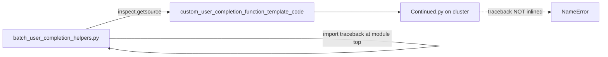

# Fix `traceback` NameError in inlined batch completion functions

## Root cause

Log sequence for `fet11-01_12-58-54` Continued:

1. Directional stacked fails with `'DirectionalDecodersEpochsEvaluations'` (missing computation key).
2. Except block prints the failure banner, then calls `traceback.format_exc()`.
3. That raises `NameError: name 'traceback' is not defined`, attributed to **`Continued.py:299`** — the inlined function body inside the generated script, not a missing sync of the library module.

[`MAIN_get_template_string`](h:/TEMP/Spike3DEnv_ExploreUpgrade/Spike3DWorkEnv/pyPhoPlaceCellAnalysis/src/pyphoplacecellanalysis/General/Batch/BatchJobCompletion/UserCompletionHelpers/batch_user_completion_helpers.py) embeds each completion function with `inspect.getsource(a_fn)`:

```5083:5085:h:/TEMP/Spike3DEnv_ExploreUpgrade/Spike3DWorkEnv/pyPhoPlaceCellAnalysis/src/pyphoplacecellanalysis/General/Batch/BatchJobCompletion/UserCompletionHelpers/batch_user_completion_helpers.py
    for a_name, a_fn in custom_user_completion_functions_dict.items():
        fcn_defn_str: str = inspect.getsource(a_fn)
        template_str = f"{template_str}\n{fcn_defn_str}\ncustom_user_completion_functions.append({a_name})\n# END `{a_name}` USER COMPLETION FUNCTION  _______________________________________________________________________________________ #\n\n"
```

Module-level `import traceback` (added in commit `7feb677a0`) is **not** part of that getsource output. The generated script only gets imports that live in the function body or in `_pre_user_completion_functions_header_template_str` (which already has `from copy import deepcopy` for the same reason).



## Fix (one file)

In [`batch_user_completion_helpers.py`](h:/TEMP/Spike3DEnv_ExploreUpgrade/Spike3DWorkEnv/pyPhoPlaceCellAnalysis/src/pyphoplacecellanalysis/General/Batch/BatchJobCompletion/UserCompletionHelpers/batch_user_completion_helpers.py), extend `_pre_user_completion_functions_header_template_str` (~L5003):

```python
_pre_user_completion_functions_header_template_str: str = f"""
# ==================================================================================================================== #
# BEGIN USER COMPLETION FUNCTIONS                                                                                      #
# ==================================================================================================================== #
from copy import deepcopy
import traceback


custom_user_completion_functions = []
"""
```

Keep the existing module-level `import traceback` (still needed when the function is imported/run from the notebook directly, not via a gen script).

No changes to except blocks, `ProcessBatchOutputs_qclus1246789_Only.ipy`, or `ExceptionPrintingContext`.

## After the code fix

Existing cluster gen scripts still contain the old inlined source. Regenerating via `ProcessBatchOutputs_qclus1246789_Only.ipy` (or equivalent script generation) is required before the next batch run picks this up.

## Verification

1. After regenerating a Continued script, confirm near the “BEGIN USER COMPLETION FUNCTIONS” block that `import traceback` appears before the inlined `figures_plot_...` def.
2. On a directional failure like this session’s missing `DirectionalDecodersEpochsEvaluations`, the log should show the failure banner **plus** a real multi-frame traceback — not a secondary `NameError`.
3. Out of scope for this fix: resolving why `DirectionalDecodersEpochsEvaluations` is missing for this Continued run (that is the original failure that logging should now reveal).
