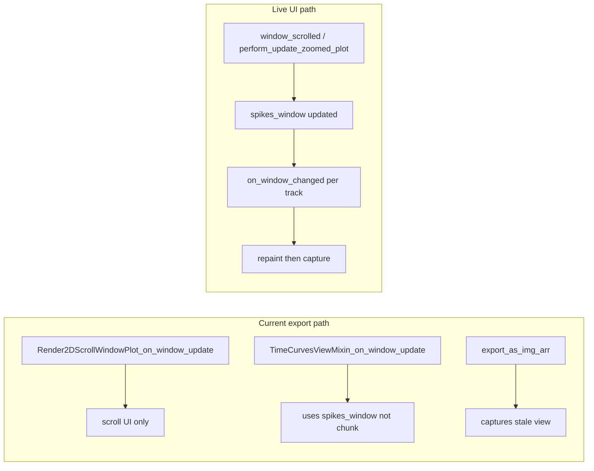

# Fix reliable multi-track PDF export

## Root cause

The export loop in [`ExportHelpers.py`](h:\TEMP\Spike3DEnv_ExploreUpgrade\Spike3DWorkEnv\pyPhoPlaceCellAnalysis\src\pyphoplacecellanalysis\General\Mixins\ExportHelpers.py) does not drive the same update pipeline as live scrolling:

The same file already has the correct pattern at ~line 1766 (`update_scroll_window_region` + `window_scrolled.emit` + `processEvents`). The DEP export path also set pyqtgraph `XRange` before `ImageExporter`.

## Implementation

### 1. Add a chunk-sync helper on `FigureToImageHelpers`

Add `_helper_sync_export_chunk_window(active_2d_plot, start, end, included_track_dock_identifiers, found_track_widgets, debug_print=False)` in [`ExportHelpers.py`](h:\TEMP\Spike3DEnv_ExploreUpgrade\Spike3DWorkEnv\pyPhoPlaceCellAnalysis\src\pyphoplacecellanalysis\General\Mixins\ExportHelpers.py), called once per chunk **before** any `export_as_img_arr` calls:

1. **Update driver state synchronously** (bypass `SignalProxy` rate limit / 200ms delay):
   - `active_2d_plot.perform_update_zoomed_plot(min_t=start, max_t=end)` — updates `spikes_window`, main raster X range, time curves ([`Spike2DRaster.py`](h:\TEMP\Spike3DEnv_ExploreUpgrade\Spike3DWorkEnv\pyPhoPlaceCellAnalysis\src\pyphoplacecellanalysis\GUI\PyQtPlot\Widgets\SpikeRasterWidgets\Spike2DRaster.py) ~902)
   - `active_2d_plot.update_scroll_window_region(start, end, block_signals=True)`

2. **Update each dock track directly** (do not rely on `window_scrolled` + delayed proxies):
   - For each `(dock_id, widget)` in zip:
     - If `dock_id in active_2d_plot.ui.connections` → **TO_WINDOW** matplotlib track → `widget.on_window_changed(start, end)`
     - Elif pyqtgraph time-sync widget (`PyqtgraphTimeSynchronizedWidget` or `hasattr(..., 'getRootPlotItem')`) → `widget.on_window_changed(start, end)`
     - Elif `on_window_changed` accepts `defer_render` → call with `defer_render=False` (decoder layers)
     - Else (**TO_GLOBAL** / no sync) → skip xlim change; keep full-session view

3. **Flush Qt paint queue**:
   - `QtWidgets.QApplication.processEvents()`
   - `active_2d_plot.repaint()` if available

Replace the current broken block at lines 1042–1043 with a call to this helper.

### 2. Harden `export_as_img_arr` implementations

**PyQtGraph** — [`PyqtgraphTimeSynchronizedWidget.py`](h:\TEMP\Spike3DEnv_ExploreUpgrade\Spike3DWorkEnv\pyPhoPlaceCellAnalysis\src\pyphoplacecellanalysis\Pho2D\PyQtPlots\TimeSynchronizedPlotters\PyqtgraphTimeSynchronizedWidget.py) (~562):

- Restore the commented-out logic from the DEP export path:
  - Temporarily break X-link if present
  - `pi.setXRange(start, end, padding=0)` when `start`/`end` provided
  - Restore original ranges + X-link after export
- Enforce minimum export dimensions: `max(1, int(...))` for width/height

**Matplotlib** — [`CustomMatplotlibWidget.py`](h:\TEMP\Spike3DEnv_ExploreUpgrade\Spike3DWorkEnv\pyPhoPlaceCellAnalysis\src\pyphoplacecellanalysis\Pho2D\matplotlib\CustomMatplotlibWidget.py) (~717):

- When `start`/`end` are passed, set xlim on all axes before `canvas.draw()` (belt-and-suspenders for window-synced tracks; TO_GLOBAL tracks won't receive chunk times from the helper above)
- Optionally accept `apply_chunk_xlim=True` kwarg defaulting to True so callers can disable if needed

### 3. Fix track height allocation (zero-height blank rows)

In `export_wrapped_tracks_to_paged_df`, before computing `normalized_track_heights`:

1. Call `QApplication.processEvents()` once so dock layout is realized
2. Compute heights with fallback:
   - `h = max(widget.height(), widget.sizeHint().height(), min_track_height_px)` where `min_track_height_px=1` (or small constant)
3. If sum is still 0, fall back to equal weights (`np.ones(n) / n`) and warn once
4. Enforce minimum figure-unit height per track when building `export_infos` (e.g. at least `0.05` inches) so exporter never gets 0-pixel height

### 4. Add export validation (debug path)

When `debug_print=True`, log per track: dock id, widget type, height, `arr.shape`, and warn if `arr.size == 0` or height &lt; 2 px.

When `debug_print=False`, still skip imshow for empty arrays with a one-line warning (prevents silent white bands without crashing).

### 5. Default to full timeline export

Change `debug_max_num_pages` default from `5` to `None` in `export_wrapped_tracks_to_paged_df` (callers like [`Spike2DRaster.export_all_tracks_to_image`](h:\TEMP\Spike3DEnv_ExploreUpgrade\Spike3DWorkEnv\pyPhoPlaceCellAnalysis\src\pyphoplacecellanalysis\GUI\PyQtPlot\Widgets\SpikeRasterWidgets\Spike2DRaster.py) and batch helpers already pass explicit limits when needed).

## Files to change

| File | Change |
|------|--------|
| [`ExportHelpers.py`](h:\TEMP\Spike3DEnv_ExploreUpgrade\Spike3DWorkEnv\pyPhoPlaceCellAnalysis\src\pyphoplacecellanalysis\General\Mixins\ExportHelpers.py) | New sync helper; replace chunk update block; height fallbacks; `debug_max_num_pages=None` default |
| [`PyqtgraphTimeSynchronizedWidget.py`](h:\TEMP\Spike3DEnv_ExploreUpgrade\Spike3DWorkEnv\pyPhoPlaceCellAnalysis\src\pyphoplacecellanalysis\Pho2D\PyQtPlots\TimeSynchronizedPlotters\PyqtgraphTimeSynchronizedWidget.py) | Restore X-range + X-link handling in `export_as_img_arr` |
| [`CustomMatplotlibWidget.py`](h:\TEMP\Spike3DEnv_ExploreUpgrade\Spike3DWorkEnv\pyPhoPlaceCellAnalysis\src\pyphoplacecellanalysis\Pho2D\matplotlib\CustomMatplotlibWidget.py) | Apply chunk xlim before draw when `start`/`end` provided |

No changes to call sites required; existing `debug_max_num_pages=25` batch overrides remain valid.

## Verification

1. Run `active_2d_plot.export_all_tracks_to_image(...)` on a session with mixed matplotlib + pyqtgraph dock tracks
2. Confirm every track row has content on page 1 and a later page (different time chunk)
3. Confirm TO_GLOBAL overview tracks still span full session (not clipped to chunk xlim on canvas)
4. Re-run with `debug_print=True` and verify no zero-shape arrays
