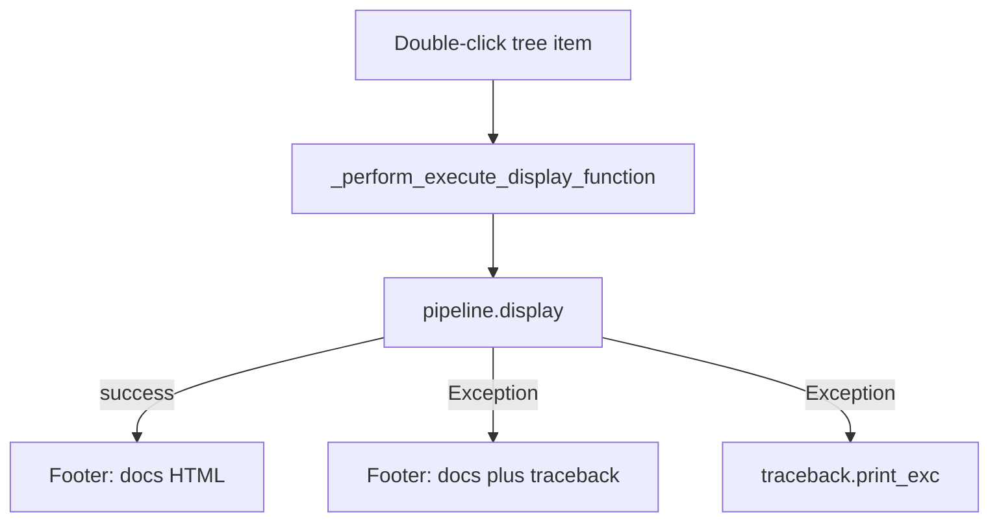

# Show display-function failures in the launcher footer

Double-click on a function in [`LauncherWidget.py`](h:/TEMP/Spike3DEnv_ExploreUpgrade/Spike3DWorkEnv/pyPhoPlaceCellAnalysis/src/pyphoplacecellanalysis/GUI/Qt/MainApplicationWindows/LauncherWidget/LauncherWidget.py) calls `_perform_execute_display_function`, which calls `curr_active_pipeline.display(...)`. `Display.display` does not catch the display function’s exception. The slot decorator [`pyqtExceptionPrintingSlot`](h:/TEMP/Spike3DEnv_ExploreUpgrade/Spike3DWorkEnv/pyPhoCoreHelpers/src/pyphocorehelpers/gui/Qt/ExceptionPrintingSlot.py) then swallows it and only `traceback.print_exc()`s to the console. The footer is `self.docPanelTextBrowser` (`self.ui.textBrowser`), filled by `update_fn_documentation_panel` with `DisplayFunctionItem.longform_description_formatted_html`.

Catch inside `_perform_execute_display_function` so the exception is handled before the decorator hides it. That also covers the context-menu **Run** action, which calls the same method.

## Change

In `_perform_execute_display_function`:

- Wrap lookup and `curr_active_pipeline.display(...)` in `try` / `except Exception`.
- On success, call `update_fn_documentation_panel(a_fcn_name)` so a previous error is cleared and the normal docs footer returns, then return the display result.
- On failure:
  - `traceback.print_exc()` (keep the current console output).
  - Build footer HTML: the function’s existing docs HTML, then a red monospace block with `html.escape(traceback.format_exc())` inside `<pre>`.
  - `self.docPanelTextBrowser.setHtml(...)`.
  - Return `None` (do not re-raise, so the decorator does not print a second copy).

No `.ui` change. Single-click still replaces the footer with docs only, which also clears a stale error.

