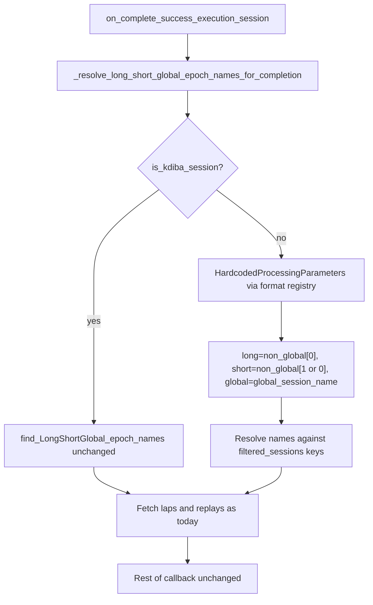

# Format-aware `on_complete_success_execution_session`

## Problem

[`on_complete_success_execution_session`](h:/TEMP/Spike3DEnv_ExploreUpgrade/Spike3DWorkEnv/pyPhoPlaceCellAnalysis/src/pyphoplacecellanalysis/General/Batch/BatchJobCompletion/BatchCompletionHandler.py) unconditionally calls `find_LongShortGlobal_epoch_names()` (line 658), which **raises for non-kdiba sessions**. The rest of the callback (post-validate, global recomputes, completion exports) never runs for Bapun batches.

The same file already branches on session format in two places:
- [`_update_pipeline_missing_preprocessing_parameters`](h:/TEMP/Spike3DEnv_ExploreUpgrade/Spike3DWorkEnv/pyPhoPlaceCellAnalysis/src/pyphoplacecellanalysis/General/Batch/BatchJobCompletion/BatchCompletionHandler.py) (~line 310): kdiba vs non-kdiba
- [`post_compute_validate`](h:/TEMP/Spike3DEnv_ExploreUpgrade/Spike3DWorkEnv/pyPhoPlaceCellAnalysis/src/pyphoplacecellanalysis/General/Batch/BatchJobCompletion/BatchCompletionHandler.py) (~line 347): kdiba runs `LongShortPipelineTests`; Bapun skips them

## Approach

Add a **new classmethod** on `BatchCompletionHandler` (per your preference) and replace the hard-coded kdiba call at the top of `on_complete_success_execution_session`.



## New helper: `_resolve_long_short_global_epoch_names_for_completion`

**Location:** [`BatchCompletionHandler.py`](h:/TEMP/Spike3DEnv_ExploreUpgrade/Spike3DWorkEnv/pyPhoPlaceCellAnalysis/src/pyphoplacecellanalysis/General/Batch/BatchJobCompletion/BatchCompletionHandler.py), placed just above `on_complete_success_execution_session` (alongside other `@classmethod` helpers like `_update_pipeline_missing_preprocessing_parameters`).

**Signature (single line per project style):**

```python
@classmethod
def _resolve_long_short_global_epoch_names_for_completion(cls, curr_active_pipeline) -> Tuple[str, str, str]:
```

**Logic:**

| Branch | Behavior |
|--------|----------|
| **kdiba** (`curr_active_pipeline.is_kdiba_session()`) | Return `curr_active_pipeline.find_LongShortGlobal_epoch_names()` — **no behavior change** |
| **non-kdiba** (Bapun, Rachel, etc.) | Load session hardcoded params using the same registry pattern as [`PendingNotebookCode.py` ~5048–5055](h:/TEMP/Spike3DEnv_ExploreUpgrade/Spike3DWorkEnv/pyPhoPlaceCellAnalysis/src/pyphoplacecellanalysis/SpecificResults/PendingNotebookCode.py): `sess.config.get_format_data_session_type_class_info()` → `_get_session_specific_parameters(session_context=curr_active_pipeline.get_session_context())` |

**Non-kdiba epoch mapping** (maps into existing `PipelineCompletionResult` long/short fields — kdiba-centric naming preserved for backwards compatibility):

- `global_epoch_name` = `hardcoded_params.global_session_name`, falling back to `curr_active_pipeline.find_Global_epoch_name()` if empty
- `non_global_names` = `hardcoded_params.non_global_activity_session_names` (fallback: all `decoder_building_session_names` except global)
- `long_epoch_name` = `non_global_names[0]`
- `short_epoch_name` = `non_global_names[1]` if `len >= 2`, else `non_global_names[0]` (covers single-maze sessions like `Day1Openfield` where both map to `'maze'`)

**Name resolution against `filtered_sessions`:** small inner helper tries exact key, then `{name}_any` suffix (mirrors kdiba lap-split naming), then raises a clear `ValueError` listing available filter keys. This keeps failures actionable without changing kdiba behavior.

## Change in `on_complete_success_execution_session`

Replace lines 658–661:

```python
long_epoch_name, short_epoch_name, global_epoch_name = curr_active_pipeline.find_LongShortGlobal_epoch_names()
long_laps, short_laps, global_laps = [...]
long_replays, short_replays, global_replays = [...]
```

with:

```python
long_epoch_name, short_epoch_name, global_epoch_name = cls._resolve_long_short_global_epoch_names_for_completion(curr_active_pipeline)
long_laps, short_laps, global_laps = [curr_active_pipeline.filtered_sessions[an_epoch_name].laps.as_epoch_obj() for an_epoch_name in [long_epoch_name, short_epoch_name, global_epoch_name]]
long_replays, short_replays, global_replays = [Epoch(curr_active_pipeline.filtered_sessions[an_epoch_name].replay.epochs.get_valid_df()) for an_epoch_name in [long_epoch_name, short_epoch_name, global_epoch_name]]
```

**Everything from line 669 onward stays unchanged** — including `PipelineCompletionResult` shape, kdiba replay/laps extraction, and completion function loop.

## Expected outcome for failing session

For `bapun_RatS_Day5TwoNovel`:
- `long_epoch_name='maze1'`, `short_epoch_name='maze2'`, `global_epoch_name='maze_GLOBAL'`
- Callback proceeds into `post_compute_validate`, global recomputes, and Bapun completion exports

## Verification

After edit, re-run the batch script for `bapun_RatS_Day5TwoNovel` and confirm:
1. No `find_LongShortGlobal_epoch_names` ValueError at callback start
2. Log reaches `starting self.completion_functions execution...`
3. kdiba regression: any existing kdiba batch still resolves epochs via `find_LongShortGlobal_epoch_names()` (unchanged branch)

No changes to [`Computation.py`](h:/TEMP/Spike3DEnv_ExploreUpgrade/Spike3DWorkEnv/pyPhoPlaceCellAnalysis/src/pyphoplacecellanalysis/General/Pipeline/Stages/Computation.py) `find_LongShortGlobal_epoch_names()` — it stays kdiba-only by design.
