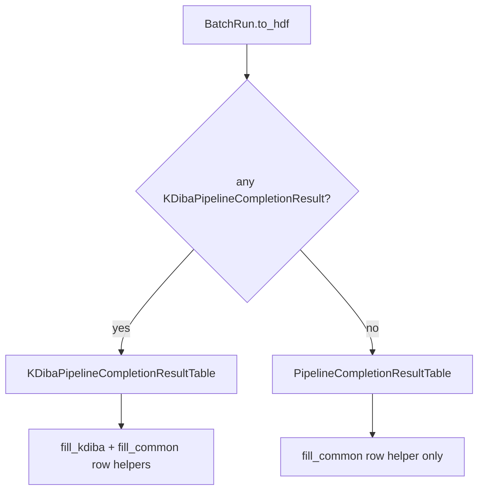

# Generalize `PipelineCompletionResultTable`

## Context

The attrs result split is already done in [`BatchCompletionHandler.py`](h:/TEMP/Spike3DEnv_ExploreUpgrade/Spike3DWorkEnv/pyPhoPlaceCellAnalysis/src/pyphoplacecellanalysis/General/Batch/BatchJobCompletion/BatchCompletionHandler.py):

- `PipelineCompletionResult` — shared fields only
- `KDibaPipelineCompletionResult` — long/short epoch laps/replays

`PipelineCompletionResultTable` (lines 151–169) still embeds all KDiba columns on the base class. It is **write-only** today (created in [`runBatch.py` `BatchRun.to_hdf`](h:/TEMP/Spike3DEnv_ExploreUpgrade/Spike3DWorkEnv/pyPhoPlaceCellAnalysis/src/pyphoplacecellanalysis/General/Batch/runBatch.py) ~line 731); no read/load path exists in the repo.



## 1. Split table classes in `BatchCompletionHandler.py`

Add column-name constant alongside the existing field constant:

```python
_KDIBA_PIPELINE_COMPLETION_RESULT_TABLE_COLUMN_NAMES = frozenset({
    'long_epoch_name', 'long_n_laps', 'long_n_replays',
    'short_epoch_name', 'short_n_laps', 'short_n_replays',
})
```

**`PipelineCompletionResultTable`** — general summary only:

```python
class PipelineCompletionResultTable(tb.IsDescription):
    """PyTables row schema for format-agnostic pipeline completion summary."""
    delta_since_last_compute = tb.Time64Col()
```

**`KDibaPipelineCompletionResultTable(PipelineCompletionResultTable)`** — KDiba long/short epoch summary (same columns as today's table):

```python
class KDibaPipelineCompletionResultTable(PipelineCompletionResultTable):
    """PyTables row schema for KDiba long/short lap/replay counts."""
    long_epoch_name = tb.StringCol(itemsize=100)
    long_n_laps = tb.UInt16Col()
    long_n_replays = tb.UInt16Col()
    short_epoch_name = tb.StringCol(itemsize=100)
    short_n_laps = tb.UInt16Col()
    short_n_replays = tb.UInt16Col()
```

**Row-fill helpers** (static methods on the base table class, colocated with definitions):

- `PipelineCompletionResultTable.fill_common_row_fields(row, a_result: PipelineCompletionResult)` — writes `delta_since_last_compute` (extract the timedelta→nanoseconds logic currently inline in `runBatch.to_hdf` lines 761–767)
- `KDibaPipelineCompletionResultTable.fill_kdiba_row_fields(row, a_result: KDibaPipelineCompletionResult)` — writes the six KDiba columns from `a_result.long_laps.n_epochs`, etc.
- `KDibaPipelineCompletionResultTable.fill_row_from_result(row, a_result: PipelineCompletionResult)` — calls both fill methods (kdiba branch only when `isinstance(a_result, KDibaPipelineCompletionResult)`, else writes empty/zero kdiba columns for mixed batches — preserves current mixed-batch behavior)

**Backward-compat resolver** (for future HDF reads):

```python
@classmethod
def resolve_table_class_from_hdf_colnames(cls, colnames) -> type:
    """Return KDiba subclass if legacy/full schema columns are present."""
    if _KDIBA_PIPELINE_COMPLETION_RESULT_TABLE_COLUMN_NAMES.intersection(colnames):
        return KDibaPipelineCompletionResultTable
    return PipelineCompletionResultTable
```

Legacy HDF files written before this change used the **full** column set — they map to `KDibaPipelineCompletionResultTable` (identical schema).

## 2. Update `runBatch.py`

**Import:** add `KDibaPipelineCompletionResultTable` to the existing import from `BatchCompletionHandler` (line 33).

**`BatchRun.to_hdf`** (~lines 730–757):

1. Before creating the table, choose schema:

```python
has_kdiba_results = any(isinstance(r, KDibaPipelineCompletionResult) for r in session_batch_outputs if r is not None)
table_class = KDibaPipelineCompletionResultTable if has_kdiba_results else PipelineCompletionResultTable
files_table = h5file.create_table(root_group, "batch_run_table", table_class)
```

2. Replace inline row population with helper calls:

```python
if has_kdiba_results:
    KDibaPipelineCompletionResultTable.fill_row_from_result(row, a_result)
else:
    PipelineCompletionResultTable.fill_common_row_fields(row, a_result)
row.append()
```

Remove the duplicated `isinstance` + zero-fill block currently at lines 743–756.

## 3. Files touched

| File | Change |
|------|--------|
| [`BatchCompletionHandler.py`](h:/TEMP/Spike3DEnv_ExploreUpgrade/Spike3DWorkEnv/pyPhoPlaceCellAnalysis/src/pyphoplacecellanalysis/General/Batch/BatchJobCompletion/BatchCompletionHandler.py) | Split table classes, column constant, row-fill + resolver helpers |
| [`runBatch.py`](h:/TEMP/Spike3DEnv_ExploreUpgrade/Spike3DWorkEnv/pyPhoPlaceCellAnalysis/src/pyphoplacecellanalysis/General/Batch/runBatch.py) | Import, dynamic table class selection, delegate row filling |

No notebook changes. `build_batch_lap_replay_counts_df` already uses `isinstance(..., KDibaPipelineCompletionResult)` and needs no table changes.

## 4. Verification

1. Smoke test: build mock `PipelineCompletionResult` and `KDibaPipelineCompletionResult`, write `BatchRun.to_hdf` to a temp `.h5`, confirm:
   - non-kdiba-only batch → table has only `delta_since_last_compute`
   - kdiba (or mixed) batch → table has full 7 columns; non-kdiba rows have zero/empty kdiba fields
2. Confirm `KDibaPipelineCompletionResultTable` column names match pre-refactor `PipelineCompletionResultTable` (legacy HDF schema preserved for kdiba batches)

## Notes

- **Mixed batches:** when any session is kdiba, use the KDiba superset table (same as current zero-fill behavior).
- **Non-kdiba `is_ready` lap thresholds** remain a separate follow-up (unchanged from prior refactor).
