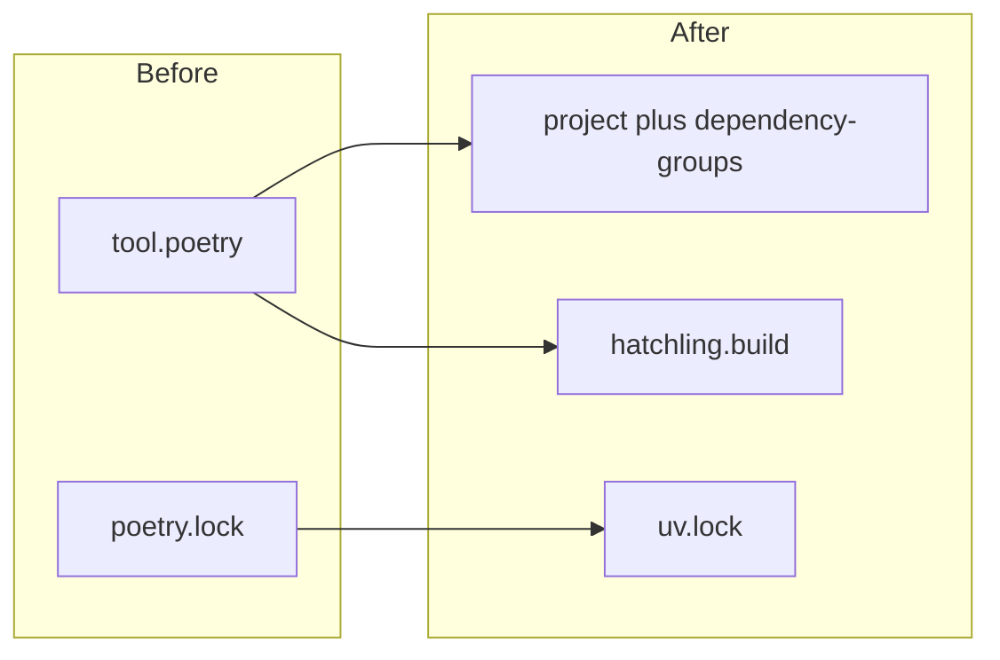

# Convert HippocampalSWRDynamics from Poetry to UV

## Current state

- `[pyproject.toml](h:\TEMP\Spike3DEnv_ExploreUpgrade\Spike3DWorkEnv\HippocampalSWRDynamics\pyproject.toml)`: Poetry `^` constraints, `[tool.poetry.dev-dependencies]`, `build-backend = "poetry.masonry.api"`, explicit package include `replay_structure`.
- `[poetry.lock](h:\TEMP\Spike3DEnv_ExploreUpgrade\Spike3DWorkEnv\HippocampalSWRDynamics\poetry.lock)`: present (remove after UV lockfile exists).
- `[.python-version](h:\TEMP\Spike3DEnv_ExploreUpgrade\Spike3DWorkEnv\HippocampalSWRDynamics\.python-version)`: `3.8.10` (keep; aligns with `python = "^3.8"`).

Reference pattern in your workspace: `[pyPhoPlaceCellAnalysis/pyproject.toml](h:\TEMP\Spike3DEnv_ExploreUpgrade\Spike3DWorkEnv\pyPhoPlaceCellAnalysis\pyproject.toml)` uses `[project]`, `[dependency-groups]`, `[tool.uv]`, and Hatchling.

## Target `pyproject.toml` shape

1. `**[project]**` (PEP 621)
  - Map Poetry fields: `name`, `version`, `description`, authors as `[{ name = "DrugowitschLab" }]`, optional `readme = "README.md"` and `license` from existing `LICENSE` if you want fuller metadata.
  - `requires-python = ">=3.8,<4"` (equivalent to Poetry `python = "^3.8"`).
  - `dependencies`: same packages as today, with Poetry `^x.y.z` translated to PEP 508 ranges `>=x.y.z,<next-major` (e.g. `numpy = "^1.18.2"` becomes `numpy>=1.18.2,<2`).
  - Keep `black==18.9b0`-style pins where Poetry pinned exactly.
2. `**[dependency-groups]**` (PEP 735, [UV dependency groups](https://docs.astral.sh/uv/concepts/projects/dependencies/))
  - Move former `[tool.poetry.dev-dependencies]` into `dev = [...]` (pytest, flake8, black, yapf, ipykernel, mypy).
3. `**[tool.uv]**`
  - Set `default-groups = ["dev"]` so `uv sync` matches old `poetry install` behavior (main + dev), without requiring users to remember `--group dev`. If you prefer production-only default installs, omit `default-groups` and document `uv sync --group dev` instead.
4. **Build backend**
  - `[build-system]`: `requires = ["hatchling"]`, `build-backend = "hatchling.build"`.
  - Explicit wheel package selection (same intent as Poetry’s `packages = [{ include = "replay_structure" }]`):

```toml
[tool.hatch.build.targets.wheel]
packages = ["replay_structure"]
```

- Optionally mirror Hatch docs with a minimal `[tool.hatch.build.targets.sdist]` `exclude` for large local paths (`data/`, `results/`) if you want leaner sdists; not strictly required for UV compatibility.

1. **Project naming**
  - Use a single valid [PEP 621 project `name](https://packaging.python.org/en/latest/specifications/pyproject-toml/)` (normalized lowercase, hyphens allowed). Example: `hippocampalswrdynamics` (consistent with lowercase names like `replayswitchinghmm` in the workenv). This only affects distribution metadata, not the import path `replay_structure`.

## Lockfile and cleanup

- Run `uv lock` in the repo root to generate `[uv.lock](h:\TEMP\Spike3DEnv_ExploreUpgrade\Spike3DWorkEnv\HippocampalSWRDynamics\uv.lock)`.
- Run `uv sync --all-groups` (or `uv sync` if `default-groups` includes `dev`) per your usual workflow.
- Remove `poetry.lock` from the tree and stop committing it.

## Torch / resolver caveat (plan for validation)

The stack is old (`torch ^1.4.0`, Python 3.8). Resolution may still succeed from PyPI for those pins; if `uv lock` fails or wheels are missing on your OS, follow [UV’s PyTorch guide](https://docs.astral.sh/uv/guides/integration/pytorch/) (`[[tool.uv.index]]` + `[tool.uv.sources]` for `torch`). That would be a follow-up fix only if locking fails.

## Docs and git hygiene

- Update `[README.md](h:\TEMP\Spike3DEnv_ExploreUpgrade\Spike3DWorkEnv\HippocampalSWRDynamics\README.md)` Poetry link sentence to UV (`uv sync`, `uv run`, link to [https://docs.astral.sh/uv/](https://docs.astral.sh/uv/)).
- Update `[.gitignore](h:\TEMP\Spike3DEnv_ExploreUpgrade\Spike3DWorkEnv\HippocampalSWRDynamics\.gitignore)`: replace the “poetry” section with generic `*.egg-info/`, and add `.venv/` so local UV environments are not committed.

## Verification

- `uv sync` (or with explicit groups) completes without conflicts.
- `uv run python -c "import replay_structure"` succeeds.
- Optional: `uv build` produces a wheel that contains only `replay_structure` (not ad-hoc `scripts/` packages).




