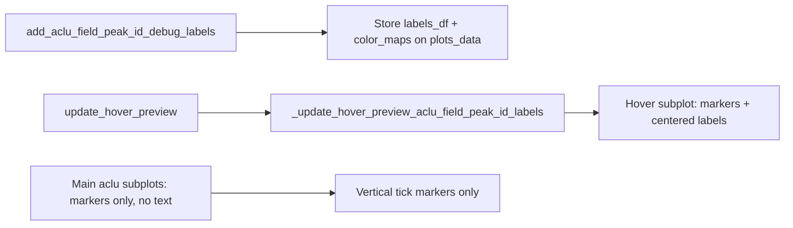

# Hover-only aclu_field_peak_id debug labels

## Current behavior

In [`TrialByTrialActivityWindow.py`](h:\TEMP\Spike3DEnv_ExploreUpgrade\Spike3DWorkEnv\pyPhoPlaceCellAnalysis\src\pyphoplacecellanalysis\GUI\PyQtPlot\Widgets\ContainerBased\TrialByTrialActivityWindow.py):

- `add_aclu_field_peak_id_debug_labels` builds labels via `_build_aclu_field_peak_id_label_items`, adds them to **every aclu subplot** (`plot_array`), stores them in `plots.aclu_field_peak_id_debug_labels`, and optionally refreshes the hover preview.
- `_update_hover_preview_aclu_field_peak_id_labels` (called from `update_hover_preview`) already draws the same labels on the **hover subplot** from stored `plots_data.aclu_field_peak_id_labels_df`.
- Label placement in `_build_aclu_field_peak_id_label_items` (lines 982–987):

```python
label_text = pg.TextItem(..., anchor=(0.5, 1.0))
label_text.setPos(float(a_x), float(a_trial_idx) + float(trial_half_height) + label_y_offset)
```

This centers horizontally but places text **above** the tick top, not on the tick center.

Peak **vertical markers** remain on main subplots via `add_peak_center_vertical_markers` — unchanged.

## Target behavior



## Changes (single file)

All edits in [`TrialByTrialActivityWindow.py`](h:\TEMP\Spike3DEnv_ExploreUpgrade\Spike3DWorkEnv\pyPhoPlaceCellAnalysis\src\pyphoplacecellanalysis\GUI\PyQtPlot\Widgets\ContainerBased\TrialByTrialActivityWindow.py).

### 1. Center labels on the vertical tick — `_build_aclu_field_peak_id_label_items`

- Change `anchor` from `(0.5, 1.0)` to `(0.5, 0.5)`.
- Change `setPos` to `(peak_center_x, trial_idx)` — remove `trial_half_height + label_y_offset` y offset.
- Remove unused `label_y_offset` local; keep `trial_half_height` in the signature for call-site compatibility (still passed from params) but it no longer affects label y-position.
- Update the method docstring: labels are centered on the tick, not above it.

### 2. Stop drawing labels on main subplots — `add_aclu_field_peak_id_debug_labels`

- Keep: trial_idx transform, color-map building per aclu, storing `plots_data.aclu_field_peak_id_labels_df` and `plots_data.aclu_field_peak_id_color_maps_dict`, storing label params on `self.params`.
- Remove: loop that calls `curr_plot.addItem(a_label)` for each aclu subplot (lines ~1288–1293).
- Remove: `self.plots.aclu_field_peak_id_debug_labels = new_labels` — set `self.plots.aclu_field_peak_id_debug_labels = None` instead (labels live only on hover).
- Return `{}` (empty dict) since no subplot items are created; update docstring/Returns section accordingly.
- Keep `include_hover_preview` refresh path unchanged.

### 3. Simplify clear helper — `_clear_aclu_field_peak_id_debug_labels`

- Remove the subplot-removal loop over `plots.aclu_field_peak_id_debug_labels` (no longer populated).
- Keep hover-preview label removal (still needed when re-calling `add_aclu_field_peak_id_debug_labels` with `clear_existing=True`).
- Still clear `plots.aclu_field_peak_id_debug_labels = None` and `plots_data.aclu_field_peak_id_color_maps_dict = None`.

### 4. No changes needed elsewhere

- `_update_hover_preview_aclu_field_peak_id_labels` — already hover-only; will pick up centered positioning via shared `_build_aclu_field_peak_id_label_items`.
- `update_hover_preview` — already calls label update on every hover.
- `add_peak_center_vertical_markers` — unchanged (markers stay on main + hover subplots).

## Manual verification

After implementation, in a notebook/session that calls:

```python
a_TbyT_activity_win.add_peak_center_vertical_markers(tracked_df[...])
a_TbyT_activity_win.add_aclu_field_peak_id_debug_labels(tracked_df)
```

Confirm:

1. Main aclu grid shows vertical tick markers but **no** `aclu_field_peak_id` text.
2. Hovering an aclu shows markers **and** id labels on the right-side hover preview only.
3. Each label is visually centered on its vertical tick (not floating above it).
