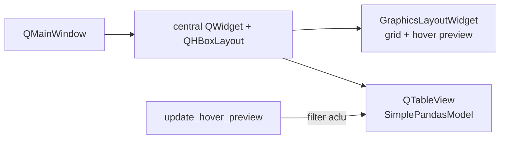

# Hover peak-prominence DataFrame table

## Goal

In non-publication [`TrialByTrialActivityWindow`](h:\TEMP\Spike3DEnv_ExploreUpgrade\Spike3DWorkEnv\pyPhoPlaceCellAnalysis\src\pyphoplacecellanalysis\GUI\PyQtPlot\Widgets\ContainerBased\TrialByTrialActivityWindow.py), place a scrollable pandas table **to the right of the hover-preview plot**, spanning the full window height, showing the **hovered aclu’s rows** from `all_decoders_peak_prominence_df`.

## Why layout must leave GraphicsLayout

`root_render_widget` is a `pg.GraphicsLayoutWidget` set as the QMainWindow central widget ([`pyqtplot_common_setup`](h:\TEMP\Spike3DEnv_ExploreUpgrade\Spike3DWorkEnv\pyPhoPlaceCellAnalysis\src\pyphoplacecellanalysis\GUI\PyQtPlot\pyqtplot_common.py)). A `QTableView` is a QWidget (not a plot item), so it will be placed as a **sibling** of the graphics widget via a horizontal layout on the main window—not inside the graphics grid.



## Data behavior

- Store the **untransformed** full DF on `plots_data.all_decoders_peak_prominence_df` (do not apply the marker `trial_idx - 1` / `* 2` transform used for plotting).
- On hover, show `df[df['aclu'] == neuron_aclu]` (all trials/decoders for that cell). Empty DF / blank model when no hover or no matching rows.
- Public API mirrors markers/labels:

```python
a_TbyT_activity_win.set_all_decoders_peak_prominence_df(all_decoders_peak_prominence_df)
```

## Implementation (single file)

All edits in [`TrialByTrialActivityWindow.py`](h:\TEMP\Spike3DEnv_ExploreUpgrade\Spike3DWorkEnv\pyPhoPlaceCellAnalysis\src\pyphoplacecellanalysis\GUI\PyQtPlot\Widgets\ContainerBased\TrialByTrialActivityWindow.py).

### 1. Build table UI next to graphics (non-publication only)

In `plot_trial_to_trial_reliability_all_decoders_image_stack`, after hover-preview creation (~556–590):

- Import `SimplePandasModel` from `pyphocorehelpers.gui.Qt.pandas_model`.
- Create `QTableView` with empty `SimplePandasModel(pd.DataFrame())`, `resizeColumnsToContents`, sensible min width (~320–400px).
- Replace central widget:

```python
container = pg.QtWidgets.QWidget()
hbox = pg.QtWidgets.QHBoxLayout(container)
hbox.setContentsMargins(0, 0, 0, 0)
hbox.addWidget(root_render_widget, stretch=3)
hbox.addWidget(table_view, stretch=1)
parent_root_widget.setCentralWidget(container)
```

- Store on `_obj.ui`: `peak_prominence_table_view`, `peak_prominence_table_model`, `content_container`.
- For publication mode: leave table refs as `None` (same as hover preview).

### 2. Wire hover updates

Add `_update_hover_peak_prominence_table(self, neuron_aclu)`:

- No-op if table UI or stored DF is missing.
- Filter by `aclu`, build new `SimplePandasModel(filtered.copy())`, `setModel`, store model on `ui`, `resizeColumnsToContents`.

Call it from `update_hover_preview` in both branches (same-cell refresh and new-cell update), alongside peak markers/labels.

### 3. Public setter

Add `set_all_decoders_peak_prominence_df(self, all_decoders_peak_prominence_df: pd.DataFrame)`:

- `deepcopy` onto `plots_data.all_decoders_peak_prominence_df`.
- If a cell is already hovered, refresh the table for that aclu; otherwise leave empty until first hover.

## Manual check

```python
all_decoders_peak_prominence_df, _, _ = a_trial_by_trial_result.computing_trial_peak_promenences(max_peak_idx=2)
a_TbyT_activity_win.set_all_decoders_peak_prominence_df(all_decoders_peak_prominence_df)
```

Confirm: table sits right of hover preview, full height, scrolls; hovering an aclu shows only that cell’s rows; publication figures unchanged.