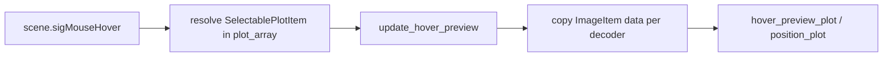

# Hover subplot preview in right axes

## Context

In [`TrialByTrialActivityWindow.py`](h:\TEMP\Spike3DEnv_ExploreUpgrade\Spike3DWorkEnv\pyPhoPlaceCellAnalysis\src\pyphoplacecellanalysis\GUI\PyQtPlot\Widgets\ContainerBased\TrialByTrialActivityWindow.py), `plot_trial_to_trial_reliability_all_decoders_image_stack` already builds:

- A grid of `SelectablePlotItem`s with overlaid decoder `ImageItem`s in `additional_img_items_dict`
- A stub right-side plot at `col=5` stored as `plots.position_plot` when `is_publication_ready_figure=False` (currently empty aside from optional notebook trajectory plotting)
- Selection callbacks via `sigSelectedChanged`, but `on_change_selection` is a no-op stub

**Chosen behavior:** true mouse hover updates the right axes with that cell’s stacked heatmaps; leaving the grid keeps the last hovered cell (avoids flicker). Selection borders stay as-is and do not drive the preview. Publication mode stays unchanged (`position_plot is None`).

## Implementation

### 1. Build / configure the right-side preview plot

In `plot_trial_to_trial_reliability_all_decoders_image_stack` (non-publication branch ~539–553):

- Keep creating the large plot at `col=5`; also store it as `hover_preview_plot` while retaining `position_plot` as the same object for notebook compatibility.
- Place it beside the grid (`row=plots_start_row`, `col=5`, `rowspan` covering the subplot rows) instead of the fragile hardcoded `row=3, rowspan=4` where practical.
- Pre-create one `ImageItem` per decoder in decoder order (`long_LR`, then the rest), with the same LUTs as `additional_cmaps`, add them to the preview plot, and store in `plots.hover_preview_img_items_dict`.
- Set matching `x_range` / `y_range` / title styling from `plot_data_array[0]` initially; clear title until first hover.

### 2. Hover detection

In `build_internal_callbacks`:

- Connect `root_render_widget.scene().sigMouseHover` to a new handler (only if preview plot exists).
- Walk hovered scene items’ parents to find a `SelectablePlotItem` that is in `self.plot_array`.
- Ignore items belonging to the preview plot itself.
- On match, call `update_hover_preview(a_linear_index)`; if no subplot under cursor, leave the last preview unchanged.

### 3. Preview update method

Add instance methods on `TrialByTrialActivityWindow`:

- `update_hover_preview(self, a_linear_index: int)`  
  - Skip if index unchanged (`params.hovered_linear_index` or similar).  
  - For each decoder, copy image array + opacity from `additional_img_items_dict[decoder][a_linear_index]` into the corresponding preview `ImageItem` (same `rect` / levels).  
  - Set preview title from `plot_data_array[a_linear_index]['formatted_title']` (or `curr_cell_identifier_string`).  
  - Update footer/`lblFooter` with the hovered aclu if useful.

- Optionally call opacity sync from `update_all_series_opacities_from_legend` so legend toggles also affect the preview layers for the currently shown cell.

### 4. Minimal surface-area changes

- Touch only [`TrialByTrialActivityWindow.py`](h:\TEMP\Spike3DEnv_ExploreUpgrade\Spike3DWorkEnv\pyPhoPlaceCellAnalysis\src\pyphoplacecellanalysis\GUI\PyQtPlot\Widgets\ContainerBased\TrialByTrialActivityWindow.py).
- Do not change `SelectablePlotItem` unless scene hover proves unreliable; prefer scene-level hover first.
- Preserve existing `position_plot` attribute name so old notebook snippets that grab `.plots.position_plot` still resolve (content will be heatmap preview until manually cleared/overplotted).

