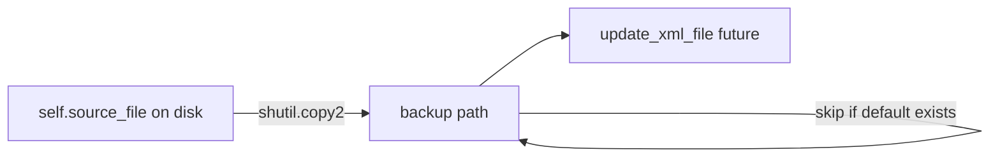

# Implement `backup_xml_file`

## Context

[`neuropy/io/neuroscopeio.py`](h:/TEMP/Spike3DEnv_ExploreUpgrade/Spike3DWorkEnv/NeuroPy/neuropy/io/neuroscopeio.py) recently gained two stubs: `backup_xml_file` (to implement) and `update_xml_file` (future inverse of `_parse_xml_file`). The backup method is meant to run **before** in-place XML edits.

The docstring ("writes the xml out to an unmodified path") is ambiguous; the intended behavior is: **copy the current on-disk XML to a backup location while leaving `self.source_file` unchanged**.

## Design decisions

| Decision | Choice | Rationale |
|---|---|---|
| Copy source | On-disk `self.source_file` via `shutil.copy2` | Preserves exact bytes/formatting; in-memory `channel_groups` edits must not affect the backup |
| Default backup name | `{source}.xml.pre_edit.bak` | Matches commented pattern in [`BapunDataSessionFormat.py`](h:/TEMP/Spike3DEnv_ExploreUpgrade/Spike3DWorkEnv/NeuroPy/neuropy/core/session/Formats/Specific/BapunDataSessionFormat.py) (`with_suffix(suffix + ".pre_edit.bak")`) |
| Existing default backup | **Skip copy, return existing path** | Per your preference; preserves the first pre-edit snapshot |
| `override_backup_path` | Always copy (overwrite allowed) | Explicit caller intent; create parent dirs if needed |
| Missing source | Raise `FileNotFoundError` | Fail fast before any edit workflow continues |

## Implementation (single file)

Edit [`neuropy/io/neuroscopeio.py`](h:/TEMP/Spike3DEnv_ExploreUpgrade/Spike3DWorkEnv/NeuroPy/neuropy/io/neuroscopeio.py):

1. **Add imports** at top of file:
   - `import shutil`
   - `from typing import Optional` (required — `Optional` is referenced but not imported today)

2. **Implement `backup_xml_file`** (~15 lines):

```python
def backup_xml_file(self, override_backup_path: Optional[Path]=None) -> Path:
    """Copy the on-disk neuroscope .xml to a backup path, leaving the source unchanged."""
    source_path = Path(self.source_file).resolve()
    if not source_path.is_file():
        raise FileNotFoundError(f"Cannot backup missing neuroscope xml file: {source_path}")
    if override_backup_path is not None:
        backup_path = Path(override_backup_path).resolve()
        backup_path.parent.mkdir(parents=True, exist_ok=True)
        shutil.copy2(source_path, backup_path)
        return backup_path
    backup_path = source_path.with_suffix(source_path.suffix + ".pre_edit.bak")
    if not backup_path.is_file():
        shutil.copy2(source_path, backup_path)
    return backup_path
```

3. **Replace the vague docstring** with a short description noting:
   - copies from disk, not parsed/in-memory state
   - default backup naming and skip-if-exists behavior
   - `override_backup_path` always copies

No changes to `update_xml_file`, tests, or other files unless you want those in a follow-up.

## Expected usage

```python
recinfo = NeuroscopeIO(xml_path)
backup_path = recinfo.backup_xml_file()  # -> .../session.xml.pre_edit.bak
# later: recinfo.update_xml_file()
```

## Verification

- Manual smoke test with any local `.xml`: call once → backup file created; call again → same path returned, source mtime unchanged on second call
- Confirm `Optional` import resolves the current type-hint error on line 68


