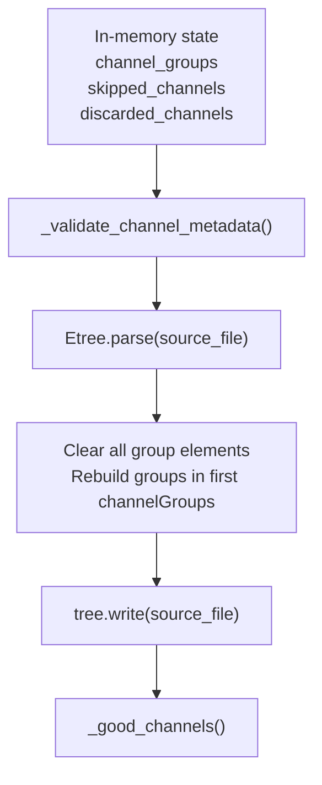

# Implement `update_xml_file`

## Context

[`neuropy/io/neuroscopeio.py`](h:/TEMP/Spike3DEnv_ExploreUpgrade/Spike3DWorkEnv/NeuroPy/neuropy/io/neuroscopeio.py) loads channel metadata in `_parse_xml_file`:

```36:59:h:/TEMP/Spike3DEnv_ExploreUpgrade/Spike3DWorkEnv/NeuroPy/neuropy/io/neuroscopeio.py
        channel_groups, skipped_channels = [], []
        for x in myroot.findall("anatomicalDescription"):
            for y in x.findall("channelGroups"):
                for z in y.findall("group"):
                    chan_group = []
                    for chan in z.findall("channel"):
                        if int(chan.attrib["skip"]) == 1:
                            skipped_channels.append(int(chan.text))
                        chan_group.append(int(chan.text))
                    if chan_group:
                        channel_groups.append(np.array(chan_group))
        discarded_channels = np.setdiff1d(
            np.arange(n_channels), np.concatenate(channel_groups)
        )
```

`update_xml_file` must reverse only this anatomical section (not `acquisitionSystem`, `fieldPotentials`, or `spikeDetection`). [`backup_xml_file`](h:/TEMP/Spike3DEnv_ExploreUpgrade/Spike3DWorkEnv/NeuroPy/neuropy/io/neuroscopeio.py) is already implemented and intended to run first.

Neuroscope XML shape (from [`load_exported.py`](h:/TEMP/Spike3DEnv_ExploreUpgrade/Spike3DWorkEnv/NeuroPy/neuropy/utils/load_exported.py)):

```xml
<parameters>
  <anatomicalDescription>
    <channelGroups>
      <group>
        <channel skip="0">72</channel>
        <channel skip="1">73</channel>
      </group>
    </channelGroups>
  </anatomicalDescription>
</parameters>
```

- **`channel_groups`**: list of shank/group channel index arrays written as `<group>` blocks
- **`skipped_channels`**: channels still listed in groups but with `skip="1"` (Neuroscope “skip” semantics — hidden but layout-preserving)
- **`discarded_channels`**: derived on load as channels **not** in any group; used for **validation** on write (they are omitted from XML by construction)

## Data flow



## Design decisions

| Decision | Choice | Rationale |
|---|---|---|
| Write target | Always `self.source_file` | Matches `backup_xml_file` workflow; caller backs up first |
| XML sections touched | `anatomicalDescription/channelGroups` only | Matches docstring and `_parse_xml_file` scope |
| Multiple `channelGroups` nodes | Clear groups from **all** nodes; write new groups into the **first** | Load concatenates all groups; avoids duplicate groups on round-trip |
| `discarded_channels` | Validate consistency; do not write separately | It is derived, not stored in XML |
| After write | Call `_good_channels()` | Keeps `self.good_channels` in sync |
| Return value | `Path` to written file | Consistent with `backup_xml_file` |
| XML serialization | `tree.write(source_path)` | Same pattern as [`parsePath.py`](h:/TEMP/Spike3DEnv_ExploreUpgrade/Spike3DWorkEnv/sleep_loss_hippocampal_replay/misc_code/BasicGens/parsePath.py) line 133 |

## Implementation (single file)

Edit [`neuropy/io/neuroscopeio.py`](h:/TEMP/Spike3DEnv_ExploreUpgrade/Spike3DWorkEnv/NeuroPy/neuropy/io/neuroscopeio.py):

### 1. Add private validator `_validate_channel_metadata(self) -> None`

Normalize inputs and fail fast with clear `ValueError` / `FileNotFoundError`:

- Require `channel_groups`, `skipped_channels`, `discarded_channels`, and `n_channels` to be initialized
- Flatten each group to `int`; reject duplicates across groups
- Reject out-of-range channel indices (`< 0` or `>= n_channels`)
- Recompute expected discarded set:
  `np.setdiff1d(np.arange(n_channels), concatenated_groups)`
  and require it matches `self.discarded_channels` (sorted compare)
- Require every `skipped_channels` entry appears in some group

Use `np.asarray(...).ravel()` throughout so empty arrays and scalar edge cases are handled.

### 2. Implement `update_xml_file(self) -> Path`

Core logic (~25–35 lines):

```python
def update_xml_file(self) -> Path:
    """Inverse of ``_parse_xml_file``: persist channel group state to disk."""
    self._validate_channel_metadata()
    source_path = Path(self.source_file).resolve()
    tree = Etree.parse(source_path)
    root = tree.getroot()
    channel_groups_elements = [
        cg for ad in root.findall("anatomicalDescription")
        for cg in ad.findall("channelGroups")
    ]
    if not channel_groups_elements:
        raise ValueError(f"No anatomicalDescription/channelGroups in {source_path}")
    skipped_set = set(int(c) for c in np.asarray(self.skipped_channels).ravel())
    for cg_elem in channel_groups_elements:
        for group_elem in list(cg_elem.findall("group")):
            cg_elem.remove(group_elem)
    primary_channel_groups = channel_groups_elements[0]
    for chan_group in self.channel_groups:
        group_elem = Etree.SubElement(primary_channel_groups, "group")
        for chan_idx in np.asarray(chan_group, dtype=int).ravel():
            chan_elem = Etree.SubElement(group_elem, "channel")
            chan_elem.text = str(int(chan_idx))
            chan_elem.set("skip", "1" if int(chan_idx) in skipped_set else "0")
    tree.write(source_path)
    self._good_channels()
    return source_path
```

### 3. Expand docstring

Document:
- inverse of `_parse_xml_file`
- expected prior call to `backup_xml_file()`
- which XML subtree is modified
- validation rules and raised exceptions

## Expected usage

```python
recinfo = NeuroscopeIO(xml_path)
recinfo.skipped_channels = np.array([5, 12])  # example in-memory edit
recinfo.backup_xml_file()
recinfo.update_xml_file()
```

## Verification

Manual round-trip smoke test (no committed test file unless you want one):

1. Load a real session `.xml` with `NeuroscopeIO`
2. Call `update_xml_file()` **without** changing in-memory fields
3. Reload with a fresh `NeuroscopeIO(source_file)` and confirm `channel_groups`, `skipped_channels`, and `discarded_channels` match

Optional follow-up (out of scope unless requested): add `tests/test_neuroscopeio.py` with a minimal inline XML fixture in `tmp_path` for automated round-trip coverage.

## Out of scope

- Syncing `spikeDetection/channelGroups` (separate Neuroscope section; not parsed by `NeuroscopeIO`)
- Changing `n_channels` or other acquisition metadata
- Preserving original XML whitespace/ordering beyond ElementTree defaults
