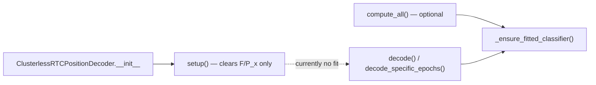

# Fit clusterless classifier on decoder init

## Problem

Today, environment + classifier construction lives entirely in [`_ensure_fitted_classifier()`](h:\TEMP\Spike3DEnv_ExploreUpgrade\Spike3DWorkEnv\pyPhoPlaceCellAnalysis\src\pyphoplacecellanalysis\Analysis\Decoder\rtc_clusterless_decoder.py) and runs **lazily** on the first call to `decode()`, `compute_all()`, or manual `_ensure_fitted_classifier()`.

The pipeline path in [`DefaultComputationFunctions.py`](h:\TEMP\Spike3DEnv_ExploreUpgrade\Spike3DWorkEnv\pyPhoPlaceCellAnalysis\src\pyphoplacecellanalysis\General\Pipeline\Stages\ComputationFunctions\DefaultComputationFunctions.py) creates decoders with `setup_on_init=True` but default `should_defer_compute_all_decoded_times=True`, so **`compute_all()` is skipped** and the classifier stays `None`. Downstream code (e.g. [`PendingNotebookCode.py`](h:\TEMP\Spike3DEnv_ExploreUpgrade\Spike3DWorkEnv\pyPhoPlaceCellAnalysis\src\pyphoplacecellanalysis\SpecificResults\PendingNotebookCode.py) line 289) manually calls `_ensure_fitted_classifier()` as a workaround before `decode_specific_epochs()`.



## Approach (minimal, reuse existing hook)

Use the same lifecycle hook that `BasePositionDecoder` already provides for rebuilding non-serialized computation state:

| Hook | When it runs |
|------|----------------|
| `setup()` | `setup_on_init=True` (pipeline default) |
| `post_load()` → `_setup_computation_variables()` | `post_load_on_init=True` (pickle reload) |

**Changes in [`rtc_clusterless_decoder.py`](h:\TEMP\Spike3DEnv_ExploreUpgrade\Spike3DWorkEnv\pyPhoPlaceCellAnalysis\src\pyphoplacecellanalysis\Analysis\Decoder\rtc_clusterless_decoder.py) only:**

1. **Update `setup()`** (lines 139–143) to call `self._setup_computation_variables()` after clearing neuron fields (mirrors `BasePositionDecoder.setup()` pattern).

2. **Implement `_setup_computation_variables()`** (currently empty pass at lines 146–148):

```python
def _setup_computation_variables(self):
    if self.multiunits is not None and self.rtc_time is not None:
        self._ensure_fitted_classifier(debug_print=self.debug_print)
```

3. **Leave `_ensure_fitted_classifier()` unchanged** — it already idempotently short-circuits when `self.classifier` is set, handles electrode masking, memory guard, and `rtc_position_bin_centers`.

4. **Leave `_predict_clusterless_posterior()` / `compute_all()` unchanged** — they still call `_ensure_fitted_classifier()` for lazy paths (e.g. `setup_on_init=False`, or after `replacing_computation_epochs()` clears the classifier).

## Behavior after change

| Scenario | Classifier fitted when? |
|----------|-------------------------|
| Pipeline init (`setup_on_init=True`, multiunits + rtc_time provided) | **Immediately on init** |
| `compute_all()` not called | OK — classifier already ready; `decode_specific_epochs()` works |
| Tests with `setup_on_init=False` | Unchanged — still lazy fit on first decode |
| Init without multiunits/rtc_time | Skips fit; `decode()` can still pass fit data lazily |
| `replacing_computation_epochs()` | Clears classifier (existing); refits lazily on next decode |
| Pickle reload with `post_load_on_init=True` | Refits via inherited `post_load()` (classifier is `non_serialized_field`) |

No changes needed in [`DefaultComputationFunctions.py`](h:\TEMP\Spike3DEnv_ExploreUpgrade\Spike3DWorkEnv\pyPhoPlaceCellAnalysis\src\pyphoplacecellanalysis\General\Pipeline\Stages\ComputationFunctions\DefaultComputationFunctions.py) — it already passes `setup_on_init=True` and supplies `multiunits` / `rtc_time`.

Optional follow-up (not required for this task): remove redundant manual `_ensure_fitted_classifier()` in `PendingNotebookCode.py` line 289 once init-fit is verified.

## Tests

Add one regression test to [`tests/test_rtc_clusterless_decoder.py`](h:\TEMP\Spike3DEnv_ExploreUpgrade\Spike3DWorkEnv\pyPhoPlaceCellAnalysis\tests\test_rtc_clusterless_decoder.py):

- **`test_clusterless_fit_classifier_on_init`**
  - Build decoder with `setup_on_init=True` (default), `multiunits`, `rtc_time`
  - Patch `build_clusterless_training_data_from_pfnd` (same pattern as existing decode tests)
  - Assert **before** any `decode()` / `compute_all()` call:
    - `decoder.classifier is not None`
    - `decoder.rtc_position_bin_centers is not None`
    - `decoder.multiunit_electrode_keep_mask is not None`
  - Assert `decoder.p_x_given_n is None` (init-fit does not run full decode)

Run: `uv run pytest tests/test_rtc_clusterless_decoder.py -k fit_classifier_on_init`

## Files touched

- [`rtc_clusterless_decoder.py`](h:\TEMP\Spike3DEnv_ExploreUpgrade\Spike3DWorkEnv\pyPhoPlaceCellAnalysis\src\pyphoplacecellanalysis\Analysis\Decoder\rtc_clusterless_decoder.py) — ~5 lines changed
- [`test_rtc_clusterless_decoder.py`](h:\TEMP\Spike3DEnv_ExploreUpgrade\Spike3DWorkEnv\pyPhoPlaceCellAnalysis\tests\test_rtc_clusterless_decoder.py) — new test
