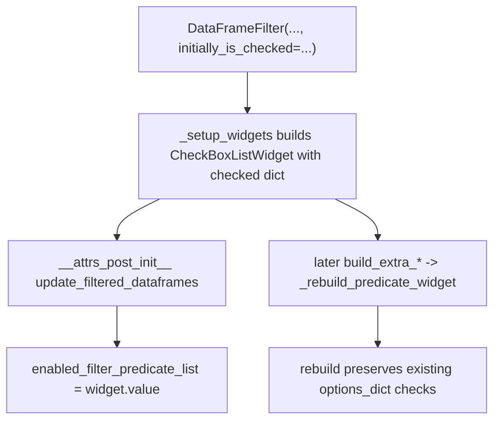

# Add `initially_is_checked` to DataFrameFilter init

## Goal

Allow:

```python
df_filter = DataFrameFilter(
    original_df_dict=...,
    additional_filter_predicates=additional_filter_predicates,
    initially_is_checked={
        'is_NOT_low_pct_corr_session': True,
        'is_track_body': True,
        'is_preplay_like': True,
        'is_long_duration': True,
    },
    ...
)
```

so those predicates start checked and are applied on the first filter pass (no post-hoc `_rebuild_predicate_widget` call required).

## Changes (single file)

Edit [`pyPhoPlaceCellAnalysis/.../PhoDiba2023Paper.py`](h:/TEMP/Spike3DEnv_ExploreUpgrade/Spike3DWorkEnv/pyPhoPlaceCellAnalysis/src/pyphoplacecellanalysis/SpecificResults/PhoDiba2023Paper.py) only.

### 1. New attrs field

Next to `additional_filter_predicates` (~line 2774), add:

```python
initially_is_checked: Optional[Dict[str, bool]] = non_serialized_field(default=None)
```

Same name/shape as `_rebuild_predicate_widget(initially_is_checked=...)`. Default `None` preserves current behavior (all unchecked). Not serialized (UI bootstrap only).

### 2. Apply during `_setup_widgets`

Replace the list-only construction (~line 3157):

```python
self.active_filter_predicate_selector_widget = CheckBoxListWidget(options_list=list(self.additional_filter_predicates.keys()))
```

with a dict built like `_rebuild_predicate_widget` already does:

```python
predicate_keys = list(self.additional_filter_predicates.keys())
initial_checked = self.initially_is_checked or {}
options_dict = {k: bool(initial_checked.get(k, False)) for k in predicate_keys}
self.active_filter_predicate_selector_widget = CheckBoxListWidget(options_list=options_dict)
```

Unknown keys in `initially_is_checked` are ignored (same as rebuild). `CheckBoxListWidget` already accepts `Dict[str, bool]` and sets checkbox values + `.value` from checked keys.

### 3. Why this is enough



- First filter in `__attrs_post_init__` already reads `active_filter_predicate_selector_widget.value`, so init-checked predicates apply immediately.
- Later `build_extra_dropdown_widget` / `build_extra_selectMultiple_widget` calls to `_rebuild_predicate_widget` keep prior checks via `existing_options_dict`, so user init checks survive.

### 4. Docstring usage snippet

Update the class Usage block to show one example passing `initially_is_checked=...` alongside `additional_filter_predicates`.

## Out of scope

- No notebook edits.
- No changes to `CheckBoxListWidget` or `_rebuild_predicate_widget` signature.
- No HDF serialization of `initially_is_checked`.
