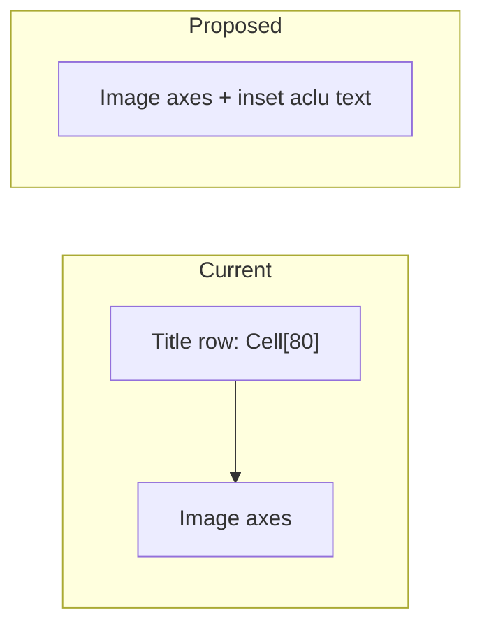

# Inset aclu labels in placefield debug grid

## Problem

In [`TimeSynchronizedPlacefieldActivityDebugPlotter.py`](h:\TEMP\Spike3DEnv_ExploreUpgrade\Spike3DWorkEnv\pyPhoPlaceCellAnalysis\src\pyphoplacecellanalysis\Pho2D\PyQtPlots\TimeSynchronizedPlotters\TimeSynchronizedPlacefieldActivityDebugPlotter.py), `_buildGraphics()` creates each subplot with an external title:

```325:328:h:\TEMP\Spike3DEnv_ExploreUpgrade\Spike3DWorkEnv\pyPhoPlaceCellAnalysis\src\pyphoplacecellanalysis\Pho2D\PyQtPlots\TimeSynchronizedPlotters\TimeSynchronizedPlacefieldActivityDebugPlotter.py
curr_plot = self.ui.root_graphics_layout_widget.addPlot(
    row=row, col=col, 
    title=generate_html_string(input_str=curr_cell_identifier_string, font_size=2, color='grey')
)
```

Even with `generate_html_string(..., font_size=2)`, pyqtgraph still reserves a title row above each plot, which wastes vertical space in a dense 6×N grid.

The cell identifier already available as aclu is `cell_ID = ratemap.neuron_ids[neuron_idx]` (same value matched against `spikes_df['aclu']` in `_get_cell_activity_levels`).

## Approach

Follow the existing in-repo pattern from [`posterior2D_animated_grid.py`](h:\TEMP\Spike3DEnv_ExploreUpgrade\Spike3DWorkEnv\pyPhoPlaceCellAnalysis\src\pyphoplacecellanalysis\Pho2D\PyQtPlots\posterior2D_animated_grid.py): create plots with **no title**, then add a `pg.TextItem` inside the plot data area.



## Code changes (single file, `_buildGraphics` only)

Target: [`TimeSynchronizedPlacefieldActivityDebugPlotter.py`](h:\TEMP\Spike3DEnv_ExploreUpgrade\Spike3DWorkEnv\pyPhoPlaceCellAnalysis\src\pyphoplacecellanalysis\Pho2D\PyQtPlots\TimeSynchronizedPlotters\TimeSynchronizedPlacefieldActivityDebugPlotter.py)

1. **Remove external title**
   - Change `addPlot(...)` to omit `title` (or pass `title=None`).
   - Delete the local import of `generate_html_string` (only used here).

2. **Add inset aclu label after plot setup**
   - After `curr_plot.addItem(curr_position_marker)` (and before axis linking), create:
     - `aclu_label = pg.TextItem(text=str(int(cell_ID)), color=(255, 255, 255), anchor=(0, 1))`
     - Small font via `pg.QtGui.QFont()` with `setPixelSize(7)` (or similar ~7–8px).
   - Position in data coordinates at the upper-left of the image bounds:
     - `x = self.params.x_range[0] + x_pad`
     - `y = self.params.y_range[1] - y_pad`
     - where `x_pad` / `y_pad` are ~2% of the respective axis span (keeps label inset from the white border on any track size).
   - `curr_plot.addItem(aclu_label)`

3. **Keep existing debug identifiers unchanged**
   - Retain `curr_cell_identifier_string = f'Cell[{cell_ID}]'` for `setObjectName(...)` and position-marker names so internal naming/debug strings stay consistent; only the **visible** label changes to bare aclu.

## What will not change

- No changes to `_update_plots()` (labels are static).
- No new `self.ui.*_array` storage unless needed later (labels are created once and never updated).
- No changes to [`TimeSynchronizedPlacefieldsPlotter.py`](h:\TEMP\Spike3DEnv_ExploreUpgrade\Spike3DWorkEnv\pyPhoPlaceCellAnalysis\src\pyphoplacecellanalysis\Pho2D\PyQtPlots\TimeSynchronizedPlotters\TimeSynchronizedPlacefieldsPlotter.py) unless you want the same treatment there separately.

## Verification

After implementation, reopen the plotter and confirm:
- No title band above each subplot; grid cells are taller.
- Each subplot shows a small white aclu number (e.g. `80`) in the upper-left inside the white-bordered image area.
- Axis visibility (left column y, bottom row x) and position markers still behave as before.
