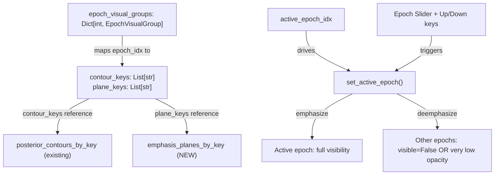

# Interactive Epoch Cycling for Volumentric2DTimeSeriesPlotter

All changes are in `[predicitive_decoding_vispy.py](h:\TEMP\Spike3DEnv_ExploreUpgrade\Spike3DWorkEnv\pyPhoPlaceCellAnalysis\src\pyphoplacecellanalysis\Pho2D\vispy\predicitive_decoding_vispy.py)`.

## Problem

The user's workflow adds per-epoch contours and emphasis planes to the 3D viewer, but there is no way to interactively cycle through epochs -- all visuals are shown simultaneously. Additionally, `add_emphasis_plane` stores its visuals in the flat `highlight_boxes` list, making per-plane visibility control impossible.

## Architecture




## Changes

### 1. Add new attrs fields (after line ~1758)

- `emphasis_planes_by_key: Dict[str, Dict[str, Any]]` -- tracks emphasis planes by unique key, same pattern as `posterior_contours_by_key`. Each entry stores `{'unique_identifier', 'plane_mesh', 'edge_line', 'visible'}`.
- `emphasis_planes_counter: int` -- counter for auto-generated plane keys
- `epoch_visual_groups: Dict[int, Dict[str, List[str]]]` -- maps `epoch_idx` to `{'contour_keys': [...], 'plane_keys': [...]}` listing which visuals belong to that epoch
- `active_epoch_idx: Optional[int]` -- currently emphasized epoch index (None = show all)
- `epoch_slider: Optional[Any]` -- QSlider for epoch cycling
- `epoch_value_label: Optional[Any]` -- QLabel showing current epoch index

### 2. Modify `add_emphasis_plane` (~line 2504)

Store the created `(plane_mesh, edge_line)` in `emphasis_planes_by_key[unique_identifier]` in addition to `highlight_boxes`. The `curr_label` parameter will serve as the key (already passed by the user as `f'plane[{an_epoch_idx}]'`).

### 3. Add emphasis plane visibility control methods (after `add_emphasis_plane`)

- `set_emphasis_plane_visibility(unique_identifier, is_visible)` -- mirrors `set_posterior_contours_visibility`
- `get_emphasis_plane(unique_identifier)` -- lookup helper
- `list_emphasis_plane_keys()` -- list keys

### 4. Add epoch group management methods

- `register_epoch_visual(epoch_idx, visual_type, unique_identifier)` -- registers a visual key as belonging to an epoch. `visual_type` is `'contour'` or `'plane'`.
- `add_epoch_visuals(epoch_idx, per_t_bin_mask, t_bin_edges, contour_kwargs=None, plane_kwargs=None)` -- convenience method that calls `add_posterior_contours` + `add_emphasis_plane` + `register_epoch_visual` for both, using standard naming (`contour[{epoch_idx}]`, `plane[{epoch_idx}]`). Returns dict of created keys.
- `set_active_epoch(epoch_idx)` -- the core cycling method. For the active epoch, set contours + planes visible (full opacity). For all other epochs, set contours + planes to `visible=False`. If `epoch_idx` is None, show all.
- `n_epoch_groups` property -- returns `len(self.epoch_visual_groups)`

### 5. Add UI controls in `buildUI` (~line 1846)

Add an epoch slider below the existing t-bin slider. Initially hidden/disabled (0 range) since epochs are added after construction. Add a method `_update_epoch_slider_range()` that updates the slider range when epochs are registered, called from `register_epoch_visual` / `add_epoch_visuals`.

### 6. Extend keyboard handling in `on_key_press` (~line 2549)

Add `Up` / `Down` arrow key handling to step through epoch indices (calling `set_active_epoch`). This mirrors the existing `Left` / `Right` handling for t-bin stepping.

### 7. Add `on_epoch_slider_value_changed` handler

Connected to the epoch slider; calls `set_active_epoch(value)`.

## Deemphasis Strategy

- Active epoch: contours and planes set to `visible=True`
- Other epochs: contours and planes set to `visible=False` (hidden entirely, since adjusting opacity post-construction for vispy Mesh/Line is unreliable -- visibility toggle is clean and fast)
- When `active_epoch_idx` is None (default / reset): all epochs visible

## Usage After Implementation

```python
for an_epoch_idx in np.arange(len(epoch_flat_mask_future_past_result)):
    epoch_result = epoch_flat_mask_future_past_result[an_epoch_idx]
    per_t_bin_mask = epoch_result.epoch_t_bins_high_prob_pos_mask
    time_bin_edges = epoch_result.decoded_epoch_result.time_bin_edges
    viewer_3d.add_epoch_visuals(epoch_idx=an_epoch_idx, per_t_bin_mask=per_t_bin_mask, t_bin_edges=time_bin_edges)

viewer_3d.set_active_epoch(0)
```

Then use Up/Down keys or the epoch slider to cycle through epochs.