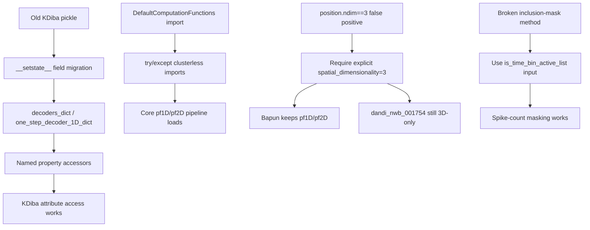

# KDiba Compatibility Fixes (preserve Bapun/NWB)

Based on [docs/2026-07-28_pyPhoPlaceCellAnalysis_DevelopToKDibaBranchReport.md](h:\TEMP\Spike3DEnv_ExploreUpgrade\Spike3DWorkEnv\pyPhoPlaceCellAnalysis\docs\2026-07-28_pyPhoPlaceCellAnalysis_DevelopToKDibaBranchReport.md) plus deep dives from [Explore TrackTemplates changes](f0e27117-dccf-494e-9a5e-9117ae118b14), [Explore decoder pickle compat](a9c9b5d4-c957-4024-b7b6-e7bf28e0c1e4), and [Explore placefield 3D guards](3030bb0c-141d-47cd-8b9e-f6143528f1b8).

## Already OK (no change needed)

- `TrackTemplates.get_decoder_names()` / LR / RL remain `@classmethod`s with hardcoded 4-decoder names
- `TrackTemplates.get_decoders()` still returns `DirectionalDecodersTuple`
- `TrackTemplates.init_from_paired_decoders` restored (wraps dicts API)
- Continuous-cache pickle float→`(W,W)` coercion already in `DirectionalDecodersContinuouslyDecodedResult.__setstate__`
- `DecodedFilterEpochsResult.__setstate__` already migrates `decoding_time_bin_hop` → `decoding_slideby` (alias still needed for runtime access)
- `BasePositionDecoder` new reliability fields are default-safe
- KDiba 4-decoder `compute_marginals` columns still resolve via `_resolve_pseudo2D_context_layout`
- NeuropyPipeline NWB fixups gated on NWB format names

## Gaps to fix



### 1. Pickle migration: named decoder fields → dicts (HIGH)

**File:** [`DirectionalPlacefieldGlobalComputationFunctions.py`](h:\TEMP\Spike3DEnv_ExploreUpgrade\Spike3DWorkEnv\pyPhoPlaceCellAnalysis\src\pyphoplacecellanalysis\General\Pipeline\Stages\ComputationFunctions\MultiContextComputationFunctions\DirectionalPlacefieldGlobalComputationFunctions.py)

Old pickles store `long_LR_decoder` / `long_LR_one_step_decoder_1D` as attrs fields. New classes expect `decoders_dict` / `one_step_decoder_1D_dict`. Named accessors are properties into those dicts → KeyError after load. `BaseDirectionalLapsResult`/`DirectionalLapsResult` override `__setstate__` with bare `update(state)` and skip migration.

Implement a shared helper and use it in:

- `BaseTrackTemplates.__attrs_post_init__` + `__setstate__`: if legacy named decoder attrs exist and `decoders_dict` is empty/missing, build the dict and pop legacy keys
- `BaseDirectionalLapsResult.__setstate__` (and subclass): same for the eight `*_one_step_decoder_1D` / `*_shared_aclus_only_one_step_decoder_1D` names

Do **not** reintroduce named fields as attrs `serialized_field`s.

### 2. Soft-import clusterless modules (HIGH)

**File:** [`DefaultComputationFunctions.py`](h:\TEMP\Spike3DEnv_ExploreUpgrade\Spike3DWorkEnv\pyPhoPlaceCellAnalysis\src\pyphoplacecellanalysis\General\Pipeline\Stages\ComputationFunctions\DefaultComputationFunctions.py)

Top-level imports of `rtc_clusterless_*` / `spyglass_clusterless_*` pull `replay_trajectory_classification` at package load via `ComputationFunctions/__init__.py`. Wrap in `try/except ImportError`, set `_CLUSTERLESS_DECODER_AVAILABLE`, use `Optional[Any]` for optional param types, and raise a clear `ImportError` if clusterless computation methods are invoked when unavailable. Leave `_perform_position_decoding_computation` always importable.

### 3. Fix `BaseDirectionalLapsResult` broken paths (HIGH for non-KDiba)

**Same Directional file:**

- **`init_from_pipeline_natural_epochs` (~1810–1815):** replace undefined-`k` / undefined-dict assignment with the working 4-decoder dict pattern from `DirectionalLapsResult` (~2080–2090)
- **`get_templates` (~1645–1646):** uses `self.get_decoders().items()` but `get_decoders()` returns a **tuple** → use `get_decoders_dict()` instead
- Optionally restore `@classmethod get_decoder_names` on `DirectionalLapsResult` mirroring `TrackTemplates` (low priority; most call sites use `TrackTemplates`)

KDiba continues to use `DirectionalLapsResult.init_from_pipeline_natural_epochs` via `is_kdiba_session()` at `_split_to_directional_laps` (~7994).

### 4. Fix `mask_computed_..._by_time_bin_inclusion_masks` (HIGH)

**File:** [`reconstruction.py`](h:\TEMP\Spike3DEnv_ExploreUpgrade\Spike3DWorkEnv\pyPhoPlaceCellAnalysis\src\pyphoplacecellanalysis\Analysis\Decoder\reconstruction.py) ~1795–2053

Incomplete refactor: body still calls `spikes_df.spikes.compute_unit_time_binned_spike_counts_and_mask(...)` with out-of-scope names → `NameError` whenever the spike-counts wrapper delegates here. Also ignores input `is_time_bin_active_list[i]`, and contiguous-edge `len(edges)==n+1` assert/`break` breaks sliding `(n_bins, 2)` edges.

Fix:

```python
is_time_bin_active = np.asarray(is_time_bin_active_list[i]).astype(bool)
inactive_mask = np.logical_not(is_time_bin_active)
# ... apply masking using inactive_mask ...
_out_is_time_bin_active_list.append(is_time_bin_active)
```

Remove the dead `spikes_df` block. Allow 2D sliding-window edges (skip contiguous-only length assert when `edges.ndim == 2`). Spike-counts wrapper signature stays unchanged.

### 5. `decoding_time_bin_hop` alias + `marginal_z_list` seed (MEDIUM)

**Same reconstruction file** on `DecodedFilterEpochsResult`:

- Keep `__setstate__` hop→slideby migration; add property alias `decoding_time_bin_hop` ↔ `decoding_slideby`
- Seed `marginal_z_list = []` (or per-epoch `None`s) when missing in `__setstate__` / give the field `default=Factory(list)` so old pickles don't AttributeError

### 6. Continuous-cache float lookup helper (MEDIUM)

**Directional file** on `DirectionalDecodersContinuouslyDecodedResult`:

Add `get_continuously_decoded_dict(key, slideby=None)` / `get_continuously_decoded_pseudo2D(key, slideby=None)` wrapping `normalize_continuous_decoding_cache_lookup_key`. Keep stored keys as `(W, H)`.

### 7. Explicit 3D-only gating (HIGH for Bapun; clarifies KDiba)

**Files:** NeuroPy [`BaseDataSessionFormats.py`](h:\TEMP\Spike3DEnv_ExploreUpgrade\Spike3DWorkEnv\NeuroPy\neuropy\core\session\Formats\BaseDataSessionFormats.py) and/or shared helper used by [`PlacefieldComputations.py`](h:\TEMP\Spike3DEnv_ExploreUpgrade\Spike3DWorkEnv\pyPhoPlaceCellAnalysis\src\pyphoplacecellanalysis\General\Pipeline\Stages\ComputationFunctions\PlacefieldComputations.py) + `DefaultComputationFunctions._session_uses_3d_placefields_only`.

Today `get_spatial_dimensionality` falls back to `sess.position.ndim`. KDiba is currently safe (`x,y` → ndim 2), but **Bapun with `z` can hit ndim==3 and wrongly null pf1D/pf2D**. Only `dandi_nwb_001754` sets `HardcodedProcessingParameters.spatial_dimensionality=3` (+ `skip_1d_*`) intentionally.

Chosen approach:

- Treat 3D-only as true **only** when hardcoded params explicitly set `spatial_dimensionality == 3` (and/or `skip_1d_placefields` / `skip_1d_decoders`)
- Do **not** treat bare `position.ndim == 3` as 3D-placefields-only
- Keep `dandi_nwb_001754` behavior unchanged
- Optionally set KDiba hardcoded params to `spatial_dimensionality=2` for clarity (not required if explicit-flag gate is used)
- Share one helper between Placefield and Default computation paths

## Out of scope

- Reverting the `decoders_dict` redesign
- Notebook rewrites beyond soft-imports / aliases / lookup helpers
- Making `replay_trajectory_classification` required for KDiba

## Verification (after implementation)

- Import `DefaultComputationFunctions` succeeds with clusterless deps mocked missing
- Fake legacy state dict with named decoder fields → `__setstate__` fills dicts; named properties work
- Bapun-like session with `position.ndim==3` but no explicit `spatial_dimensionality=3` still computes pf1D/pf2D
- `dandi_nwb_001754`-like explicit flag still takes pf3D-only path
- Inclusion-mask method uses provided masks without referencing `spikes_df`
- `TrackTemplates.get_decoder_names()` classmethod still works; DirectionalLaps property setters still populate dicts
