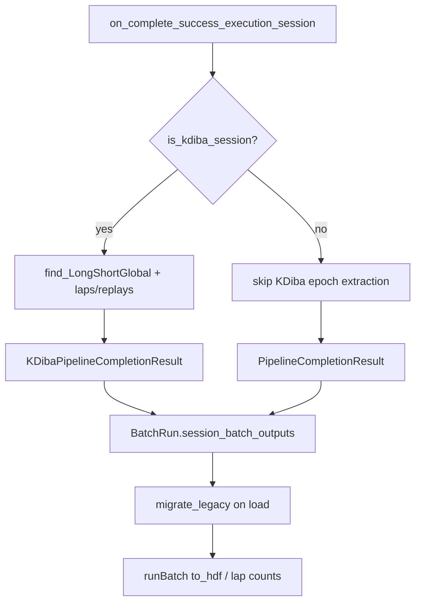

# Split KDiba fields into `KDibaPipelineCompletionResult`

## Current state

[`BatchCompletionHandler.py`](h:/TEMP/Spike3DEnv_ExploreUpgrade/Spike3DWorkEnv/pyPhoPlaceCellAnalysis/src/pyphoplacecellanalysis/General/Batch/BatchJobCompletion/BatchCompletionHandler.py) defines both classes with **duplicate** KDiba fields:

```65:74:h:/TEMP/Spike3DEnv_ExploreUpgrade/Spike3DWorkEnv/pyPhoPlaceCellAnalysis/src/pyphoplacecellanalysis/General/Batch/BatchJobCompletion/BatchCompletionHandler.py
class PipelineCompletionResult(...):
    long_epoch_name: str = serialized_attribute_field()
    long_laps: Epoch = serialized_field()
    ...
```

```108:117:h:/TEMP/Spike3DEnv_ExploreUpgrade/Spike3DWorkEnv/pyPhoPlaceCellAnalysis/src/pyphoplacecellanalysis/General/Batch/BatchJobCompletion/BatchCompletionHandler.py
class KDibaPipelineCompletionResult(PipelineCompletionResult):
    long_epoch_name: str = serialized_attribute_field()
    long_laps: Epoch = serialized_field()
    ...
```

The callback at line 820 always constructs `PipelineCompletionResult(...)`, and [`runBatch.py`](h:/TEMP/Spike3DEnv_ExploreUpgrade/Spike3DWorkEnv/pyPhoPlaceCellAnalysis/src/pyphoplacecellanalysis/General/Batch/runBatch.py) unconditionally reads `.long_laps`, `.long_epoch_name`, etc. (lines 741–747, 876–881).



## 1. Refactor result classes in `BatchCompletionHandler.py`

**`PipelineCompletionResult`** — keep only shared fields:
- `delta_since_last_compute`, `outputs_local`, `outputs_global`, `across_session_results`
- Remove lines 68–74 (KDiba fields)
- Keep existing `to_hdf` (calls `super()` only)

**`KDibaPipelineCompletionResult`** — sole owner of KDiba fields:
- Keep `long_epoch_name`, `long_laps`, `long_replays`, `short_epoch_name`, `short_laps`, `short_replays`
- Remove redundant commented duplicate of common properties (lines 119–124)
- Remove duplicate `to_hdf` unless KDiba-specific HDF handling is added later (currently identical to parent)
- Add module-level constant `_KDIBA_PIPELINE_COMPLETION_RESULT_FIELD_NAMES` for migration

**Legacy migration helpers** (new, on `KDibaPipelineCompletionResult` / `PipelineCompletionResult`):

```python
@classmethod
def from_legacy_pipeline_completion_result(cls, obj: "PipelineCompletionResult") -> "KDibaPipelineCompletionResult":
    """Build KDiba subclass from a legacy base instance that still carries KDiba attrs in __dict__."""
```

```python
def __setstate__(self, state):
    if type(self) is PipelineCompletionResult and _KDIBA_PIPELINE_COMPLETION_RESULT_FIELD_NAMES.intersection(state):
        self.__class__ = KDibaPipelineCompletionResult
    super().__setstate__(state)
```

```python
@classmethod
def migrate_session_batch_output(cls, result: Optional["PipelineCompletionResult"]) -> Optional["PipelineCompletionResult"]:
    """Upgrade in-memory legacy instances after pickle load."""
```

This leverages existing [`AttrsBasedClassHelperMixin.__setstate__`](h:/TEMP/Spike3DEnv_ExploreUpgrade/Spike3DWorkEnv/NeuroPy/neuropy/utils/mixins/AttrsClassHelpers.py) (line 781), which already merges unknown keys into `__dict__` — migration promotes them to declared fields on the subclass.

## 2. Branch callback return type in `on_complete_success_execution_session`

At the top of the callback (currently lines 689–697), gate KDiba epoch extraction behind the same pattern used elsewhere in this file:

```python
is_kdiba_session: bool = (curr_active_pipeline.active_sess_config.format_name.lower() in ['kdiba'])
```

- **kdiba**: keep `find_LongShortGlobal_epoch_names()` + laps/replay extraction; return `KDibaPipelineCompletionResult(...)` with KDiba + common kwargs
- **non-kdiba**: skip epoch extraction entirely; return `PipelineCompletionResult(...)` with common kwargs only

Extract shared kwargs once (`delta_since_last_compute`, `outputs_local`, `outputs_global`, `across_session_results`) to avoid duplication.

Return type annotation stays `-> PipelineCompletionResult` (subclass is valid).

**Side benefit:** non-kdiba batches no longer crash at `find_LongShortGlobal_epoch_names()` on callback entry.

## 3. Update `runBatch.py` consumers

**Import/export:** add `KDibaPipelineCompletionResult` to the import from `BatchCompletionHandler` (line 33).

**`BatchRun.to_hdf`** (lines 741–747): guard KDiba table columns with `isinstance(a_result, KDibaPipelineCompletionResult)`; for base results write empty epoch names and zero lap/replay counts (same as current `None` fallback behavior in `build_batch_lap_replay_counts_df`).

**`BatchResultDataframeAccessor.build_batch_lap_replay_counts_df`** (lines 872–882): same `isinstance` guard instead of unconditional `.long_laps` access.

**Post-load migration:** in `BatchRun.try_init_from_file` (after successful `loadData`), walk `session_batch_outputs` and replace each value with `PipelineCompletionResult.migrate_session_batch_output(v)`. This covers legacy pickles where `__setstate__` left kdiba data in `__dict__` but the instance class remained `PipelineCompletionResult`.

`PipelineCompletionResultTable` stays unchanged (KDiba-oriented summary table; non-kdiba rows get zeros).

## 4. Files touched (minimal scope)

| File | Change |
|------|--------|
| [`BatchCompletionHandler.py`](h:/TEMP/Spike3DEnv_ExploreUpgrade/Spike3DWorkEnv/pyPhoPlaceCellAnalysis/src/pyphoplacecellanalysis/General/Batch/BatchJobCompletion/BatchCompletionHandler.py) | Class split, migration helpers, callback branch |
| [`runBatch.py`](h:/TEMP/Spike3DEnv_ExploreUpgrade/Spike3DWorkEnv/pyPhoPlaceCellAnalysis/src/pyphoplacecellanalysis/General/Batch/runBatch.py) | Import, isinstance guards, post-load migration |

No notebook changes (per user rule). Spike3D `.ipy` imports of `PipelineCompletionResult` remain valid; kdiba-specific access should use `isinstance(..., KDibaPipelineCompletionResult)` where needed (not required for this refactor since those scripts mostly use `BatchSessionCompletionHandler`).

## 5. Verification

1. **Unit-style smoke:** construct both result types; confirm attrs fields and HDF `to_hdf` succeed for kdiba subclass
2. **Legacy pickle:** load an existing kdiba `global_batch_result.pkl`; confirm `session_batch_outputs` values migrate to `KDibaPipelineCompletionResult` and `.long_laps` is accessible
3. **kdiba batch run:** one session completes; returned type is `KDibaPipelineCompletionResult`; lap/replay counts in progress dataframe unchanged
4. **non-kdiba batch run:** callback completes without `find_LongShortGlobal_epoch_names` error; returned type is plain `PipelineCompletionResult`

## Known follow-up (out of scope)

`post_load_find_usable_sessions` uses `n_long_laps` / `n_short_laps` thresholds — non-kdiba batches will report zeros and fail `is_ready` when `min_required_replays_or_laps > 0`. That is pre-existing coupling to KDiba semantics; a format-aware readiness check would be a separate change.
