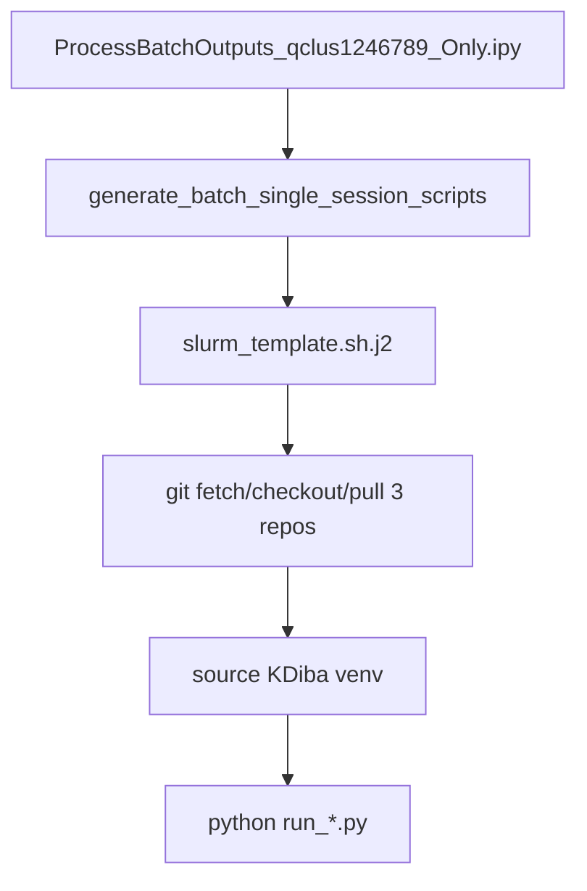

# KDiba release-branch batch script generation

## Problem

[`ProcessBatchOutputs_qclus1246789_Only.ipy`](h:/TEMP/Spike3DEnv_ExploreUpgrade/Spike3DWorkEnv/Spike3D/ProcessBatchOutputs_qclus1246789_Only.ipy) calls `generate_batch_single_session_scripts(...)`, but generated runners do not pin code to `release/pho-diba-2025-paper`:

- [`slurm_template.sh.j2`](h:/TEMP/Spike3DEnv_ExploreUpgrade/Spike3DWorkEnv/pyPhoPlaceCellAnalysis/src/pyphoplacecellanalysis/Resources/Templates/slurm_template.sh.j2) hardcodes a KDiba venv path and runs `python` with **no git steps**
- [`bash_template.sh.j2`](h:/TEMP/Spike3DEnv_ExploreUpgrade/Spike3DWorkEnv/pyPhoPlaceCellAnalysis/src/pyphoplacecellanalysis/Resources/Templates/bash_template.sh.j2) has the same issue
- Spike3D [`pyproject.toml`](h:/TEMP/Spike3DEnv_ExploreUpgrade/Spike3DWorkEnv/Spike3D/pyproject.toml) uses **editable local path deps**, so batch jobs use whatever branch is checked out on the execution host

Only these repos have `release/pho-diba-2025-paper` (Spike3D does **not**):

- `NeuroPy`
- `pyPhoCoreHelpers`
- `pyPhoPlaceCellAnalysis`

Editable installs mean **git checkout + pull is enough** inside job wrappers; no per-job `uv sync` is required.



## Implementation

### 1. Extend batch templating library

**File:** [`pythonScriptTemplating.py`](h:/TEMP/Spike3DEnv_ExploreUpgrade/Spike3DWorkEnv/pyPhoPlaceCellAnalysis/src/pyphoplacecellanalysis/General/Batch/pythonScriptTemplating.py)

Add small helpers near existing `get_running_python()` / `get_python_environment()`:

- `KDIBA_RELEASE_GIT_BRANCH = 'release/pho-diba-2025-paper'`
- `DEFAULT_KDIBA_GIT_CHECKOUT_REPO_NAMES = ['NeuroPy', 'pyPhoCoreHelpers', 'pyPhoPlaceCellAnalysis']`
- `resolve_venv_activate_path(venv_activate_path: Optional[str] = None) -> str` — use explicit path when provided, else derive from `get_running_python()`
- `resolve_workenv_repos_root(workenv_repos_root: Optional[Union[str, Path]] = None, known_workenv_repos_root_paths: Optional[List[Union[str, Path]]] = None) -> Path` — resolve parent dir containing the three repos + Spike3D

Extend `generate_batch_single_session_scripts(...)` signature with optional kwargs (backward-compatible defaults = current behavior):

- `venv_activate_path: Optional[str] = None`
- `workenv_repos_root: Optional[str] = None`
- `git_branch: Optional[str] = None`
- `git_checkout_repo_names: Optional[List[str]] = None`

At generation time:

- Resolve `venv_activate_path` once
- If `git_branch` is set, require `workenv_repos_root` and pass both into `_subfn_build_slurm_script` / `_subfn_build_non_slurm_bash_script`
- Replace hardcoded VSCode interpreter paths in `build_vscode_workspace` call site with resolved `python_executable` from `get_running_python()` when on Windows (keep existing GL fallback list as secondary candidate)

Update `build_windows_powershell_run_script` call in the ipy to pass `activate_path` / `python_executable` from `get_running_python()` (Windows/Apogee local runs).

### 2. Parameterize Slurm/bash templates

**Files:**

- [`slurm_template.sh.j2`](h:/TEMP/Spike3DEnv_ExploreUpgrade/Spike3DWorkEnv/pyPhoPlaceCellAnalysis/src/pyphoplacecellanalysis/Resources/Templates/slurm_template.sh.j2)
- [`bash_template.sh.j2`](h:/TEMP/Spike3DEnv_ExploreUpgrade/Spike3DWorkEnv/pyPhoPlaceCellAnalysis/src/pyphoplacecellanalysis/Resources/Templates/bash_template.sh.j2)

Replace hardcoded `source '...Spike3DEnv_KDibaVersion...'` with:

```bash

BRANCH='{{ git_branch }}'
REPOS_ROOT='{{ workenv_repos_root }}'

cd "$REPOS_ROOT/{{ repo_name }}" || exit 1
git fetch origin
git checkout "$BRANCH" || exit 1
git pull origin "$BRANCH" || exit 1
echo "=== {{ repo_name }}: $(git rev-parse --short HEAD) on $(git branch --show-current) ==="



source '{{ venv_activate_path }}'
```

Fix bash template activation (`sh '.../activate'` → `source '...'`).

Keep existing module-load / MPLBACKEND / Xvfb blocks unchanged.

### 3. Update the KDiba batch driver ipy

**File:** [`ProcessBatchOutputs_qclus1246789_Only.ipy`](h:/TEMP/Spike3DEnv_ExploreUpgrade/Spike3DWorkEnv/Spike3D/ProcessBatchOutputs_qclus1246789_Only.ipy)

Add a small config block after path setup (~lines 84–90):

```python
from pyphoplacecellanalysis.General.Batch.pythonScriptTemplating import get_running_python

KDIBA_RELEASE_GIT_BRANCH = 'release/pho-diba-2025-paper'
known_workenv_repos_root_paths = [
    Path('/scratch/kdiba_root/kdiba99/halechr/repos/Spike3DEnv_KDibaVersion'),
    Path(r'H:/TEMP/Spike3DEnv_ExploreUpgrade/Spike3DWorkEnv'),
    Path('~/repos/Spike3DWorkEnv').expanduser(),
]
workenv_repos_root = find_first_extant_path(known_workenv_repos_root_paths)
active_venv_path, python_executable, activate_script_path = get_running_python()
```

Pass into `generate_batch_single_session_scripts(...)`:

```python
venv_activate_path=str(activate_script_path),
workenv_repos_root=str(workenv_repos_root),
git_branch=KDIBA_RELEASE_GIT_BRANCH,
```

Update Windows PowerShell section to use resolved venv paths:

```python
powershell_script_path = build_windows_powershell_run_script(
    script_paths,
    max_concurrent_jobs=max_parallel_executions,
    script_name='run_scripts',
    activate_path=str(activate_script_path),
    python_executable=str(python_executable),
)
```

Add a print of resolved `workenv_repos_root`, `venv_activate_path`, and `git_branch` before script generation for auditability.

### 4. Verification

After implementation, regenerate scripts for one session and inspect one Slurm wrapper:

1. Contains checkout block for `NeuroPy`, `pyPhoCoreHelpers`, `pyPhoPlaceCellAnalysis`
2. `source` points at the intended KDiba/ExploreUpgrade venv
3. `python` line unchanged (still targets generated `run_*.py`)

On Great Lakes, dry-run one `sbatch` and confirm `slurm_*.out` shows the three `git rev-parse` lines before Python starts.

On Windows/Apogee, confirm generated `.sh` files are not used; PowerShell runner uses the local venv from `get_running_python()`.

## Out of scope

- Changing Spike3D `pyproject.toml` to git-rev `[tool.uv.sources]` (kdiba fragment) — not needed for editable workflow
- Per-job `uv sync` inside Slurm/bash wrappers
- Runtime Python assertion (you chose wrapper checkout only)
- Multi-phase subdirectory / `batch_scripts_root_directory` fixes from Bapun/NWB plans (not required for this KDiba single-phase driver)

## Files touched

| File | Change |
|------|--------|
| [`pythonScriptTemplating.py`](h:/TEMP/Spike3DEnv_ExploreUpgrade/Spike3DWorkEnv/pyPhoPlaceCellAnalysis/src/pyphoplacecellanalysis/General/Batch/pythonScriptTemplating.py) | New resolve helpers + kwargs plumbed into template render |
| [`slurm_template.sh.j2`](h:/TEMP/Spike3DEnv_ExploreUpgrade/Spike3DWorkEnv/pyPhoPlaceCellAnalysis/src/pyphoplacecellanalysis/Resources/Templates/slurm_template.sh.j2) | Parameterized venv + optional git checkout preamble |
| [`bash_template.sh.j2`](h:/TEMP/Spike3DEnv_ExploreUpgrade/Spike3DWorkEnv/pyPhoPlaceCellAnalysis/src/pyphoplacecellanalysis/Resources/Templates/bash_template.sh.j2) | Same as slurm template |
| [`ProcessBatchOutputs_qclus1246789_Only.ipy`](h:/TEMP/Spike3DEnv_ExploreUpgrade/Spike3DWorkEnv/Spike3D/ProcessBatchOutputs_qclus1246789_Only.ipy) | KDiba release config + pass new kwargs + PowerShell venv paths |
