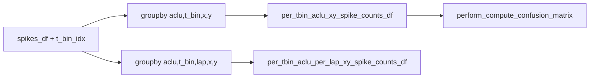

# Add `per_tbin_aclu_per_lap_xy_spike_counts_df`

## Approach

Compute true lap-partitioned spike counts inside [`compute_reliability_matrix`](h:\TEMP\Spike3DEnv_ExploreUpgrade\Spike3DWorkEnv\pyPhoPlaceCellAnalysis\src\pyphoplacecellanalysis\Analysis\reliability.py) from the same spike-level frame (with `t_bin_idx` / `binned_x` / `binned_y` already assigned). Keep the existing non-lap `per_tbin_aclu_xy_spike_counts_df` and confusion path unchanged. When `'lap'` is missing, return/store `None`.

## Changes

### 1. [`reliability.py`](h:\TEMP\Spike3DEnv_ExploreUpgrade\Spike3DWorkEnv\pyPhoPlaceCellAnalysis\src\pyphoplacecellanalysis\Analysis\reliability.py) — `compute_reliability_matrix`

After the existing Polars block (~1035–1046), when `'lap' in spikes_df.columns`:

- Build a second Polars frame from `["t_bin_idx", "aclu", "lap", "binned_x", "binned_y"]`
- `group_by(["aclu", "t_bin_idx", "lap", "binned_x", "binned_y"]).agg(pl.len().alias("n_spikes"))`
- Else set `per_tbin_aclu_per_lap_xy_spike_counts_df = None`

Return it as the **6th** tuple element. Update docstring Returns. Leave the existing 5 outputs’ semantics identical (coarse `per_tbin_aclu_spike_counts_df` still sums the non-lap xy table).

Update the two unpack sites:

- Docstring example ~896
- Mixin `_perform_compute_unit_confusion_reliability_variables` ~2376–2383: unpack + `self.per_tbin_aclu_per_lap_xy_spike_counts_df = ...`; keep the public 5-tuple return of that method unchanged (storage on `self` is the API for this new table). Document the new attribute in the mixin class docstring Outputs list.

### 2. Decoder storage / slice / reset (mirror sibling field)

[`reconstruction.py`](h:\TEMP\Spike3DEnv_ExploreUpgrade\Spike3DWorkEnv\pyPhoPlaceCellAnalysis\src\pyphoplacecellanalysis\Analysis\Decoder\reconstruction.py):

- Add `per_tbin_aclu_per_lap_xy_spike_counts_df: pd.DataFrame = serialized_field(default=None, ...)` next to `per_tbin_aclu_xy_spike_counts_df`
- Clear it in `setup` / `post_load`
- Neuron-slice filter by `aclu` beside the existing xy-counts block (~3862)

[`reconstruction_dst.py`](h:\TEMP\Spike3DEnv_ExploreUpgrade\Spike3DWorkEnv\pyPhoPlaceCellAnalysis\src\pyphoplacecellanalysis\Analysis\Decoder\reconstruction_dst.py): same neuron-slice filter (~229).

## Resulting columns

`['aclu', 't_bin_idx', 'lap', 'binned_x', 'binned_y', 'n_spikes']` (spike `t_bin_idx` remains 1-based; no lap filtering — callers can drop `lap == -1` if needed).

## Non-goals

- Do not change confusion / `reliability_*` math
- Do not rewire `plot_reliability_maps_with_spikes` to use this table yet
- Do not change the mixin method’s 5-value return signature beyond storing the new attribute on `self`